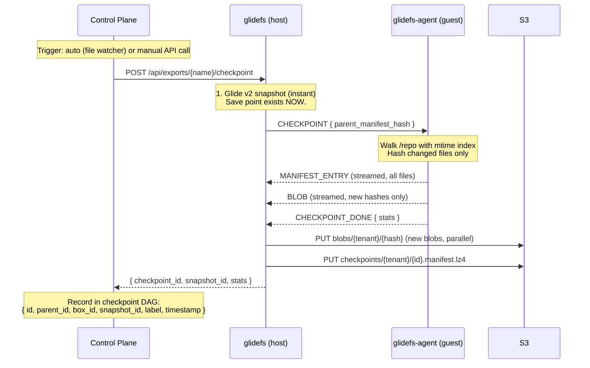
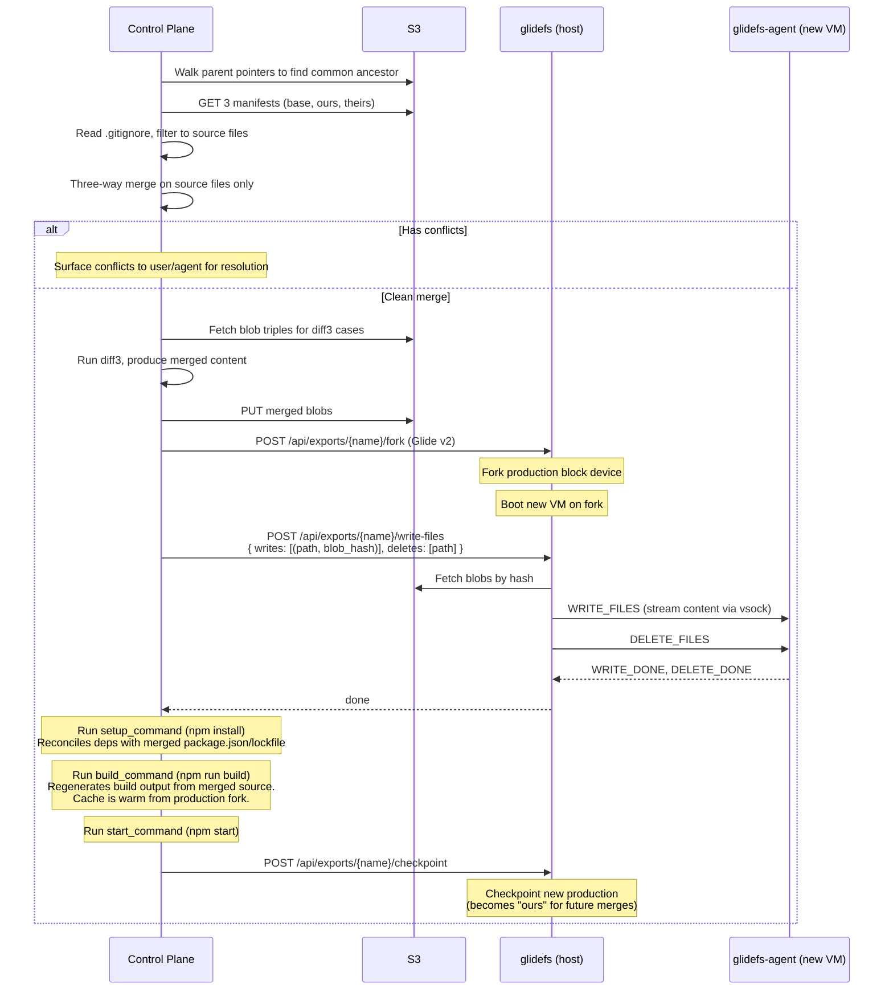

# Checkpoint Agent — File-Level Operations for Boxes

## Design Document — vsock Guest Agent + File Manifests + Three-Way Merge

---

## Overview

A thin file-level layer on top of Glide v2 that gives Boxes version control semantics — automatic save points, file-level diffs, branching, and three-way merge for promotion. No git ceremony.

**Core insight: Glide v2 sees blocks, not files.** It can snapshot, fork, and restore a block device instantly — but it can't tell you which *files* changed, or merge two developers' changes to the same codebase. A lightweight guest agent bridges this gap by giving glidefs file-level visibility through vsock.

**Why a guest agent:** glidefs runs on the host. The VM's filesystem (ext4) lives on the block device that glidefs serves via NBD. To see files, glidefs would need to parse ext4 from raw blocks — complex, brittle, and coupled to a specific filesystem. A small agent running inside the VM has native filesystem access through the kernel's VFS. It works with any filesystem, requires no parsing, and communicates over vsock (host↔guest virtio socket — fast, no network stack, no TCP overhead).

**What this enables:**

- **Auto-checkpoint**: Agent watches /repo, triggers checkpoints on change. No git add, no git commit. Invisible save points.
- **File-level diff**: Compare two checkpoints, see exactly which files changed and what changed in each one.
- **Three-way merge**: Promote a checkpoint to production without overwriting concurrent changes.
- **Selective restore**: Replace /repo from a checkpoint without touching the rest of the filesystem (OS, runtime, caches stay warm).
- **Branching**: Fork a VM (Glide v2), keep working independently, diff branches against their common ancestor.

**What this does NOT replace:** Glide v2 handles all block-level operations — snapshot, fork, sleep/wake, S3 portability, cache, compression, migration. This layer adds file-level awareness on top. If the agent isn't running, glidefs works fine — you just don't get file-level diff, merge, or auto-checkpoints.

---

## Benefits

**Git semantics without git ceremony.** Agents and developers get save points, branches, diffs, and merges without understanding staging, index, or commit workflows. Checkpoints happen automatically. Branching is just forking a VM.

**Instant save points.** The Glide v2 snapshot is the save point — taken in <1ms. The file manifest is built in the background. The agent never waits.

**Sub-second diff.** Comparing two checkpoints with 50K files takes <1ms (hash comparison). Fetching content for ~100 changed files takes 50-200ms. Total: well under a second for any realistic codebase.

**Safe concurrent development.** Two agents (or an agent and a developer) can fork from the same production, work independently, and both promote. Three-way merge reconciles their changes automatically when they don't conflict, and surfaces conflicts clearly when they do.

**Incremental everything.** After the first checkpoint (which hashes every file), subsequent checkpoints only hash changed files. The mtime index makes this O(changed files), not O(total files). Blob uploads are deduplicated — same content is never uploaded twice.

**No second storage system.** File blobs live in S3 alongside Glide v2 block data. Same bucket, same tenant isolation, same encryption. One more prefix, not one more system.

**Acceptable storage duplication.** File content in `/repo` exists twice in S3 — once inside Glide v2 block packs (as ext4 blocks), once in the blob store (as individual files). This is the cost of file-level visibility without parsing ext4 from raw blocks. The overhead is small: `/repo` is typically 200MB-2GB out of a 10-20GB block device, so blob duplication adds 2-10% to total storage. With content-addressed dedup across forks, the marginal cost per additional VM is near zero. The alternative — mounting `/repo` via virtio-fs backed by the blob store directly — eliminates duplication but adds filesystem-serving complexity and degrades write performance for I/O-heavy operations (npm install, builds). Not a worthwhile trade.

---

## Tradeoffs

**File manifest is a second consistency domain.** Glide v2 block-level snapshots and file-level manifests are independent. A snapshot without a manifest is valid (block-level operations work, file-level operations don't). A manifest without a snapshot is useless (no block data to back it). The snapshot is always taken first — the failure mode is always "have blocks, missing file metadata" — which is safe and recoverable.

**vsock requires a cooperating guest.** If the agent isn't running (or the guest kernel doesn't support vsock), file-level operations fail silently. Block-level operations are unaffected. This is acceptable — we control the base images and the agent is a tiny static binary.

**Three-way merge is line-based.** Content merge (diff3) works on text files with line-level granularity. It can produce semantically incorrect merges for structured files (JSON, YAML) where a line-level merge is syntactically valid but logically wrong. This is the same limitation as git. For code files, it works well.

**No atomic multi-file restore.** Individual files are atomically replaced (write to temp, fsync, rename). But the restore as a whole is not atomic across files. A crash mid-restore leaves /repo in a mixed state. Mitigation: re-trigger restore (idempotent — same inputs, same result). For promotion, the VM isn't serving traffic until build succeeds, so partial state during restore is never user-visible.

**Flat manifests don't scale past ~500K files.** At 50K files (typical), manifest comparison is microseconds. At 500K files (large monorepo), it's milliseconds — still fine. If someone has millions of files in /repo, add Merkle trees then. No one will.

---

## Architecture

```
┌──────────────────────────────────────────────────────────────┐
│  VM (guest)                                                   │
│                                                               │
│  ┌───────────────────────────┐   ┌──────────────────────────┐│
│  │  User workload            │   │  glidefs-agent           ││
│  │  (app, build, AI agent)   │   │                          ││
│  │                           │   │  • inotify on /repo      ││
│  │  reads/writes /repo       │   │  • file walk + hash      ││
│  │  normally                 │   │  • file write (restore)  ││
│  └───────────────────────────┘   │  • vsock connection      ││
│           │                      └─────────────┬────────────┘│
│           │ normal file I/O                    │ vsock        │
│           ▼                                    │              │
│  ┌────────────────────────────────────────────────────────┐  │
│  │  ext4 filesystem (/dev/vda)                            │  │
│  └────────────────────────────────────────────────────────┘  │
│           │ block I/O                                        │
├───────────┼──────────────────────────────────────────────────┤
│  Host     │                                    │              │
│           ▼                                    ▼              │
│  ┌────────────────────────────────────────────────────────┐  │
│  │  glidefs daemon                                        │  │
│  │                                                        │  │
│  │  Block-level (Glide v2):     File-level (this doc):    │  │
│  │  • snapshot / fork           • vsock server             │  │
│  │  • S3 packs + manifests      • checkpoint coordinator  │  │
│  │  • cache, WAL, compression   • blob upload to S3       │  │
│  │  • flush scheduler           • write-blobs-to-VM       │  │
│  │  • sleep / wake / migrate      (fetch S3 → agent)      │  │
│  └────────────────────────────────────────────────────────┘  │
│           │                                                   │
│           ▼                                                   │
│  ┌────────────────────────────────────────────────────────┐  │
│  │  S3                                                    │  │
│  │                                                        │  │
│  │  packs/...          (Glide v2 — block data)            │  │
│  │  manifests/...      (Glide v2 — block maps)            │  │
│  │  checkpoints/...    (this doc — file manifests)        │  │
│  │  blobs/...          (this doc — file content)          │  │
│  └────────────────────────────────────────────────────────┘  │
│                                                               │
│  ┌────────────────────────────────────────────────────────┐  │
│  │  Control Plane                                         │  │
│  │                                                        │  │
│  │  • Checkpoint DAG (database or S3 metadata)            │  │
│  │  • Diff engine (fetch manifests + blobs, unified diff) │  │
│  │  • Merge engine (three-way merge, diff3)               │  │
│  │  • Promotion orchestration                             │  │
│  │  • Auto-checkpoint scheduling                          │  │
│  └────────────────────────────────────────────────────────┘  │
└──────────────────────────────────────────────────────────────┘
```

**Separation of concerns:**

- **glidefs-agent** (guest): file I/O only. Walks filesystem, hashes files, writes files, reports changes. No storage logic, no S3 access, no merge logic, no policy decisions.
- **glidefs daemon** (host): block storage + vsock bridge. Handles block-level operations (Glide v2), coordinates with the agent over vsock, uploads blob content to S3 on checkpoint, and executes file write plans by fetching blobs from S3 and streaming them to the agent. Does NOT compute diffs, merges, or manage the checkpoint DAG.
- **Control plane** (separate service): file-level intelligence. Manages the checkpoint DAG, computes diffs and three-way merges, orchestrates promotions, decides when to auto-checkpoint. Sends write plans to glidefs for execution.

---

## File Manifest

The manifest is a flat map of every file in the checkpointed directory (default: `/repo`).

```json
{
  "src/main.rs":            { "hash": "blake3:2b4c...", "size": 2048, "mode": "0644" },
  "src/lib.rs":             { "hash": "blake3:9e1d...", "size": 512,  "mode": "0644" },
  "package.json":           { "hash": "blake3:7f3a...", "size": 1024, "mode": "0644" },
  "node_modules/react/index.js": { "hash": "blake3:ab12...", "size": 4096, "mode": "0644" },
  "scripts/deploy.sh":     { "hash": "blake3:cd34...", "size": 256,  "mode": "0755" },
  "assets/logo.png":       { "hash": "blake3:ef56...", "size": 8192, "mode": "0644" }
}
```

**Per-entry fields:**

| Field | Description |
|-------|-------------|
| **path** | Relative to checkpoint root (/repo). Forward slashes, no leading slash. |
| **hash** | BLAKE3-128 of raw file content. 16 bytes, hex-encoded. |
| **size** | File size in bytes. |
| **mode** | Permission bits (0777 mask, octal string). |

**What's NOT recorded:**

- Ownership (uid/gid) — VM-specific, not meaningful across VMs.
- Timestamps (mtime/atime/ctime) — not meaningful across restore.
- Extended attributes, ACLs — defer until needed.
- Empty directories — like git, only track files. A directory exists if it contains files.

**Symlinks:** Recorded as a special entry. The hash is BLAKE3-128 of the symlink target path (not the target's content). Symlinks are never followed during walk — prevents infinite loops and inclusion of content outside /repo. Broken symlinks (target doesn't exist) are recorded normally — the target path is the content, existence doesn't matter. Symlinks pointing outside `/repo` are recorded as-is — the target path is stored verbatim. On restore, the symlink is recreated with the same target. If that target doesn't exist on the new VM, the symlink is broken — same as it would be in git.

### Hash Choice: BLAKE3-128

Same hash as Glide v2 block addressing. 128-bit truncation of BLAKE3.

- **Birthday bound: ~2^64.** At 128KB per block, that's ~2 exabytes of unique data before collision probability reaches 50%. At any realistic per-tenant scale (<1 PB), the probability is ~10^-21. Not a concern.
- **Consistent with Glide v2.** Same hash, same size, same code path. One hash function across the entire system.
- **Fast.** BLAKE3 is ~3-4x faster than SHA-256. ~5μs for 128KB.
- **16 bytes per entry.** Keeps manifests compact.

### Why Flat (Not a Merkle Tree)

A Merkle tree gives O(changes) diff by skipping shared subtrees. But /repo typically has 5K-50K files. Comparing two flat manifests by hash is microseconds. The Merkle tree adds tree objects, recursive hashing, tree deduplication, and tree-aware GC — real implementation complexity — for a performance improvement that doesn't matter at this scale.

If /repo grows to millions of files, add Merkle trees then. The manifest format can evolve without changing the agent protocol or the checkpoint model.

### Manifest Size

| Repo size | Files | Manifest (uncompressed) | Manifest (LZ4) |
|-----------|-------|-------------------------|-----------------|
| Small (web app) | 500 | ~60KB | ~30KB |
| Medium (monolith) | 5,000 | ~600KB | ~300KB |
| Large (monorepo) | 50,000 | ~6MB | ~3MB |
| Huge | 500,000 | ~60MB | ~30MB |

Manifests are serialized as MessagePack + LZ4. Same serialization as the vsock protocol (`rmp-serde`) — zero additional dependencies. Faster to parse than JSON at 50K entries, and smaller on the wire. Nobody reads raw manifests out of S3 anyway (they're LZ4-compressed).

Each checkpoint has one file in S3:

```
checkpoints/{tenant}/{id}.manifest.lz4    ← file manifest (MessagePack + LZ4)
```

### Checkpoint DAG

The DAG tracks parent pointers, labels, and timestamps for every checkpoint. It's how the system finds common ancestors for merge and walks history for diff.

Each checkpoint record:

```
id:                     "chk_0042"
parent_id:              "chk_0041"
box_id:                 "preview-abc"
snapshot_id:            "glide-snap-0042"
source_checkpoint_id:   "chk_P0"          ← production checkpoint this preview forked from
label:                  "before-migration"
timestamp:              "2026-02-11T15:04:05Z"
```

**Where to store it depends on the control plane:**

If the control plane already has a database (likely — it manages tenants, boxes, deployments), the checkpoint DAG belongs there. A `checkpoints` table with a recursive CTE walks any ancestor chain in milliseconds regardless of depth. Retention compaction is a single `UPDATE` to re-point children. This is exactly the kind of structured pointer-following query that databases are good at.

If the control plane is genuinely stateless, store the DAG as `.meta.json` sidecar files next to each manifest in S3 (same pattern as git commit objects). This works but has real costs: ancestor discovery is O(depth) sequential S3 GETs at 10-50ms each, and compaction requires read-modify-write of children's metadata files. Acceptable for shallow chains, painful for long ones.

**Recommendation: use the control plane's database.** The DAG is small (thousands of records), relational, and queried on every merge. It's not worth optimizing for the no-database case when the control plane almost certainly has one.

---

## Blob Store

File content is stored content-addressed in S3:

```
blobs/{tenant}/{hash[0:2]}/{hash[2:4]}/{hash}
```

Sharded by first four hex characters of hash (256 x 256 = 65K prefix buckets) to avoid S3 LIST performance degradation on large flat prefixes.

**Properties:**

- **Write-once.** Same content → same hash → same key. PUT is idempotent. Blobs are never modified.
- **Tenant-isolated.** Same isolation model as Glide v2 tenant packs. No cross-tenant blob access.
- **Compressed.** LZ4 before upload (consistent with Glide v2). Decompress on read. Hash is always of raw content — hash before compress.
- **No packing.** Unlike Glide v2's pack files (25 fixed-size blocks per pack), file blobs are stored individually. Files range from bytes to megabytes — fixed-size batching doesn't help. Simpler to implement, simpler to GC, simpler to fetch individual files for diff.

**Deduplication:**

Content-addressing means ten preview VMs of the same app share 100% of their blobs. Dependencies (node_modules) are identical across forks — stored once, referenced by every manifest. Only genuinely unique files (an agent's code edits) add storage.

| Scenario | Unique blobs | S3 storage |
|----------|-------------|------------|
| Single app, 5K files, 200MB total | 5,000 | ~120MB (LZ4) |
| Same app, 100 checkpoints, ~10% file churn | ~5K base + ~50K deltas | ~150MB total |
| 10 preview VMs forked from same production | ~0 additional | ~0 additional |

### Blob GC

Same approach as Glide v2: mark-and-sweep with a grace period.

1. **Mark:** Walk all live checkpoint manifests for the tenant. Collect referenced hashes.
2. **Sweep:** LIST blobs in tenant namespace. Delete unreferenced blobs older than 15 minutes.
3. **Frequency:** Runs alongside Glide v2's tenant GC (daily or every few hours).

The grace period protects against races: a checkpoint in progress has uploaded blobs but hasn't written its manifest yet. No blob younger than 15 minutes is ever deleted. (A checkpoint takes <500ms end-to-end. 15 minutes covers network partitions, retries, and slow S3 uploads with margin to spare.)

---

## vsock Protocol

Communication between glidefs (host) and glidefs-agent (guest) over virtio-vsock.

### Connection

| Property | Value |
|----------|-------|
| **Transport** | AF_VSOCK, SOCK_STREAM |
| **Guest CID** | Assigned by Firecracker at VM creation (known to glidefs) |
| **Agent port** | 10842 (fixed) |
| **Direction** | Host-initiated (glidefs connects to agent) |
| **Reconnect** | glidefs retries on connection failure (agent may not be started yet) |

### Framing

```
Each message:
  ┌──────────────┬──────────┬──────────────────┐
  │ length: u32  │ type: u8 │ payload: [u8]    │
  │ (big-endian) │          │ (MessagePack)    │
  └──────────────┴──────────┴──────────────────┘
  length = size of (type + payload). Does not include the length field itself.
```

MessagePack for the payload — compact binary, fast to encode/decode, libraries in every language. Not JSON (too verbose for streaming file content). Not protobuf (overkill for a two-party local protocol).

### Messages

**Host → Agent:**

| Type | Name | Payload | Description |
|------|------|---------|-------------|
| 0x01 | CHECKPOINT | `{ parent_manifest_hash }` | Request file manifest + new blobs |
| 0x02 | WRITE_FILES | stream of `(path, mode, content)` | Write files to /repo |
| 0x03 | DELETE_FILES | `{ paths: [string] }` | Delete files from /repo |
| 0x04 | READ_FILES | `{ paths: [string] }` | Read specific file contents |
| 0x05 | PING | `{}` | Health check |

**Agent → Host:**

| Type | Name | Payload | Description |
|------|------|---------|-------------|
| 0x81 | MANIFEST_ENTRY | `(path, hash, size, mode)` | One file entry (streamed) |
| 0x82 | BLOB | `(hash, content)` | File content for a new blob |
| 0x83 | CHECKPOINT_DONE | `{ total_files, new_blobs, elapsed_ms }` | End of checkpoint stream |
| 0x84 | WRITE_DONE | `{ written, errors: [(path, error)] }` | Write result |
| 0x85 | DELETE_DONE | `{ deleted, errors: [(path, error)] }` | Delete result |
| 0x86 | FILE_CONTENT | `(path, content)` | Requested file content |
| 0x87 | FILE_CHANGED | `{ }` | Notification: something changed in /repo |
| 0x88 | PONG | `{ uptime_ms }` | Health response |
| 0xFF | ERROR | `{ code, message }` | Error response |

### Checkpoint Protocol Flow

```
glidefs (host)                          glidefs-agent (guest)
     │                                       │
     │  CHECKPOINT { parent_manifest_hash }   │
     ├──────────────────────────────────────►│
     │                                       │
     │                                       │ 1. Load mtime index
     │                                       │ 2. Walk /repo (skip .checkpointignore)
     │                                       │ 3. For each file:
     │                                       │    stat() → compare to mtime index
     │                                       │    unchanged? reuse cached hash
     │                                       │    changed? read + hash + update index
     │                                       │ 4. Load parent manifest (if cached locally)
     │                                       │
     │       MANIFEST_ENTRY (path, hash, ..) │
     │◄──────────────────────────────────────┤  (one per file, streamed)
     │       MANIFEST_ENTRY ...              │
     │◄──────────────────────────────────────┤
     │       ...                             │
     │                                       │
     │       BLOB (hash, content)            │  (only hashes NOT in parent manifest)
     │◄──────────────────────────────────────┤
     │       BLOB ...                        │
     │◄──────────────────────────────────────┤
     │                                       │
     │       CHECKPOINT_DONE { stats }       │
     │◄──────────────────────────────────────┤
     │                                       │
```

The agent sends the **full manifest** (all files, not just changes) so the host has a self-contained snapshot. But it only sends **blob content for new hashes** — files whose hash differs from the parent manifest. For a typical checkpoint with ~100 changed files out of 50K, this means 50K small manifest entries (~7.5MB over vsock at >1 GB/s = ~7ms) plus ~100 blob payloads (~1MB).

### Restore Protocol Flow

```
glidefs (host)                          glidefs-agent (guest)
     │                                       │
     │  WRITE_FILES                          │
     │  (path: "src/main.rs",               │
     │   mode: "0644",                       │
     │   content: <bytes>)                   │
     ├──────────────────────────────────────►│
     │  (path: "src/lib.rs", ...)            │  Agent writes each file:
     ├──────────────────────────────────────►│    write to {path}.tmp
     │  ...                                  │    fsync
     │                                       │    chmod
     │  DELETE_FILES                          │    rename to {path}
     │  { paths: ["old_file.rs"] }           │
     ├──────────────────────────────────────►│
     │                                       │
     │       WRITE_DONE { written: 42 }      │
     │◄──────────────────────────────────────┤
     │       DELETE_DONE { deleted: 1 }      │
     │◄──────────────────────────────────────┤
     │                                       │
```

glidefs receives a write plan from the control plane, fetches blobs from S3 by hash, and streams the file content to the agent. The agent applies them with atomic per-file replacement (write to temp, fsync, rename).

### FILE_CHANGED Notifications

```
glidefs-agent (guest)                   glidefs (host)
     │                                       │
     │ (inotify fires: file changed in /repo)│
     │                                       │
     │  FILE_CHANGED { }                     │
     ├──────────────────────────────────────►│
     │                                       │ Debounce timer resets
     │                                       │ (5s after last change,
     │                                       │  or 5min max interval)
     │                                       │
```

The notification is intentionally content-free — just "something changed." The host doesn't need to know what changed until it triggers a checkpoint. But internally, the agent maintains a **dirty set** of paths from inotify events. When a checkpoint triggers, the agent hashes only dirty paths instead of stat-walking everything (see Incremental Hashing). On `IN_Q_OVERFLOW` (inotify dropped events), the dirty set is discarded and the next checkpoint falls back to a full stat walk.

---

## Incremental Hashing (mtime Index)

Hashing every file on every checkpoint is wasteful. The agent maintains a local index to skip unchanged files.

```
Index entry per file:
  path:       src/main.rs
  mtime_ns:   1704672000000000000    (nanosecond precision)
  size:       2048
  inode:      12345
  blob_hash:  blake3:2b4c...
```

**On checkpoint (fast path — dirty set available):**

Between checkpoints, inotify events accumulate a dirty set of paths that changed. When a checkpoint triggers:

1. For each path in the dirty set: read file, hash it, update index entry
2. For paths NOT in the dirty set: reuse cached hash from the index (no stat, no read, no hash)
3. Walk /repo for the full manifest (all paths), but only hash dirty paths

**On checkpoint (fallback — full walk):**

Used on first checkpoint, after agent restart (dirty set lost), or after `IN_Q_OVERFLOW` (inotify dropped events — dirty set is incomplete):

1. Walk /repo (respecting .checkpointignore)
2. For each file, `stat()` to get (mtime, size, inode)
3. If all three match index entry → reuse cached hash (no read, no hash)
4. If any differ or entry missing → read file, hash it, update index entry

**First checkpoint:** O(total bytes) — hash everything.
**Subsequent checkpoints (fast path):** O(changed files) for both stat and hash — inotify tells you exactly what's dirty.
**Subsequent checkpoints (fallback):** O(total files) for stat, O(changed bytes) for hash — mtime index skips unchanged files.

The three-field comparison (mtime + size + inode) is the same approach git uses for its index. A file that changes content while keeping the same mtime, size, AND inode number is astronomically unlikely. If paranoia is needed, add a `--full-hash` flag that ignores the index and hashes everything.

**Index location:** `/var/lib/glidefs-agent/index.bin` inside the VM. Binary format (not human-readable) for fast load. If missing or corrupt, the next checkpoint rebuilds it by hashing everything — slower once, then back to incremental.

---

## File Filtering

Three filters control what gets stored, what gets shown, and what gets merged. Each serves a different purpose.

```
┌─────────────────────────────────────────────────────────────────────┐
│  All files in /repo                                                  │
│                                                                      │
│  ┌───────────────────────────────────────────────────────────────┐  │
│  │  Checkpointed (stored in manifest + blob store)               │  │
│  │  = everything NOT matched by .checkpointignore                │  │
│  │                                                               │  │
│  │  ┌───────────────────────────────────────────────────────┐    │  │
│  │  │  Source files (shown in diffs, merged file-by-file)   │    │  │
│  │  │  = checkpointed files NOT matched by .gitignore       │    │  │
│  │  │                                                       │    │  │
│  │  │  src/main.rs, package.json, Makefile, etc.            │    │  │
│  │  └───────────────────────────────────────────────────────┘    │  │
│  │                                                               │  │
│  │  Generated files (stored but hidden from diffs/merge)         │  │
│  │  = checkpointed files matched by .gitignore                   │  │
│  │                                                               │  │
│  │  node_modules/, dist/, .next/, build/, vendor/                │  │
│  └───────────────────────────────────────────────────────────────┘  │
│                                                                      │
│  Excluded (not stored at all)                                        │
│  = matched by .checkpointignore or hardcoded                         │
│                                                                      │
│  *.log, .env.local, .git/, *.sock, *.pid                            │
└─────────────────────────────────────────────────────────────────────┘
```

| Filter | Controls | Purpose | Who reads it |
|--------|----------|---------|--------------|
| **Hardcoded** | Storage | Always excluded, can't override. `.git/`, `*.sock`, `*.pid`. | Agent |
| **`.checkpointignore`** | Storage | Excluded from checkpoints entirely. Truly useless files — logs, secrets, machine-specific caches. | Agent |
| **`.gitignore`** | Display + merge | Already exists in every repo. Defines "source" vs "generated." Generated files are checkpointed (for dedup and warm restores) but hidden from diffs and skipped during merge. Rebuilt by `setup_command` + `build_command`. | Control plane |

### Why three filters?

**`.checkpointignore` exists because `.gitignore` is wrong for storage.** `.gitignore` excludes `node_modules/` and `dist/` — but those are the most valuable things to checkpoint. Dependencies are the biggest dedup win (100 preview VMs sharing one copy of `node_modules`). Build caches make restores fast. Excluding them from storage would defeat the purpose.

**`.gitignore` exists because showing 4,000 dependency file changes in a diff is useless.** When a human reviews what an agent did, they want to see source code changes — not that `node_modules/react/cjs/react.development.js` has a different timestamp. `.gitignore` already defines this boundary in every repo. We just reuse it.

**`.gitignore` edge cases:**

- **No `.gitignore` present:** Treat all checkpointed files as source files. Diffs and merges operate on everything. This is safe — it's just noisier. The common case (most repos have a `.gitignore`) optimizes for signal.
- **Nested `.gitignore` files:** Full gitignore semantics apply — a `.gitignore` in a subdirectory scopes to that subtree, child rules override parent rules, negation (`!`) works. This is hairy to implement correctly from scratch. Use the `ignore` crate (from ripgrep) on the Rust side — it handles the full spec including nested files, negation, and directory-only patterns. Don't hand-roll this.
- **`.gitignore` changes between checkpoints:** Use the `.gitignore` from the target checkpoint (for diffs) or production (for merges). A file that was generated in the base and is now source (removed from `.gitignore`) gets included in the merge as a new source file.

**Hardcoded exclusions exist because some things are never useful.** `.git/` internals, Unix sockets, PID files. Not configurable because there's no reason to checkpoint them.

### .checkpointignore

Gitignore-compatible file at `/repo/.checkpointignore`. Same glob syntax, same semantics (negation with `!`, directory matching with trailing `/`).

```
# .checkpointignore

# Secrets
.env.local
.env*.local

# OS junk
.DS_Store
Thumbs.db

# Logs and temp
*.log
/tmp/

# IDE state (machine-specific)
.idea/
.vscode/settings.json
*.swp
*.swo

# Language caches (machine-specific, not useful across VMs)
__pycache__/
*.pyc
.pytest_cache/
node_modules/.cache/
.turbo/
coverage/
```

If `.checkpointignore` doesn't exist, the agent generates a default one on first checkpoint with the patterns above. If it exists, it's the source of truth — the agent doesn't add defaults.

**What's NOT in .checkpointignore:** `node_modules/`, `dist/`, `.next/`, `build/`, `vendor/`, `target/`. Those are generated but valuable — stored for dedup and warm restores, filtered out of diffs and merges by `.gitignore`.

---

## Checkpoint Flow (End-to-End)



**Timing for a typical checkpoint (50K files, 100 changed):**

| Step | Fast path (dirty set) | Fallback (full walk) |
|------|-----------------------|----------------------|
| Glide v2 snapshot | <1ms | <1ms |
| Agent identifies changed files | <1ms (dirty set) | 50-200ms (stat walk 50K files) |
| Agent hash changed files (100 files, ~1MB) | 5-20ms | 5-20ms |
| Agent walk for full manifest (paths only) | 20-50ms | (already done) |
| vsock transfer (full manifest + new blobs) | 10-50ms | 10-50ms |
| S3 uploads (manifest + ~100 blobs, parallel) | 50-200ms | 50-200ms |
| **Total** | **~90-320ms** | **~120-470ms** |

The Glide v2 snapshot is the save point. Everything after is metadata enrichment that happens in the background — the agent (or developer) never waits. If the host dies between the snapshot and the manifest upload, the block-level snapshot exists and the file manifest can be rebuilt by triggering a full checkpoint on the recovered VM.

---

## Diff

Comparing two checkpoints at the file level. Computed by the control plane.

### Algorithm

Diffs only show source files by default (see File Filtering). Generated files are counted but not diffed.

1. Fetch manifest A and manifest B from S3
2. Read `.gitignore` — classify each path as **source** or **generated**
3. For source files in the union of both manifests:
   - Present in A only → deleted
   - Present in B only → added
   - Present in both, same hash → unchanged (skip)
   - Present in both, different hash → modified
5. For modified source files: fetch both blob versions from S3, generate unified diff
6. For generated files: count changes but don't fetch content or generate diffs

### Output

```json
{
  "base": "chk_001",
  "target": "chk_002",
  "added": [
    { "path": "src/new_feature.rs", "size": 1024 }
  ],
  "deleted": [
    { "path": "src/deprecated.rs" }
  ],
  "modified": [
    {
      "path": "src/main.rs",
      "diff": "@@ -10,3 +10,5 @@\n fn main() {\n-    println!(\"hello\");\n+    println!(\"hello world\");\n+    run_server();\n }"
    }
  ],
  "filtered": {
    "paths_changed": 4247,
    "top_dirs": { "node_modules/": 4200, "dist/": 42, ".next/cache/": 5 }
  },
  "stats": { "added": 1, "deleted": 1, "modified": 1, "unchanged": 4997, "filtered": 4247 }
}
```

The `filtered` summary tells the reviewer "4,247 dependency/build files also changed" without showing the noise. If someone needs the full unfiltered diff (debugging a weird `node_modules` issue), pass `?exclude=` with an empty value.

### Performance

| Step | Latency |
|------|---------|
| Fetch 2 manifests from S3 | 20-50ms |
| Compare manifests (50K entries) | <1ms |
| Fetch blob pairs for modified source files (100 files, parallel) | 50-200ms |
| Generate unified diffs | 10-50ms |
| **Total** | **~100-300ms** |

The diff engine skips fetching blob content for generated files entirely. The expensive part (blob fetch + diff generation) only runs on source files that actually changed.

**Binary file detection:** If a blob contains null bytes in the first 8KB, treat as binary. Show "Binary file changed (8192 → 8448 bytes)" instead of a unified diff.

---

## Three-Way Merge

The critical operation for concurrent development. When promoting a checkpoint based on a stale production state, three-way merge reconciles the changes instead of blindly overwriting.

### Why It's Needed

```
Timeline:
  T0: Production is at checkpoint P0
  T1: Agent A forks production, starts working
  T2: Agent B forks production, starts working
  T3: Agent A promotes → production is now P1 (includes A's changes)
  T4: Agent B wants to promote

  Without merge:
    Fork P1 + replace /repo with B's checkpoint → A's changes are lost.

  With three-way merge:
    Base = P0 (common ancestor)
    Ours = P1 (current production, includes A's work)
    Theirs = B's checkpoint
    → A's changes preserved, B's changes applied, conflicts surfaced.
```

### Finding the Common Ancestor

Every checkpoint records its parent. The common ancestor is the point where the two chains diverge:

```
P0 ── P1 (Agent A promoted)              ← "ours" chain
 └─── chk_B1 ── chk_B2 ── chk_B3        ← "theirs" chain
       common ancestor = P0
```

Walk both chains backward until they meet. With a database, this is a recursive CTE — milliseconds regardless of depth. With S3 metadata, it's sequential GETs — fast for shallow chains, slow for deep ones.

### Merge Scope: Source Files Only

Like diffs, merges only operate on source files (see File Filtering). Generated files (`node_modules/`, `dist/`, etc.) are left as-is from the production fork and regenerated by `setup_command` + `build_command` after the merge.

This matters because merging generated files file-by-file is wrong. Two agents both running `npm install` produce subtly different `node_modules/` trees (non-deterministic file ordering, timestamps, platform-specific binaries). Merging 40,000 node_modules files produces thousands of spurious "conflicts" that are meaningless. Merging source files and rebuilding everything else avoids this entirely.

### Per-Path Merge Strategies

Some source files don't merge well with diff3:

| File | Strategy | Why |
|------|----------|-----|
| `package-lock.json` | Take theirs | Machine-generated, `npm install` regenerates from merged `package.json` |
| `yarn.lock` | Take theirs | Same reason |
| `pnpm-lock.yaml` | Take theirs | Same reason |
| `Cargo.lock` | Take theirs | Same reason |
| Everything else | diff3 | Standard three-way content merge |

Lockfiles are source-controlled (not in `.gitignore`) but machine-generated. diff3 on them produces nonsense. "Take theirs" means the promoted checkpoint's lockfile wins, and `setup_command` reconciles it with the merged `package.json`.

### Merge Algorithm

Three inputs:

- **base**: manifest at common ancestor (what production looked like when the checkpoint's branch started)
- **ours**: manifest of current production (includes all changes merged since the ancestor)
- **theirs**: manifest of the checkpoint being promoted

For each **source file** path (not matched by `.gitignore`) across all three manifests:

```
base      ours      theirs     Action
────────  ────────  ────────   ─────────────────────────────────
same      same      same       No change.
same      same      changed    Take theirs. (They changed it, we didn't.)
same      changed   same       Keep ours. (We changed it, they didn't.)
same      changed   changed    Same hash? Take either.
                               Diff hash? Content merge (diff3)
                               — or per-path strategy if configured.
absent    absent    present    Take theirs. (They added a new file.)
absent    present   absent     Keep ours. (We added a new file.)
absent    present   present    Both added:
                                 same hash → take either.
                                 diff hash → CONFLICT.
present   absent    present    We deleted:
                                 theirs == base → clean delete.
                                 theirs != base → CONFLICT.
                                   (We deleted, they modified.)
present   present   absent     They deleted:
                                 ours == base → accept delete.
                                 ours != base → CONFLICT.
                                   (They deleted, we modified.)
```

Generated files (matched by `.gitignore`) are not in this table. They're skipped — left on the production fork as-is, regenerated by the build.

### Content Merge (diff3)

When both sides modified the same source file, attempt a three-way content merge:

1. Fetch all three versions (base, ours, theirs) from the blob store
2. If any version is binary → CONFLICT (can't merge binary files)
3. Run the diff3 algorithm on the text content
4. If diff3 produces a clean merge → take the merged content, hash it, store as new blob
5. If diff3 has overlapping changes → CONFLICT

diff3 is well-understood — it's the algorithm behind `git merge`, `diff3(1)`, and every version control system since RCS. Clean merges happen when changes touch different regions of the file. Conflicts happen when both sides changed the same lines.

### Conflict Resolution

When merge produces conflicts, the promotion stops and returns the conflicts to the caller:

```json
{
  "merge_result": "conflicts",
  "clean_changes": {
    "take_theirs": 42,
    "keep_ours": 15,
    "content_merged": 3
  },
  "conflicts": [
    {
      "path": "src/config.rs",
      "type": "both_modified",
      "base_hash": "blake3:aabb...",
      "ours_hash": "blake3:ccdd...",
      "theirs_hash": "blake3:eeff...",
      "markers": "<<<<<<< production\nlet port = 8080;\n=======\nlet port = 3000;\n>>>>>>> checkpoint"
    },
    {
      "path": "src/legacy.rs",
      "type": "delete_modify",
      "detail": "Deleted in production, modified in checkpoint."
    }
  ]
}
```

Resolution options (chosen by the control plane or user, not by glidefs):

1. **Manual**: Human or agent resolves conflicts, creates a new checkpoint, re-promotes.
2. **Theirs wins**: Accept all of the checkpoint's versions for conflicting files.
3. **Ours wins**: Keep all of production's versions for conflicting files.
4. **Mixed**: Per-file resolution (take theirs for config.rs, keep ours for legacy.rs).

The merge engine (in the control plane) computes the result and reports it. It does NOT auto-resolve. Resolution policy is also a control plane concern.

### Merge + Rebuild Flow (End-to-End)

The control plane computes the merge and produces a write plan. glidefs executes it.



**The key split:** The control plane decides *what* to write (merge computation). glidefs decides *how* to write it (fetch from S3, stream to agent via vsock). glidefs receives a write plan — a list of `(path, blob_hash)` pairs — and doesn't know or care that it came from a merge. It's just "put these blobs at these paths."

**Why the build step matters:** The merge only touches source files. Dependencies and build output are left from the production fork. `setup_command` (`npm install`) sees the merged `package.json` and installs any new dependencies. `build_command` compiles from the merged source. This is the same build pipeline as any promotion — the merge just changes which source files land before the build runs.

### Build Failure After Clean Merge

The most common real-world failure isn't merge conflicts — it's a clean merge that produces semantically broken code. Two agents both add different versions of the same dependency. diff3 merges `package.json` fine (different lines), but `npm install` chokes on the conflicting version constraints. Or the merged source compiles but crashes at runtime.

**The rule: nothing changes until everything succeeds.** The promote flow operates on a fresh fork of production, not on production itself. If any step fails — `setup_command`, `build_command`, `start_command`, or health check — the fork is killed. Production is untouched. The caller gets an error with the build output:

```json
{
  "result": "build_failed",
  "merge": "clean",
  "failed_step": "setup_command",
  "command": "npm install",
  "exit_code": 1,
  "output": "npm ERR! ERESOLVE unable to resolve dependency tree\nnpm ERR! Found: react@17.0.2\nnpm ERR! Could not resolve dependency: react@^18.0.0",
  "recovery": "Fork killed. Production unchanged."
}
```

**The promotion is atomic from the outside.** Either the full pipeline succeeds (merge + install + build + start + health check → swap traffic to new VM → checkpoint) or nothing happens. The fork is a scratch space. This is the same atomicity guarantee as a normal (non-merge) promotion — the merge just adds one more step that can fail before the point of no return.

### Prerequisites

For merge to work, the system must maintain:

1. **Production checkpointed after each promotion.** The "ours" manifest comes from current production. Step 6 above ensures every promotion creates a checkpoint. Without this, there's no "ours" to merge against.

2. **Source checkpoint tracked on fork.** When creating a preview, the control plane records `source_checkpoint_id` — the production checkpoint the preview was forked from. This becomes the "base" for any future merge.

3. **Ancestor manifests retained.** If B forked from P0 three weeks ago, P0's manifest must still exist when B promotes. Retention policy: keep any manifest that is an ancestor of a live VM's source checkpoint. GC skips it.

### When Merge Is NOT Needed

If the checkpoint being promoted is a direct descendant of current production (no concurrent changes happened), it's a straight restore — no merge required. The control plane detects this:

```
checkpoint's ancestor chain includes current production?
  YES → simple restore (just write theirs, no merge)
  NO  → three-way merge
```

This is the common case for solo developers or sequential promotions. Merge only kicks in when there's been concurrent work.

---

## Restore

Replacing /repo on a VM with a checkpoint's file state.

### Full Restore (Rollback)

Used when restoring to a completely different checkpoint (e.g., rollback to yesterday):

1. Control plane fetches the target manifest and current VM's manifest from S3
2. Computes diff: files to write, files to delete
3. Sends write plan to glidefs: `{ writes: [(path, blob_hash)], deletes: [path] }`
4. glidefs fetches blob content from S3 by hash
5. glidefs streams WRITE_FILES + DELETE_FILES to agent via vsock
6. Agent applies atomically per-file (temp → fsync → rename)

### Selective Restore (Promotion)

For promotion: fork production (Glide v2, full block device), then restore /repo from the checkpoint or merge result. OS, runtime, system packages, and caches from production remain untouched.

This is the default behavior — the manifest only covers /repo, so restore naturally only affects /repo.

### Restore vs Block-Level Restore

Both options exist and serve different purposes:

| | File-level restore (this doc) | Block-level restore (Glide v2) |
|---|---|---|
| **Scope** | /repo only | Entire block device |
| **Use case** | Promotion, selective rollback | Full VM rollback to exact state |
| **OS/runtime** | Untouched (from production fork) | Restored to snapshot state |
| **Speed** | Proportional to changed files | Instant (swap block map) |
| **Merge possible** | Yes (three-way) | No (whole-disk replacement) |

---

## Auto-Checkpoint

### Agent Side (File Watching)

```
1. Set up recursive inotify watch on /repo
   Events: IN_CREATE | IN_MODIFY | IN_DELETE | IN_MOVED_FROM | IN_MOVED_TO
   Respect .checkpointignore: don't watch ignored paths

2. On any event:
   Buffer for 500ms (coalesce rapid edits)
   Send FILE_CHANGED to glidefs via vsock
```

### Host Side (Relay)

glidefs relays FILE_CHANGED notifications from the agent to the control plane. glidefs does NOT make scheduling decisions — it just forwards the signal.

### Control Plane Side (Scheduling)

```
On FILE_CHANGED notification (relayed by glidefs):
  1. Reset debounce timer to 5 seconds
  2. If max interval (5 minutes) has elapsed since last checkpoint:
     trigger immediately
  3. When debounce timer fires:
     tell glidefs to trigger checkpoint (block snapshot + file manifest)
  4. Rate limit: max 60 checkpoints per hour per export
```

**Label convention:** Auto-checkpoints are labeled `auto-{timestamp}`. Manual checkpoints get user-provided labels.

### Checkpoint Retention

At 60 checkpoints/hour, an active AI agent produces 400+ checkpoints in a workday. Times N preview VMs. Without a retention policy, manifests and blobs accumulate without bound.

**Default policy (per export):**

| Age | Retention |
|-----|-----------|
| Last 1 hour | Keep all (full resolution) |
| 1-24 hours | Keep 1 per 10 minutes (compact) |
| 1-7 days | Keep 1 per hour |
| 7+ days | Keep 1 per day |
| Labeled (user-created) | Keep forever (until explicitly deleted) |
| Source ancestors of live VMs | Keep forever (needed for future merges) |

**Compaction:** The control plane runs compaction periodically (every hour). It deletes auto-checkpoints that exceed the density for their age bracket. The checkpoint's manifest is deleted from S3. Orphaned blobs (referenced only by deleted manifests) are cleaned by blob GC on the next sweep.

**Worst case math:** 400 checkpoints/day × compaction = ~60 retained after 24h, ~84 after a week. At ~3MB per manifest (LZ4), that's ~250MB of manifests per export per week. Blobs are deduplicated, so only genuinely unique file content adds storage.

### When Watching is Paused

- During restore (agent pauses inotify while receiving WRITE_FILES, resumes after)
- During build (the control plane disables auto-checkpoint while setup_command / build_command runs, re-enables after)
- In production mode (no auto-checkpoint — explicit only)

Auto-checkpoint is a per-export setting, controlled by the control plane.

---

## Crash Recovery

### Agent Crash

The agent process dies or becomes unresponsive.

- glidefs detects vsock connection drop
- File-level operations return errors until agent restarts
- Block-level operations (Glide v2 snapshot, fork, sleep/wake) continue working — unaffected
- Agent restarts automatically (managed by guest init — systemd, openrc, or a simple supervisor)
- On restart: agent loads mtime index from disk (if intact) or rebuilds from scratch
- Next checkpoint works normally

### Mid-Checkpoint Crash (Agent or Host)

1. Glide v2 snapshot already taken → block-level save point is safe
2. File manifest partially streamed → discard, no manifest written to S3
3. Some blobs uploaded to S3 → orphaned, cleaned by blob GC (grace period protects them until then)
4. Next checkpoint succeeds normally — nothing to recover

### Mid-Restore Crash

1. Some files written to /repo, some not → /repo in partial state
2. Each file write is atomic (temp → fsync → rename), so no individual file is corrupt
3. Recovery: re-trigger the same restore (idempotent — same manifest, same result)
4. For promotion: the VM isn't serving traffic until build succeeds, so partial state during restore is never user-visible

### Host Death

- Glide v2 handles block-level recovery (fall back to last S3 manifest, see Glide v2 doc)
- File-level: last S3-stored checkpoint manifest is available on the recovered VM
- Checkpoints between the last S3 upload and the crash are lost (same as Glide v2's durability guarantee)
- The agent's mtime index is lost (on the dead host's SSD) — rebuilt from scratch on next checkpoint

---

## Security

### Guest Agent Attack Surface

The agent listens on vsock port 10842. vsock is host↔guest only — zero network exposure. No external party can connect.

The agent enforces:

- **Path confinement.** Only reads/writes under the configured checkpoint root (/repo). Requests for paths outside (e.g., `../../etc/shadow`) are rejected. Path traversal is normalized before checking.
- **No shell execution.** The agent reads files, writes files, and walks directories. It never executes commands, interprets arguments as shell, or spawns processes.
- **No S3 access.** The agent never touches S3. All storage goes through glidefs on the host.

### Blob Isolation

Same model as Glide v2 tenant packs:

- Blobs are namespaced per tenant: `blobs/{tenant}/...`
- No cross-tenant blob access
- Content-addressing within a tenant is safe — your own data deduplicating against itself has no information leak

### Manifest Integrity

Manifests are stored in S3 with SSE-KMS using the tenant's key (same encryption model as Glide v2 manifests and packs).

---

## API Surface

### glidefs Endpoints

New endpoints on glidefs alongside the existing Glide v2 block-level API. These are execution-level — glidefs does what it's told.

| Method | Path | Description |
|--------|------|-------------|
| POST | `/api/exports/{name}/checkpoint` | Glide v2 snapshot + file manifest + blob upload |
| POST | `/api/exports/{name}/write-files` | Execute a write plan: fetch blobs from S3, stream to agent |
| PUT | `/api/exports/{name}` | Export config (checkpoint root, auto-checkpoint flag) |

```
POST /api/exports/{name}/checkpoint
{
  "label": "before-migration"     // optional
}

→ 200 OK
{
  "checkpoint_id": "chk_0042",
  "snapshot_id": "glide-snap-0042",
  "stats": {
    "total_files": 5000,
    "new_blobs": 7,
    "elapsed_ms": 340
  }
}
```

```
POST /api/exports/{name}/write-files
{
  "writes": [
    { "path": "src/main.rs", "blob_hash": "blake3:2b4c...", "mode": "0644" },
    { "path": "src/lib.rs", "blob_hash": "blake3:9e1d...", "mode": "0644" }
  ],
  "deletes": ["src/deprecated.rs"]
}

→ 200 OK
{
  "written": 2,
  "deleted": 1,
  "errors": []
}
```

### Control Plane Endpoints

Intelligence-level operations that live on the control plane, not glidefs.

| Method | Path | Description |
|--------|------|-------------|
| GET | `/api/checkpoints/{id}` | Checkpoint metadata + manifest |
| GET | `/api/checkpoints/{a}/diff/{b}` | File-level diff between two checkpoints |
| POST | `/api/exports/{name}/restore` | Compute restore plan, send to glidefs for execution |
| POST | `/api/exports/{name}/promote` | Fork + three-way merge + write plan + build |
| POST | `/api/merge` | Dry-run three-way merge (result without applying) |

```
POST /api/merge
{
  "base_checkpoint": "chk_P0",
  "ours_checkpoint": "chk_P1",
  "theirs_checkpoint": "chk_B3"
}

→ 200 OK (clean merge)
{
  "result": "clean",
  "changes": {
    "take_theirs": 42,
    "keep_ours": 15,
    "content_merged": 3,
    "deletes": 1,
    "unchanged": 4939
  }
}

→ 409 Conflict (has conflicts)
{
  "result": "conflicts",
  "conflicts": [ ... ]
}
```

---

## The Agent Binary

### What It Is

A single static binary (`glidefs-agent`) baked into the base image. No runtime dependencies. Starts on VM boot via init system. Runs for the VM's lifetime.

### Scope

The agent does:

- Watch /repo for file changes (inotify)
- Walk /repo, hash files, stream manifest to host (vsock)
- Write files to /repo on restore/merge (vsock)
- Maintain mtime index for incremental hashing

The agent does NOT:

- Manage block devices or talk to S3
- Know about tenants, apps, boxes, or checkpoints
- Run builds or user commands
- Serve HTTP or expose network ports
- Make policy decisions (checkpoint frequency, retention, merge strategy)
- Understand the checkpoint DAG

It reads files, hashes files, writes files, and reports changes. The host tells it what to do.

### Implementation

| Property | Value |
|----------|-------|
| **Language** | Rust (shared types with glidefs for manifest/protocol) |
| **Binary size** | ~2-5MB static |
| **Lines of code** | ~2000-3000 (gitignore-compatible glob parsing, recursive inotify with overflow handling, atomic writes with error propagation, mtime index with corruption detection) |
| **Memory usage** | ~10-50MB (mtime index + vsock buffers) |
| **CPU usage** | Negligible except during checkpoint (hashing) |
| **Dependencies** | blake3, rmp-serde (MessagePack), inotify, vsock, ignore (gitignore-compatible glob matching for .checkpointignore) |

### File Ownership

The agent needs vsock access (typically requires root or a specific group). But files in `/repo` should be owned by the workload user, not root. The agent handles this by:

1. Starting as root (for vsock bind)
2. Reading a configured `repo_uid`/`repo_gid` (default: 1000/1000 — standard first non-root user)
3. All file writes use `chown(repo_uid, repo_gid)` after the atomic rename
4. The agent does NOT drop privileges itself — it needs root for vsock and inotify on arbitrary paths

The manifest records `mode` (permission bits) but not `uid`/`gid`. Ownership is a VM-local concern configured once per base image, not a per-file property that travels with checkpoints.

### Startup

```
1. Parse config: checkpoint root (default: /repo), vsock port (default: 10842),
   repo_uid (default: 1000), repo_gid (default: 1000)
2. Load mtime index from /var/lib/glidefs-agent/index.bin (or start fresh)
3. Set up inotify watches on checkpoint root
4. Listen on vsock port
5. Ready (log "glidefs-agent listening on vsock port 10842")
```

### Graceful Shutdown

On SIGTERM:

1. Stop accepting new vsock requests
2. Finish any in-progress checkpoint or restore
3. Persist mtime index to disk
4. Exit

---

## Component Summary

| Component | Location | Role |
|-----------|----------|------|
| **glidefs-agent** | Guest VM (~2000-3000 LOC) | File I/O — walk, hash, read, write. vsock client. inotify watcher. |
| **vsock server** | glidefs host daemon | Connects to agent, sends requests, receives manifests and blobs. |
| **Checkpoint coordinator** | glidefs host daemon | Orchestrates: Glide v2 snapshot → agent manifest → blob upload → S3 store. |
| **Write plan executor** | glidefs host daemon | Fetches blobs from S3 by hash, streams to agent via vsock. |
| **Manifest store** | S3 | `checkpoints/{tenant}/{id}.manifest.lz4` — file-level manifests. |
| **Blob store** | S3 | `blobs/{tenant}/{prefix}/{hash}` — file content, content-addressed. |
| **Diff engine** | Control plane | Compares two manifests, fetches blobs, generates unified diffs. |
| **Merge engine** | Control plane | Three-way manifest merge + diff3 content merge. Reports conflicts. |
| **Auto-checkpoint scheduler** | Control plane | Debounce + rate limit on FILE_CHANGED → tells glidefs to checkpoint. |
| **Promotion orchestrator** | Control plane | Fork + merge + write plan + build + checkpoint. |
| **Blob GC** | Control plane | Mark-and-sweep alongside Glide v2 tenant GC. |
| **Checkpoint DAG** | Control plane database | Parent pointers, labels, timestamps, common ancestor queries. |

---

## What This Replaces

| Traditional Tool | Replacement | Why It's Better |
|-----------------|-------------|-----------------|
| `git add` + `git commit` | Auto-checkpoint (invisible) | No ceremony. Agent doesn't need to understand git. Save points just happen. |
| `git branch` | Fork VM (Glide v2) | A branch is a full running environment, not just a pointer to a commit. |
| `git diff` | Checkpoint diff (control plane) | Same output, but diffing environments — includes deps, build output, everything in /repo. |
| `git merge` | Three-way merge on promote | Same algorithm (diff3), but operates on sandboxes, not repositories. |
| `git push` + CI/CD pipeline | Promote checkpoint | No artifact upload, no CI runner, no separate deploy. The checkpoint IS the deployable. |
| `git stash` | Checkpoint + restore | Named save points in the DAG, not a fragile stack. |
| `git blame` | Checkpoint metadata | Who made each checkpoint (agent or human), when, with what label. |

---

## Open Questions

1. **Large files** — Files >100MB (ML models, database dumps) are expensive to hash and transfer as single blobs. Options: chunk them (adds complexity), exclude by default (`.checkpointignore` pattern), or LFS-style pointer files. Defer until it's a measured problem.

2. **Checkpoint during active write** — Agent hashes a file while the workload is writing to it. Could read a partially-written file. Mitigation: hash, stat, compare mtime. If mtime changed during hash, re-hash. Unlikely in practice — agent workflows write a file and move on.

3. **Base image file manifests** — Can the bless pipeline (Glide v2) pre-compute file manifests for base images? Would make the first checkpoint of a fresh VM skip hashing base OS files. Useful but not required — base OS files are outside /repo and not checkpointed anyway.

4. **Diff for binary files** — Currently "binary file changed (size delta)." Could generate image diffs for common formats (PNG, JPG), or show hex diffs, or nothing. This is a frontend concern — the diff engine just reports the hash change.

5. **Custom merge strategies** — The default per-path strategies (lockfiles → take theirs, everything else → diff3) cover common cases. Should we support user-configurable merge drivers like git's `.gitattributes`? Probably not initially — add if users hit recurring conflicts on specific file types.

6. **Checkpoint portability** — Can a checkpoint from a Node 18 base image be restored onto a Node 20 base image? The checkpoint only covers /repo, so yes — but `node_modules` may contain native binaries compiled for Node 18. The build step after restore handles this (`npm install` rebuilds native modules). Document: "Checkpoints are portable across base image versions. Rebuild may be required."

7. **Concurrent checkpoints** — What if auto-checkpoint fires while a manual checkpoint is in progress? Serialize — only one checkpoint at a time per export. Second request waits or is deduplicated if the first one covers the same state.
