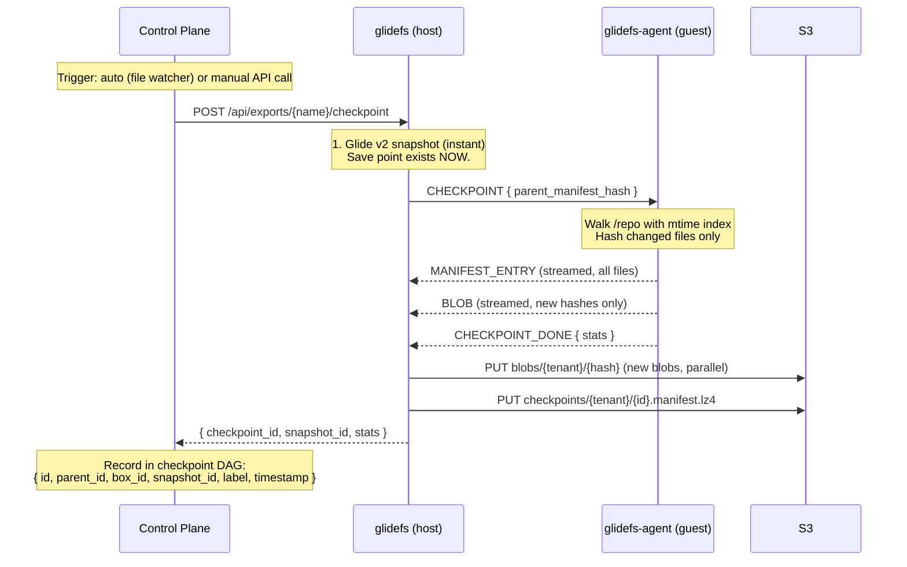
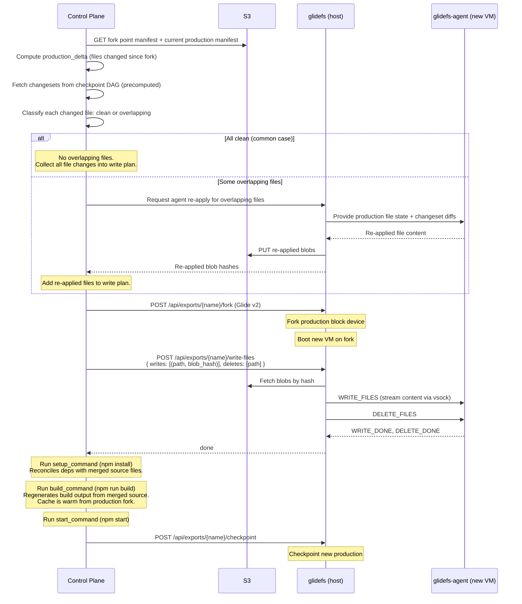

# Checkpoint Agent — File-Level Operations for Boxes

## Design Document — vsock Guest Agent + File Manifests + Stacked Merge

---

## Overview

A thin file-level layer on top of Glide v2 that gives Boxes version control semantics — automatic save points, file-level diffs, branching, and stacked merge for promotion. No git ceremony.

**Core insight: Glide v2 sees blocks, not files.** It can snapshot, fork, and restore a block device instantly — but it can't tell you which _files_ changed, or merge two developers' changes to the same codebase. A lightweight guest agent bridges this gap by giving glidefs file-level visibility through vsock.

**Why a guest agent:** glidefs runs on the host. The VM's filesystem (ext4) lives on the block device that glidefs serves via NBD. To see files, glidefs would need to parse ext4 from raw blocks — complex, brittle, and coupled to a specific filesystem. A small agent running inside the VM has native filesystem access through the kernel's VFS. It works with any filesystem, requires no parsing, and communicates over vsock (host↔guest virtio socket — fast, no network stack, no TCP overhead).

**What this enables:**

- **Auto-checkpoint**: Agent watches /repo, triggers checkpoints on change. No git add, no git commit. Invisible save points.
- **File-level diff**: Compare two checkpoints, see exactly which files changed and what changed in each one.
- **Stacked merge**: Promote a checkpoint to production without overwriting concurrent changes.
- **Selective restore**: Replace /repo from a checkpoint without touching the rest of the filesystem (OS, runtime, caches stay warm).
- **Branching**: Fork a VM (Glide v2), keep working independently, diff branches against their common ancestor.

**What this does NOT replace:** Glide v2 handles all block-level operations — snapshot, fork, sleep/wake, S3 portability, cache, compression, migration. This layer adds file-level awareness on top. If the agent isn't running, glidefs works fine — you just don't get file-level diff, merge, or auto-checkpoints.

---

## Benefits

**Git semantics without git ceremony.** Agents and developers get save points, branches, diffs, and merges without understanding staging, index, or commit workflows. Checkpoints happen automatically. Branching is just forking a VM.

**Instant save points.** The Glide v2 snapshot is the save point — taken in <1ms. The file manifest is built in the background. The agent never waits.

**Sub-second diff.** Comparing two checkpoints with ~5-10K source files takes <1ms (hash comparison). Fetching content for ~100 changed files takes 50-200ms. Total: well under a second for any realistic codebase.

**Safe concurrent development.** Two agents (or an agent and a developer) can fork from the same production, work independently, and both promote. Stacked merge decomposes each agent's work into its natural stack of small changesets (auto-checkpoints) and applies them individually — overlapping files are re-applied by the agent with full semantic understanding, not merged mechanically at the text level.

**Incremental everything.** After the first checkpoint (which hashes every file), subsequent checkpoints only hash changed files. The mtime index makes this O(changed files), not O(total files). Blob uploads are deduplicated — same content is never uploaded twice.

**No second storage system.** File blobs live in S3 alongside Glide v2 block data. Same bucket, same tenant isolation, same encryption. One more prefix, not one more system.

**Acceptable storage duplication.** File content in `/repo` exists twice in S3 — once inside Glide v2 block packs (as ext4 blocks), once in the blob store (as individual files). This is the cost of file-level visibility without parsing ext4 from raw blocks. The overhead is small: `/repo` is typically 200MB-2GB out of a 10-20GB block device, so blob duplication adds 2-10% to total storage. With content-addressed dedup across forks, the marginal cost per additional VM is near zero. The alternative — mounting `/repo` via virtio-fs backed by the blob store directly — eliminates duplication but adds filesystem-serving complexity and degrades write performance for I/O-heavy operations (npm install, builds). Not a worthwhile trade.

---

## Tradeoffs

**File manifest is a second consistency domain.** Glide v2 block-level snapshots and file-level manifests are independent. A snapshot without a manifest is valid (block-level operations work, file-level operations don't). A manifest without a snapshot is useless (no block data to back it). The snapshot is always taken first — the failure mode is always "have blocks, missing file metadata" — which is safe and recoverable.

**vsock requires a cooperating guest.** If the agent isn't running (or the guest kernel doesn't support vsock), file-level operations fail silently. Block-level operations are unaffected. This is acceptable — we control the base images and the agent is a tiny static binary.

**Agent re-apply requires the agent.** When both sides modify the same file, stacked merge delegates to the AI agent to re-apply its change on the new base. If the agent is unavailable (offline, timed out), the promotion blocks until the agent is ready. Fallback for human developers: show a unified diff for manual resolution. This is the exception — most promotions have no overlapping files and complete without agent involvement.

**No atomic multi-file restore.** Individual files are atomically replaced (write to temp, fsync, rename). But the restore as a whole is not atomic across files. A crash mid-restore leaves /repo in a mixed state. Mitigation: re-trigger restore (idempotent — same inputs, same result). For promotion, the VM isn't serving traffic until build succeeds, so partial state during restore is never user-visible.

**Flat manifests don't scale past ~500K files.** At ~5-10K source files (typical), manifest comparison is microseconds. At 500K files (large monorepo), it's milliseconds — still fine. If someone has millions of source files in /repo, add Merkle trees then. No one will.

---

## Architecture

```
┌──────────────────────────────────────────────────────────────┐
│  VM (guest)                                                   │
│                                                               │
│  ┌───────────────────────────┐   ┌──────────────────────────┐│
│  │  User workload            │   │  glidefs-agent           ││
│  │  (app, build, AI agent)   │   │                          ││
│  │                           │   │  • fanotify on /repo     ││
│  │  reads/writes /repo       │   │  • file walk + hash      ││
│  │  normally                 │   │  • file write (restore)  ││
│  └───────────────────────────┘   │  • vsock connection      ││
│           │                      └─────────────┬────────────┘│
│           │ normal file I/O                    │ vsock        │
│           ▼                                    │              │
│  ┌────────────────────────────────────────────────────────┐  │
│  │  ext4 filesystem (/dev/vda)                            │  │
│  └────────────────────────────────────────────────────────┘  │
│           │ block I/O                                        │
├───────────┼──────────────────────────────────────────────────┤
│  Host     │                                    │              │
│           ▼                                    ▼              │
│  ┌────────────────────────────────────────────────────────┐  │
│  │  glidefs daemon                                        │  │
│  │                                                        │  │
│  │  Block-level (Glide v2):     File-level (this doc):    │  │
│  │  • snapshot / fork           • vsock server             │  │
│  │  • S3 packs + manifests      • checkpoint coordinator  │  │
│  │  • cache, WAL, compression   • blob upload to S3       │  │
│  │  • flush scheduler           • write-blobs-to-VM       │  │
│  │  • sleep / wake / migrate      (fetch S3 → agent)      │  │
│  └────────────────────────────────────────────────────────┘  │
│           │                                                   │
│           ▼                                                   │
│  ┌────────────────────────────────────────────────────────┐  │
│  │  S3                                                    │  │
│  │                                                        │  │
│  │  packs/...          (Glide v2 — block data)            │  │
│  │  manifests/...      (Glide v2 — block maps)            │  │
│  │  checkpoints/...    (this doc — file manifests)        │  │
│  │  blobs/...          (this doc — file content)          │  │
│  └────────────────────────────────────────────────────────┘  │
│                                                               │
│  ┌────────────────────────────────────────────────────────┐  │
│  │  Control Plane                                         │  │
│  │                                                        │  │
│  │  • Checkpoint DAG (database or S3 metadata)            │  │
│  │  • Diff engine (fetch manifests + blobs, unified diff) │  │
│  │  • Merge engine (stacked merge, agent re-apply)        │  │
│  │  • Promotion orchestration                             │  │
│  │  • Auto-checkpoint scheduling                          │  │
│  └────────────────────────────────────────────────────────┘  │
└──────────────────────────────────────────────────────────────┘
```

**Separation of concerns:**

- **glidefs-agent** (guest): file I/O only. Walks filesystem, hashes files, writes files, reports changes. No storage logic, no S3 access, no merge logic, no policy decisions.
- **glidefs daemon** (host): block storage + vsock bridge. Handles block-level operations (Glide v2), coordinates with the agent over vsock, uploads blob content to S3 on checkpoint, and executes file write plans by fetching blobs from S3 and streaming them to the agent. Does NOT compute diffs, merges, or manage the checkpoint DAG.
- **Control plane** (separate service): file-level intelligence. Manages the checkpoint DAG, computes diffs and stacked merges, orchestrates promotions, decides when to auto-checkpoint. Sends write plans to glidefs for execution.

---

## File Manifest

The manifest is a flat map of every file in the checkpointed directory (default: `/repo`).

```json
{
  "src/main.rs": { "hash": "blake3:2b4c...", "size": 2048, "mode": "0644" },
  "src/lib.rs": { "hash": "blake3:9e1d...", "size": 512, "mode": "0644" },
  "package.json": { "hash": "blake3:7f3a...", "size": 1024, "mode": "0644" },
  "scripts/deploy.sh": {
    "hash": "blake3:cd34...",
    "size": 256,
    "mode": "0755"
  },
  "assets/logo.png": { "hash": "blake3:ef56...", "size": 8192, "mode": "0644" }
}
```

**Per-entry fields:**

| Field    | Description                                                             |
| -------- | ----------------------------------------------------------------------- |
| **path** | Relative to checkpoint root (/repo). Forward slashes, no leading slash. |
| **hash** | BLAKE3-128 of raw file content. 16 bytes, hex-encoded.                  |
| **size** | File size in bytes.                                                     |
| **mode** | Permission bits (0777 mask, octal string).                              |

**What's NOT recorded:**

- Ownership (uid/gid) — VM-specific, not meaningful across VMs.
- Timestamps (mtime/atime/ctime) — not meaningful across restore.
- Extended attributes, ACLs — defer until needed.
- Empty directories — like git, only track files. A directory exists if it contains files.

**Symlinks:** Recorded as a special entry. The hash is BLAKE3-128 of the symlink target path (not the target's content). Symlinks are never followed during walk — prevents infinite loops and inclusion of content outside /repo. Broken symlinks (target doesn't exist) are recorded normally — the target path is the content, existence doesn't matter. Symlinks pointing outside `/repo` are recorded as-is — the target path is stored verbatim. On restore, the symlink is recreated with the same target. If that target doesn't exist on the new VM, the symlink is broken — same as it would be in git.

### Hash Choice: BLAKE3-128

Same hash as Glide v2 block addressing. 128-bit truncation of BLAKE3.

- **Birthday bound: ~2^64.** At 128KB per block, that's ~2 exabytes of unique data before collision probability reaches 50%. At any realistic per-tenant scale (<1 PB), the probability is ~10^-21. Not a concern.
- **Consistent with Glide v2.** Same hash, same size, same code path. One hash function across the entire system.
- **Fast.** BLAKE3 is ~3-4x faster than SHA-256. ~5μs for 128KB.
- **16 bytes per entry.** Keeps manifests compact.

### Why Flat (Not a Merkle Tree)

A Merkle tree gives O(changes) diff by skipping shared subtrees. But /repo typically has ~5-10K source files (after `.checkpointignore` excludes deps/build output). Comparing two flat manifests by hash is microseconds. The Merkle tree adds tree objects, recursive hashing, tree deduplication, and tree-aware GC — real implementation complexity — for a performance improvement that doesn't matter at this scale.

If /repo grows to millions of files, add Merkle trees then. The manifest format can evolve without changing the agent protocol or the checkpoint model.

### Manifest Size

| Repo size         | Files   | Manifest (uncompressed) | Manifest (LZ4) |
| ----------------- | ------- | ----------------------- | -------------- |
| Small (web app)   | 500     | ~60KB                   | ~30KB          |
| Medium (monolith) | 5,000   | ~600KB                  | ~300KB         |
| Large (monorepo)  | 50,000  | ~6MB                    | ~3MB           |
| Typical app       | 5-10K   | ~1.2MB                  | ~600KB         |
| Huge              | 500,000 | ~60MB                   | ~30MB          |

Manifests are serialized as MessagePack + LZ4. Same serialization as the vsock protocol (`rmp-serde`) — zero additional dependencies. Faster to parse than JSON, and smaller on the wire. Nobody reads raw manifests out of S3 anyway (they're LZ4-compressed).

Each checkpoint has one file in S3:

```
checkpoints/{tenant}/{id}.manifest.lz4    ← file manifest (MessagePack + LZ4)
```

### Checkpoint DAG

The DAG tracks parent pointers, labels, timestamps, and changesets for every checkpoint. It's how the system finds fork points for stacked merge, walks history for diff, and retrieves precomputed changesets at promotion time.

Each checkpoint record:

```
id:                     "chk_0042"
parent_id:              "chk_0041"
box_id:                 "preview-abc"
snapshot_id:            "glide-snap-0042"
source_checkpoint_id:   "chk_P0"          ← production checkpoint this preview forked from
label:                  "before-migration"
timestamp:              "2026-02-11T15:04:05Z"
changeset:              ["src/main.rs"]    ← files changed vs parent (precomputed for stacked merge)
```

**Where to store it depends on the control plane:**

If the control plane already has a database (likely — it manages tenants, boxes, deployments), the checkpoint DAG belongs there. A `checkpoints` table with a recursive CTE walks any ancestor chain in milliseconds regardless of depth. Retention compaction is a single `UPDATE` to re-point children. This is exactly the kind of structured pointer-following query that databases are good at.

If the control plane is genuinely stateless, store the DAG as `.meta.json` sidecar files next to each manifest in S3 (same pattern as git commit objects). This works but has real costs: ancestor discovery is O(depth) sequential S3 GETs at 10-50ms each, and compaction requires read-modify-write of children's metadata files. Acceptable for shallow chains, painful for long ones.

**Recommendation: use the control plane's database.** The DAG is small (thousands of records), relational, and queried on every merge. It's not worth optimizing for the no-database case when the control plane almost certainly has one.

---

## Blob Store

File content is stored content-addressed in S3:

```
blobs/{tenant}/{hash[0:2]}/{hash[2:4]}/{hash}
```

Sharded by first four hex characters of hash (256 x 256 = 65K prefix buckets) to avoid S3 LIST performance degradation on large flat prefixes.

**Properties:**

- **Write-once.** Same content → same hash → same key. PUT is idempotent. Blobs are never modified.
- **Tenant-isolated.** Same isolation model as Glide v2 tenant packs. No cross-tenant blob access.
- **Compressed.** LZ4 before upload (consistent with Glide v2). Decompress on read. Hash is always of raw content — hash before compress.
- **No packing.** Unlike Glide v2's pack files (25 fixed-size blocks per pack), file blobs are stored individually. Files range from bytes to megabytes — fixed-size batching doesn't help. Simpler to implement, simpler to GC, simpler to fetch individual files for diff.

**Deduplication:**

Content-addressing means ten preview VMs of the same app share 100% of their source blobs. Only genuinely unique files (an agent's code edits) add storage. Dependencies (`node_modules`, build output) are handled by the block layer — GlideFS deduplicates them across forks at the block level.

| Scenario                                   | Unique blobs          | S3 storage    |
| ------------------------------------------ | --------------------- | ------------- |
| Single app, ~5K source files, ~50MB total  | ~5,000                | ~30MB (LZ4)   |
| Same app, 100 checkpoints, ~10% file churn | ~5K base + ~5K deltas | ~35MB total   |
| 10 preview VMs forked from same production | ~0 additional         | ~0 additional |

### Blob GC

Same event-driven refcount pattern as Glide v2 pack GC — O(1) per lifecycle event, not O(N manifests).

**Primary: refcounts in the control plane DB.** Each blob hash has a reference count, updated transactionally with checkpoint manifest writes and retention compaction deletes. Blob with refcount 0 + grace period → delete.

- **Checkpoint write:** increment refcount for new blob hashes.
- **Manifest delete (retention compaction):** decrement refcount for hashes unique to the deleted manifest.
- **Refcount → 0:** enqueue blob for deletion after 24-hour grace period.

**Safety net: monthly mark-and-sweep reconciliation.** Walk all live checkpoint manifests, compare against blob refcounts in DB, correct any drift. Same pattern as Glide v2.

The 24-hour grace period (matching Glide v2) protects against races: a checkpoint in progress has uploaded blobs but hasn't written its manifest yet. Grace periods are sized for the unhappy path — interrupted uploads, retried checkpoints, crash recovery, network partitions. A checkpoint takes <500ms end-to-end in the happy case, but 24 hours covers everything that can go wrong with margin to spare.

---

## vsock Protocol

Communication between glidefs (host) and glidefs-agent (guest) over virtio-vsock.

### Connection

| Property       | Value                                                                |
| -------------- | -------------------------------------------------------------------- |
| **Transport**  | AF_VSOCK, SOCK_STREAM                                                |
| **Guest CID**  | Assigned by Firecracker at VM creation (known to glidefs)            |
| **Agent port** | 10842 (fixed)                                                        |
| **Direction**  | Host-initiated (glidefs connects to agent)                           |
| **Reconnect**  | glidefs retries on connection failure (agent may not be started yet) |

### Framing

```
Each message:
  ┌──────────────┬──────────┬──────────────────┐
  │ length: u32  │ type: u8 │ payload: [u8]    │
  │ (big-endian) │          │ (MessagePack)    │
  └──────────────┴──────────┴──────────────────┘
  length = size of (type + payload). Does not include the length field itself.
```

MessagePack for the payload — compact binary, fast to encode/decode, libraries in every language. Not JSON (too verbose for streaming file content). Not protobuf (overkill for a two-party local protocol).

### Messages

**Host → Agent:**

| Type | Name         | Payload                           | Description                       |
| ---- | ------------ | --------------------------------- | --------------------------------- |
| 0x01 | CHECKPOINT   | `{ parent_manifest_hash }`        | Request file manifest + new blobs |
| 0x02 | WRITE_FILES  | stream of `(path, mode, content)` | Write files to /repo              |
| 0x03 | DELETE_FILES | `{ paths: [string] }`             | Delete files from /repo           |
| 0x04 | READ_FILES   | `{ paths: [string] }`             | Read specific file contents       |
| 0x05 | PING         | `{}`                              | Health check                      |

**Agent → Host:**

| Type | Name            | Payload                                  | Description                              |
| ---- | --------------- | ---------------------------------------- | ---------------------------------------- |
| 0x81 | MANIFEST_ENTRY  | `(path, hash, size, mode)`               | One file entry (streamed)                |
| 0x82 | BLOB            | `(hash, content)`                        | File content for a new blob              |
| 0x83 | CHECKPOINT_DONE | `{ total_files, new_blobs, elapsed_ms }` | End of checkpoint stream                 |
| 0x84 | WRITE_DONE      | `{ written, errors: [(path, error)] }`   | Write result                             |
| 0x85 | DELETE_DONE     | `{ deleted, errors: [(path, error)] }`   | Delete result                            |
| 0x86 | FILE_CONTENT    | `(path, content)`                        | Requested file content                   |
| 0x87 | FILE_CHANGED    | `{ }`                                    | Notification: something changed in /repo |
| 0x88 | PONG            | `{ uptime_ms }`                          | Health response                          |
| 0xFF | ERROR           | `{ code, message }`                      | Error response                           |

### Checkpoint Protocol Flow

```
glidefs (host)                          glidefs-agent (guest)
     │                                       │
     │  CHECKPOINT { parent_manifest_hash }   │
     ├──────────────────────────────────────►│
     │                                       │
     │                                       │ 1. Load mtime index
     │                                       │ 2. Walk /repo (skip .gitignore + .checkpointignore)
     │                                       │ 3. For each file:
     │                                       │    stat() → compare to mtime index
     │                                       │    unchanged? reuse cached hash
     │                                       │    changed? read + hash + update index
     │                                       │ 4. Load parent manifest (if cached locally)
     │                                       │
     │       MANIFEST_ENTRY (path, hash, ..) │
     │◄──────────────────────────────────────┤  (one per file, streamed)
     │       MANIFEST_ENTRY ...              │
     │◄──────────────────────────────────────┤
     │       ...                             │
     │                                       │
     │       BLOB (hash, content)            │  (only hashes NOT in parent manifest)
     │◄──────────────────────────────────────┤
     │       BLOB ...                        │
     │◄──────────────────────────────────────┤
     │                                       │
     │       CHECKPOINT_DONE { stats }       │
     │◄──────────────────────────────────────┤
     │                                       │
```

The agent sends the **full manifest** (all source files, not just changes) so the host has a self-contained snapshot. But it only sends **blob content for new hashes** — files whose hash differs from the parent manifest. For a typical checkpoint with ~100 changed files out of ~5-10K source files, this means ~5-10K small manifest entries (~1MB over vsock at >1 GB/s = ~1ms) plus ~100 blob payloads (~1MB).

### Restore Protocol Flow

```
glidefs (host)                          glidefs-agent (guest)
     │                                       │
     │  WRITE_FILES                          │
     │  (path: "src/main.rs",               │
     │   mode: "0644",                       │
     │   content: <bytes>)                   │
     ├──────────────────────────────────────►│
     │  (path: "src/lib.rs", ...)            │  Agent writes each file:
     ├──────────────────────────────────────►│    write to {path}.tmp
     │  ...                                  │    fsync
     │                                       │    chmod
     │  DELETE_FILES                          │    rename to {path}
     │  { paths: ["old_file.rs"] }           │
     ├──────────────────────────────────────►│
     │                                       │
     │       WRITE_DONE { written: 42 }      │
     │◄──────────────────────────────────────┤
     │       DELETE_DONE { deleted: 1 }      │
     │◄──────────────────────────────────────┤
     │                                       │
```

glidefs receives a write plan from the control plane, fetches blobs from S3 by hash, and streams the file content to the agent. The agent applies them with atomic per-file replacement (write to temp, fsync, rename).

### FILE_CHANGED Notifications

```
glidefs-agent (guest)                   glidefs (host)
     │                                       │
     │ (fanotify: FAN_CLOSE_WRITE in /repo)  │
     │                                       │
     │  FILE_CHANGED { }                     │
     ├──────────────────────────────────────►│
     │                                       │ Debounce timer resets
     │                                       │ (5s after last change,
     │                                       │  or 5min max interval)
     │                                       │
```

The notification is intentionally content-free — just "something changed." The host doesn't need to know what changed until it triggers a checkpoint. But internally, the agent maintains a **dirty set** of paths from fanotify events. When a checkpoint triggers, the agent hashes only dirty paths instead of stat-walking everything (see Incremental Hashing). fanotify with `FAN_UNLIMITED_QUEUE` doesn't overflow — the dirty set is always complete. The full stat walk fallback is only needed after agent restart (dirty set lost in memory).

---

## Incremental Hashing (mtime Index)

Hashing every file on every checkpoint is wasteful. The agent maintains a local index to skip unchanged files.

```
Index entry per file:
  path:       src/main.rs
  mtime_ns:   1704672000000000000    (nanosecond precision)
  size:       2048
  inode:      12345
  blob_hash:  blake3:2b4c...
```

**On checkpoint (fast path — dirty set available):**

Between checkpoints, fanotify `FAN_CLOSE_WRITE` events accumulate a dirty set of paths that changed. When a checkpoint triggers:

1. For each path in the dirty set: read file, hash it, update index entry
2. For paths NOT in the dirty set: reuse cached hash from the index (no stat, no read, no hash)
3. Walk /repo for the full manifest (all paths), but only hash dirty paths

**On checkpoint (fallback — full walk):**

Used on first checkpoint or after agent restart (dirty set lost):

1. Walk /repo (respecting .gitignore + .checkpointignore)
2. For each file, `stat()` to get (mtime, size, inode)
3. If all three match index entry → reuse cached hash (no read, no hash)
4. If any differ or entry missing → read file, hash it, update index entry

**First checkpoint:** O(total bytes) — hash everything.
**Subsequent checkpoints (fast path):** O(changed files) for both stat and hash — fanotify tells you exactly what's dirty.
**Subsequent checkpoints (fallback):** O(total files) for stat, O(changed bytes) for hash — mtime index skips unchanged files.

The three-field comparison (mtime + size + inode) is the same approach git uses for its index. A file that changes content while keeping the same mtime, size, AND inode number is astronomically unlikely. If paranoia is needed, add a `--full-hash` flag that ignores the index and hashes everything.

**Index location:** `/var/lib/glidefs-agent/index.bin` inside the VM. Binary format (not human-readable) for fast load. If missing or corrupt, the next checkpoint rebuilds it by hashing everything — slower once, then back to incremental.

---

## File Filtering

File-level checkpoints store what git tracks. The boundary between the two layers is `.gitignore` — which every repo already has, every developer already understands, and which already excludes exactly the right things (deps, build output, caches).

```
┌─────────────────────────────────────────────────────────────────────┐
│  All files in /repo                                                  │
│                                                                      │
│  ┌───────────────────────────────────────────────────────────────┐  │
│  │  Checkpointed (stored in manifest + blob store)               │  │
│  │  = what git would track                                       │  │
│  │  = NOT matched by .gitignore, .checkpointignore, or hardcoded │  │
│  │                                                               │  │
│  │  src/main.rs, package.json, Makefile, etc.                    │  │
│  └───────────────────────────────────────────────────────────────┘  │
│                                                                      │
│  Block layer only (not in file-level checkpoints)                    │
│  = matched by .gitignore                                             │
│                                                                      │
│  node_modules/, dist/, .next/, build/, vendor/, target/              │
│                                                                      │
│  Additional exclusions (.checkpointignore)                           │
│  .env.local, *.log, __pycache__/, .idea/, coverage/                  │
│                                                                      │
│  Hardcoded exclusions (never stored)                                 │
│  .git/, *.sock, *.pid                                                │
└─────────────────────────────────────────────────────────────────────┘
```

| Filter                  | Controls | Purpose                                                                                                                                                    | Who reads it |
| ----------------------- | -------- | ---------------------------------------------------------------------------------------------------------------------------------------------------------- | ------------ |
| **`.gitignore`**        | Storage  | Primary filter. Already excludes deps, build output, caches. Already exists in every repo. The file-level checkpoint stores what git tracks.               | Agent        |
| **`.checkpointignore`** | Storage  | Additive exclusions on top of `.gitignore`. Secrets, logs, IDE state, machine-specific caches — things that might be in git but shouldn't be checkpointed. | Agent        |
| **Hardcoded**           | Storage  | Always excluded, can't override. `.git/`, `*.sock`, `*.pid`.                                                                                               | Agent        |

### Why `.gitignore` is the right boundary

`.gitignore` already defines "source files vs everything else" in every repo. `node_modules/`, `dist/`, `.next/`, `build/`, `vendor/`, `target/` — all excluded by `.gitignore`. The block layer (GlideFS) handles these at the block level, deduplicating them across forks. Duplicating that at the file level stores the same information twice for zero benefit.

Since file-level checkpoints contain only what git tracks, every checkpointed file is meaningful. No display filtering needed — diffs and merges operate on everything in the manifest.

**`.gitignore` edge cases:**

- **No `.gitignore` present:** Checkpoint everything (minus hardcoded and `.checkpointignore`). Safe — just more files. The common case (most repos have a `.gitignore`) is well-scoped.
- **Nested `.gitignore` files:** Full gitignore semantics. Use the `ignore` crate (from ripgrep) — it handles nested files, negation, directory-only patterns. Don't hand-roll this.

### .checkpointignore

Additive exclusions on top of `.gitignore`. Gitignore-compatible syntax. For things that git tracks but shouldn't be in file-level checkpoints.

```
# .checkpointignore

# Secrets (may not be in .gitignore)
.env.local
.env*.local

# OS junk
.DS_Store
Thumbs.db

# Logs and temp
*.log
/tmp/

# IDE state (machine-specific)
.idea/
.vscode/settings.json
*.swp
*.swo

# Language caches
__pycache__/
*.pyc
.pytest_cache/
.turbo/
coverage/
```

If `.checkpointignore` doesn't exist, the agent generates a default one on first checkpoint with the patterns above. If it exists, it's the source of truth — the agent doesn't add defaults.

---

## Checkpoint Flow (End-to-End)



**Timing for a typical checkpoint (~5-10K source files, 100 changed):**

| Step                                         | Fast path (dirty set) | Fallback (full walk)             |
| -------------------------------------------- | --------------------- | -------------------------------- |
| Glide v2 snapshot                            | <1ms                  | <1ms                             |
| Agent identifies changed files               | <1ms (dirty set)      | 10-50ms (stat walk source files) |
| Agent hash changed files (100 files, ~1MB)   | 5-20ms                | 5-20ms                           |
| Agent walk for full manifest (paths only)    | 20-50ms               | (already done)                   |
| vsock transfer (full manifest + new blobs)   | 10-50ms               | 10-50ms                          |
| S3 uploads (manifest + ~100 blobs, parallel) | 50-200ms              | 50-200ms                         |
| **Total**                                    | **~90-320ms**         | **~120-470ms**                   |

The Glide v2 snapshot is the save point. Everything after is metadata enrichment that happens in the background — the agent (or developer) never waits. If the host dies between the snapshot and the manifest upload, the block-level snapshot exists and the file manifest can be rebuilt by triggering a full checkpoint on the recovered VM.

---

## Diff

Comparing two checkpoints at the file level. Computed by the control plane.

### Algorithm

Manifests contain only source files (see File Filtering), so diffs are clean by default — no filtering needed.

1. Fetch manifest A and manifest B from S3
2. For each path in the union of both manifests:
   - Present in A only → deleted
   - Present in B only → added
   - Present in both, same hash → unchanged (skip)
   - Present in both, different hash → modified
3. For modified files: fetch both blob versions from S3, generate unified diff

### Output

```json
{
  "base": "chk_001",
  "target": "chk_002",
  "added": [
    { "path": "src/new_feature.rs", "size": 1024 }
  ],
  "deleted": [
    { "path": "src/deprecated.rs" }
  ],
  "modified": [
    {
      "path": "src/main.rs",
      "diff": "@@ -10,3 +10,5 @@\n fn main() {\n-    println!(\"hello\");\n+    println!(\"hello world\");\n+    run_server();\n }"
    }
  ],
  "stats": {
    "added": 1,
    "deleted": 1,
    "modified": 1,
    "unchanged": 4997
  }
}
```

Every file in the diff is meaningful — no filtering layer needed because `.checkpointignore` already excluded deps and build output at checkpoint time.

### Performance

| Step                                                             | Latency        |
| ---------------------------------------------------------------- | -------------- |
| Fetch 2 manifests from S3                                        | 20-50ms        |
| Compare manifests (~5-10K source files)                          | <1ms           |
| Fetch blob pairs for modified source files (100 files, parallel) | 50-200ms       |
| Generate unified diffs                                           | 10-50ms        |
| **Total**                                                        | **~100-300ms** |

The expensive part (blob fetch + diff generation) only runs on files that actually changed. Since manifests contain only source files, there's no wasted work.

**Binary file detection:** If a blob contains null bytes in the first 8KB, treat as binary. Show "Binary file changed (8192 → 8448 bytes)" instead of a unified diff.

---

## Stacked Merge

The merge strategy for concurrent promotion. Instead of three-way content merge (diff3), decompose the agent's work into its natural stack of small changesets — one per auto-checkpoint — and apply each one individually. Overlapping files are resolved by the agent re-applying its intent, not by algorithmic text merging.

### Why It's Needed

```
Timeline:
  T0: Production is at checkpoint P0
  T1: Agent A forks production, starts working
  T2: Agent B forks production, starts working
  T3: Agent A promotes → production is now P1 (includes A's changes)
  T4: Agent B wants to promote

  Without merge:
    Fork P1 + replace /repo with B's final checkpoint → A's changes are lost.

  With stacked merge:
    Decompose B's work into individual changesets (one per auto-checkpoint).
    Apply each changeset to P1.
    Overlapping files → agent re-applies that one small change.
    → A's changes preserved, B's changes applied, no conflicts.
```

### The Stack

Auto-checkpoints already capture a natural stack of small changesets. Each checkpoint records a few files changed in a ~5-second window. An agent working for 2 hours produces ~400 checkpoints.

```
Agent B's checkpoint chain (forked from P0):

  P0 → chk_1 → chk_2 → chk_3 → chk_4 → chk_5
       (Δ1)    (Δ2)    (Δ3)    (Δ4)    (Δ5)

Changesets (diff between consecutive checkpoints):
  Δ1 = chk_1 − P0      added package.json dependency         (1 file)
  Δ2 = chk_2 − chk_1   added src/feature.rs, modified lib.rs (2 files)
  Δ3 = chk_3 − chk_2   modified src/main.rs                  (1 file)
  Δ4 = chk_4 − chk_3   modified src/main.rs                  (1 file)
  Δ5 = chk_5 − chk_4   added tests/feature_test.rs           (1 file)
```

A changeset is computed trivially: compare manifest N to manifest N-1. Different hash → modified. Present in N but not N-1 → added. Present in N-1 but not N → deleted. Changesets are small (typically 1-5 files), so they're recorded in the checkpoint DAG record at checkpoint time — no need to re-derive them at merge time.

### Production Delta

Before applying the stack, compute what production changed since the agent forked:

```
production_delta = diff(P0_manifest, P1_manifest)
  → { modified: ["src/main.rs", "src/config.rs"], added: [...], deleted: [...] }
```

Single manifest comparison — O(F), cached by the control plane.

### Merge Algorithm

For each changeset Δ_i in order, for each file in Δ_i:

```
File in Δ_i?   File in production_delta?   Action
───────────    ────────────────────────    ─────────────────────────
YES            NO                          Apply Δ_i's version. Clean.
NO             —                           (not in changeset, skip)
YES            YES                         Overlap → agent re-applies Δ_i.
```

That's it. No diff3. No conflict markers. No per-path merge strategies.

The question per file is: **did production also change this file since the fork?** If no → apply the changeset's version. If yes → the agent re-applies that one small change.

**Why stacking matters:** A changeset that touches `src/main.rs` in a ~5-second window is a few lines of change. An agent can re-apply a few lines of intent trivially. A monolithic diff that accumulates 2 hours of changes to `src/main.rs` is much harder to reason about and re-apply correctly.

**Write plan construction:** Process the stack from last to first. For each file, keep the latest version. If a file appears in multiple changesets (e.g., `src/main.rs` in Δ3 and Δ4) and doesn't overlap with production, use the final checkpoint's version directly — no need to replay intermediate states. Only overlapping files need changeset-level granularity.

### Merge Scope: Source Files Only

Merges only operate on source files — which is everything in the manifest, since `.checkpointignore` already excluded deps and build output at checkpoint time. Dependencies and build artifacts live on the production fork's block device (COW clone), untouched by the merge. After the write plan applies source changes, `setup_command` + `build_command` regenerate everything else.

### Agent Re-Apply

When a changeset overlaps with production (same file modified by both sides), the agent re-applies that single changeset's intent on the current base.

**What the agent receives:**

1. The current state of the overlapping files (production's version)
2. The changeset diff (what the agent changed — typically a few lines)
3. The surrounding codebase context

**Why this works:** The changeset is tiny — 1-3 files from a ~5-second window. Re-applying a small, specific change is trivial for an AI agent. The agent understands _what it was trying to do_ and applies it to whatever the file looks like now. If production refactored the function the agent was editing, the agent applies its change to the refactored version correctly — something line-level merge algorithms cannot do.

**Why it's better than diff3:**

|                       | diff3 (git-style)                                 | Agent re-apply                        |
| --------------------- | ------------------------------------------------- | ------------------------------------- |
| **Granularity**       | Line-level text matching                          | Semantic understanding                |
| **Handles refactors** | Conflict (lines moved)                            | Clean (intent preserved)              |
| **Structured files**  | False conflicts (JSON, YAML)                      | Correct merge (understands structure) |
| **Result quality**    | Syntactically merged, possibly semantically wrong | Semantically correct (agent verifies) |
| **Speed**             | Milliseconds                                      | Seconds                               |
| **Requires agent**    | No                                                | Yes                                   |

**Fallback (no agent available):** If a human developer is promoting manually and there are overlapping files, show a unified diff for manual resolution. This is the traditional workflow — less common on a platform built for AI agents.

### Finding the Fork Point

Every preview VM records `source_checkpoint_id` — the production checkpoint it forked from. This is the base for computing `production_delta`.

```
P0 ── P1 (Agent A promoted)              ← production chain
 └─── chk_1 ── chk_2 ── chk_3           ← Agent B's chain
       fork point = P0
```

With a database, finding the fork point is a single indexed lookup — milliseconds.

### Stacked Merge + Rebuild Flow (End-to-End)

The control plane decomposes the agent's work, classifies files, and produces a write plan. glidefs executes it.



**The common path (no overlapping files) requires zero agent involvement.** The control plane computes the write plan from manifests and precomputed changesets alone. Only when the same file was modified by both the agent and a concurrent promotion does the agent get involved — and even then, it's re-applying a tiny changeset, not merging hours of work.

**The key split:** The control plane decides _what_ to write (changeset classification + write plan). glidefs decides _how_ to write it (fetch from S3, stream to agent via vsock). glidefs receives a write plan — a list of `(path, blob_hash)` pairs — and doesn't know or care that it came from a merge. It's just "put these blobs at these paths."

**Why the build step matters:** The merge only touches source files. Dependencies and build output are left from the production fork. `setup_command` (`npm install`) sees the merged `package.json` and installs any new dependencies. `build_command` compiles from the merged source. This is the same build pipeline as any promotion — the merge just changes which source files land before the build runs.

### Build Failure

The most common real-world failure isn't overlapping files — it's a clean merge that produces semantically broken code. Two agents both add different versions of the same dependency. The file-level merge applies both changes cleanly (they edited different files), but `npm install` chokes on the conflicting version constraints. Or the merged source compiles but crashes at runtime.

**The rule: nothing changes until everything succeeds.** The promote flow operates on a fresh fork of production, not on production itself. If any step fails — `setup_command`, `build_command`, `start_command`, or health check — the fork is killed. Production is untouched. The caller gets an error with the build output:

```json
{
  "result": "build_failed",
  "failed_step": "setup_command",
  "command": "npm install",
  "exit_code": 1,
  "output": "npm ERR! ERESOLVE unable to resolve dependency tree\nnpm ERR! Found: react@17.0.2\nnpm ERR! Could not resolve dependency: react@^18.0.0",
  "recovery": "Fork killed. Production unchanged."
}
```

**The promotion is atomic from the outside.** Either the full pipeline succeeds (apply changesets + install + build + start + health check → swap traffic to new VM → checkpoint) or nothing happens. The fork is a scratch space. This is the same atomicity guarantee as a normal (non-merge) promotion — the merge just adds one more step that can fail before the point of no return.

### Prerequisites

For stacked merge to work, the system must maintain:

1. **Checkpoint chain retained for active previews.** The full chain from fork point to promotion checkpoint must exist — retention compaction must not collapse intermediate checkpoints while the preview VM is live. After promotion or VM death, the chain can be compacted normally. If the chain has been partially compacted (VM idle for weeks), fall back to a coarser stack — fewer, larger changesets. Still works, just less granular for overlap resolution.

2. **Production checkpointed after each promotion.** The production manifest is needed to compute `production_delta`. The final step in the flow above ensures every promotion creates a checkpoint.

3. **Source checkpoint tracked on fork.** When creating a preview, the control plane records `source_checkpoint_id` — the production checkpoint the preview was forked from. This is the base for `production_delta`.

4. **Fork point manifest retained.** If B forked from P0 three weeks ago, P0's manifest must still exist when B promotes. Retention policy: keep any manifest that is a source checkpoint of a live VM. GC skips it.

### When Merge Is NOT Needed

If the checkpoint being promoted is a direct descendant of current production (no concurrent changes happened), it's a straight restore — no merge required. The control plane detects this:

```
production_delta is empty? (no changes since fork)
  YES → simple restore (apply final checkpoint, no merge)
  NO  → stacked merge
```

This is the common case for solo developers or sequential promotions. Stacked merge only kicks in when there's been concurrent work.

---

## Restore

Replacing /repo on a VM with a checkpoint's file state.

### Full Restore (Rollback)

Used when restoring to a completely different checkpoint (e.g., rollback to yesterday):

1. Control plane fetches the target manifest and current VM's manifest from S3
2. Computes diff: files to write, files to delete
3. Sends write plan to glidefs: `{ writes: [(path, blob_hash)], deletes: [path] }`
4. glidefs fetches blob content from S3 by hash
5. glidefs streams WRITE_FILES + DELETE_FILES to agent via vsock
6. Agent applies atomically per-file (temp → fsync → rename)

### Selective Restore (Promotion)

For promotion: fork production (Glide v2, full block device), then restore /repo from the checkpoint or merge result. OS, runtime, system packages, and caches from production remain untouched.

This is the default behavior — the manifest only covers /repo, so restore naturally only affects /repo.

### Restore vs Block-Level Restore

Both options exist and serve different purposes:

|                    | File-level restore (this doc)    | Block-level restore (Glide v2)  |
| ------------------ | -------------------------------- | ------------------------------- |
| **Scope**          | /repo only                       | Entire block device             |
| **Use case**       | Promotion, selective rollback    | Full VM rollback to exact state |
| **OS/runtime**     | Untouched (from production fork) | Restored to snapshot state      |
| **Speed**          | Proportional to changed files    | Instant (swap block map)        |
| **Merge possible** | Yes (stacked merge)              | No (whole-disk replacement)     |

---

## Auto-Checkpoint

### Agent Side (File Watching)

```
1. Set up fanotify on /repo filesystem
   Single mark: FAN_CLOSE_WRITE | FAN_CREATE | FAN_DELETE | FAN_MOVED_FROM | FAN_MOVED_TO
   FAN_UNLIMITED_QUEUE — never overflows (requires CAP_SYS_ADMIN, agent has it)
   Filter events to /repo prefix in userspace, respect .gitignore + .checkpointignore

2. On any event:
   Buffer for 500ms (coalesce rapid edits)
   Send FILE_CHANGED to glidefs via vsock
```

### Host Side (Relay)

glidefs relays FILE_CHANGED notifications from the agent to the control plane. glidefs does NOT make scheduling decisions — it just forwards the signal.

### Control Plane Side (Scheduling)

```
On FILE_CHANGED notification (relayed by glidefs):
  1. Reset debounce timer to 5 seconds
  2. If max interval (5 minutes) has elapsed since last checkpoint:
     trigger immediately
  3. When debounce timer fires:
     tell glidefs to trigger checkpoint (block snapshot + file manifest)
  4. Rate limit: max 60 checkpoints per hour per export
```

**Label convention:** Auto-checkpoints are labeled `auto-{timestamp}`. Manual checkpoints get user-provided labels.

### Checkpoint Retention

At 60 checkpoints/hour, an active AI agent produces 400+ checkpoints in a workday. Times N preview VMs. Without a retention policy, manifests and blobs accumulate without bound.

**Default policy (per export):**

| Age                               | Retention                                           |
| --------------------------------- | --------------------------------------------------- |
| Last 1 hour                       | Keep all (full resolution)                          |
| 1-24 hours                        | Keep 1 per 10 minutes (compact)                     |
| 1-7 days                          | Keep 1 per hour                                     |
| 7+ days                           | Keep 1 per day                                      |
| Labeled (user-created)            | Keep forever (until explicitly deleted)             |
| Full chain for active preview VMs | Keep all (needed for stacked merge at promotion)    |
| Source ancestors of live VMs      | Keep forever (needed for production_delta at merge) |

**Compaction:** The control plane runs compaction periodically (every hour). It deletes auto-checkpoints that exceed the density for their age bracket. The checkpoint's manifest is deleted from S3. Orphaned blobs (referenced only by deleted manifests) are cleaned by blob GC on the next sweep.

**Worst case math:** 400 checkpoints/day × compaction = ~60 retained after 24h, ~84 after a week. At ~3MB per manifest (LZ4), that's ~250MB of manifests per export per week. Blobs are deduplicated, so only genuinely unique file content adds storage.

### When Watching is Paused

- During restore (agent pauses fanotify processing while receiving WRITE_FILES, resumes after)
- During build (the control plane disables auto-checkpoint while setup_command / build_command runs, re-enables after)
- In production mode (no auto-checkpoint — explicit only)

Auto-checkpoint is a per-export setting, controlled by the control plane.

---

## Crash Recovery

### Agent Crash

The agent process dies or becomes unresponsive.

- glidefs detects vsock connection drop
- File-level operations return errors until agent restarts
- Block-level operations (Glide v2 snapshot, fork, sleep/wake) continue working — unaffected
- Agent restarts automatically (managed by guest init — systemd, openrc, or a simple supervisor)
- On restart: agent loads mtime index from disk (if intact) or rebuilds from scratch
- Next checkpoint works normally

### Mid-Checkpoint Crash (Agent or Host)

1. Glide v2 snapshot already taken → block-level save point is safe
2. File manifest partially streamed → discard, no manifest written to S3
3. Some blobs uploaded to S3 → orphaned, cleaned by blob GC (grace period protects them until then)
4. Next checkpoint succeeds normally — nothing to recover

### Mid-Restore Crash

1. Some files written to /repo, some not → /repo in partial state
2. Each file write is atomic (temp → fsync → rename), so no individual file is corrupt
3. Recovery: re-trigger the same restore (idempotent — same manifest, same result)
4. For promotion: the VM isn't serving traffic until build succeeds, so partial state during restore is never user-visible

### Host Death

- Glide v2 handles block-level recovery (fall back to last S3 manifest, see Glide v2 doc)
- File-level: last S3-stored checkpoint manifest is available on the recovered VM
- Checkpoints between the last S3 upload and the crash are lost (same as Glide v2's durability guarantee)
- The agent's mtime index is lost (on the dead host's SSD) — rebuilt from scratch on next checkpoint

---

## Security

### Guest Agent Attack Surface

The agent listens on vsock port 10842. vsock is host↔guest only — zero network exposure. No external party can connect.

The agent enforces:

- **Path confinement.** Only reads/writes under the configured checkpoint root (/repo). Requests for paths outside (e.g., `../../etc/shadow`) are rejected. Path traversal is normalized before checking.
- **No shell execution.** The agent reads files, writes files, and walks directories. It never executes commands, interprets arguments as shell, or spawns processes.
- **No S3 access.** The agent never touches S3. All storage goes through glidefs on the host.

### Blob Isolation

Same model as Glide v2 tenant packs:

- Blobs are namespaced per tenant: `blobs/{tenant}/...`
- No cross-tenant blob access
- Content-addressing within a tenant is safe — your own data deduplicating against itself has no information leak

### Manifest Integrity

Manifests are stored in S3 with SSE-KMS using the tenant's key (same encryption model as Glide v2 manifests and packs).

---

## API Surface

### glidefs Endpoints

New endpoints on glidefs alongside the existing Glide v2 block-level API. These are execution-level — glidefs does what it's told.

| Method | Path                              | Description                                                |
| ------ | --------------------------------- | ---------------------------------------------------------- |
| POST   | `/api/exports/{name}/checkpoint`  | Glide v2 snapshot + file manifest + blob upload            |
| POST   | `/api/exports/{name}/write-files` | Execute a write plan: fetch blobs from S3, stream to agent |
| PUT    | `/api/exports/{name}`             | Export config (checkpoint root, auto-checkpoint flag)      |

```
POST /api/exports/{name}/checkpoint
{
  "label": "before-migration"     // optional
}

→ 200 OK
{
  "checkpoint_id": "chk_0042",
  "snapshot_id": "glide-snap-0042",
  "stats": {
    "total_files": 5000,
    "new_blobs": 7,
    "elapsed_ms": 340
  }
}
```

```
POST /api/exports/{name}/write-files
{
  "writes": [
    { "path": "src/main.rs", "blob_hash": "blake3:2b4c...", "mode": "0644" },
    { "path": "src/lib.rs", "blob_hash": "blake3:9e1d...", "mode": "0644" }
  ],
  "deletes": ["src/deprecated.rs"]
}

→ 200 OK
{
  "written": 2,
  "deleted": 1,
  "errors": []
}
```

### Control Plane Endpoints

Intelligence-level operations that live on the control plane, not glidefs.

| Method | Path                            | Description                                         |
| ------ | ------------------------------- | --------------------------------------------------- |
| GET    | `/api/checkpoints/{id}`         | Checkpoint metadata + manifest                      |
| GET    | `/api/checkpoints/{a}/diff/{b}` | File-level diff between two checkpoints             |
| POST   | `/api/exports/{name}/restore`   | Compute restore plan, send to glidefs for execution |
| POST   | `/api/exports/{name}/promote`   | Fork + stacked merge + write plan + build           |
| POST   | `/api/merge`                    | Dry-run stacked merge (result without applying)     |

```
POST /api/merge
{
  "fork_checkpoint": "chk_P0",
  "production_checkpoint": "chk_P1",
  "promote_checkpoint": "chk_B3"
}

→ 200 OK
{
  "result": "clean",
  "changesets": 5,
  "changes": {
    "apply_theirs": 42,
    "keep_production": 15,
    "deletes": 1,
    "unchanged": 4942,
    "overlapping": 0
  }
}

→ 200 OK (with overlapping files)
{
  "result": "needs_reapply",
  "changesets": 5,
  "changes": {
    "apply_theirs": 41,
    "keep_production": 15,
    "deletes": 1,
    "unchanged": 4942,
    "overlapping": 1
  },
  "overlapping_files": [
    {
      "path": "src/main.rs",
      "changeset_count": 2,
      "detail": "Modified in changesets Δ3, Δ4 and in production."
    }
  ]
}
```

---

## The Agent Binary

### What It Is

A single static binary (`glidefs-agent`) baked into the base image. No runtime dependencies. Starts on VM boot via init system. Runs for the VM's lifetime.

### Scope

The agent does:

- Watch /repo for file changes (fanotify)
- Walk /repo, hash files, stream manifest to host (vsock)
- Write files to /repo on restore/merge (vsock)
- Maintain mtime index for incremental hashing

The agent does NOT:

- Manage block devices or talk to S3
- Know about tenants, apps, boxes, or checkpoints
- Run builds or user commands
- Serve HTTP or expose network ports
- Make policy decisions (checkpoint frequency, retention, merge strategy)
- Understand the checkpoint DAG

It reads files, hashes files, writes files, and reports changes. The host tells it what to do.

### Implementation

| Property          | Value                                                                                                                                                     |
| ----------------- | --------------------------------------------------------------------------------------------------------------------------------------------------------- |
| **Language**      | Rust (shared types with glidefs for manifest/protocol)                                                                                                    |
| **Binary size**   | ~2-5MB static                                                                                                                                             |
| **Lines of code** | ~2000-3000 (gitignore-compatible glob parsing, fanotify filesystem watching, atomic writes with error propagation, mtime index with corruption detection) |
| **Memory usage**  | ~10-50MB (mtime index + vsock buffers)                                                                                                                    |
| **CPU usage**     | Negligible except during checkpoint (hashing)                                                                                                             |
| **Dependencies**  | blake3, rmp-serde (MessagePack), vsock, ignore (gitignore-compatible glob matching for .checkpointignore)                                                 |

### File Ownership

The agent needs vsock access (typically requires root or a specific group). But files in `/repo` should be owned by the workload user, not root. The agent handles this by:

1. Starting as root (for vsock bind)
2. Reading a configured `repo_uid`/`repo_gid` (default: 1000/1000 — standard first non-root user)
3. All file writes use `chown(repo_uid, repo_gid)` after the atomic rename
4. The agent does NOT drop privileges itself — it needs root for vsock and fanotify (CAP_SYS_ADMIN for FAN_UNLIMITED_QUEUE)

The manifest records `mode` (permission bits) but not `uid`/`gid`. Ownership is a VM-local concern configured once per base image, not a per-file property that travels with checkpoints.

### Startup

```
1. Parse config: checkpoint root (default: /repo), vsock port (default: 10842),
   repo_uid (default: 1000), repo_gid (default: 1000)
2. Load mtime index from /var/lib/glidefs-agent/index.bin (or start fresh)
3. Set up fanotify mark on filesystem (single mark, filters to checkpoint root)
4. Listen on vsock port
5. Ready (log "glidefs-agent listening on vsock port 10842")
```

### Graceful Shutdown

On SIGTERM:

1. Stop accepting new vsock requests
2. Finish any in-progress checkpoint or restore
3. Persist mtime index to disk
4. Exit

---

## Component Summary

| Component                     | Location                  | Role                                                                                          |
| ----------------------------- | ------------------------- | --------------------------------------------------------------------------------------------- |
| **glidefs-agent**             | Guest VM (~2000-3000 LOC) | File I/O — walk, hash, read, write. vsock client. fanotify watcher.                           |
| **vsock server**              | glidefs host daemon       | Connects to agent, sends requests, receives manifests and blobs.                              |
| **Checkpoint coordinator**    | glidefs host daemon       | Orchestrates: Glide v2 snapshot → agent manifest → blob upload → S3 store.                    |
| **Write plan executor**       | glidefs host daemon       | Fetches blobs from S3 by hash, streams to agent via vsock.                                    |
| **Manifest store**            | S3                        | `checkpoints/{tenant}/{id}.manifest.lz4` — file-level manifests.                              |
| **Blob store**                | S3                        | `blobs/{tenant}/{prefix}/{hash}` — file content, content-addressed.                           |
| **Diff engine**               | Control plane             | Compares two manifests, fetches blobs, generates unified diffs.                               |
| **Merge engine**              | Control plane             | Stacked changeset classification + write plan. Delegates overlapping files to agent re-apply. |
| **Auto-checkpoint scheduler** | Control plane             | Debounce + rate limit on FILE_CHANGED → tells glidefs to checkpoint.                          |
| **Promotion orchestrator**    | Control plane             | Fork + merge + write plan + build + checkpoint.                                               |
| **Blob GC**                   | Control plane             | Mark-and-sweep alongside Glide v2 tenant GC.                                                  |
| **Checkpoint DAG**            | Control plane database    | Parent pointers, labels, timestamps, changesets, fork point queries.                          |

---

## Algorithmic Complexity Analysis

Systematic analysis of every operation. Variables:

```
F = total_source_files (source files in /repo after .checkpointignore, typical ~5-10K)
C = changed_files (files changed since last checkpoint, typical ~100)
M = manifest_entries (= F, one per file)
B = blobs_to_upload (= C or less, after dedup)
K = checkpoint_chain_length (checkpoints between fork and promote)
O_f = overlapping_files (files changed by both agent and production, typically 0-2)
R = restore_files (files in write plan)
N = checkpoints_in_DAG (per export)
```

### Hot Path (Checkpoint — Most Frequent Operation)

| Operation                              | Time                 | Space            | Bottleneck? | Notes                                                   |
| -------------------------------------- | -------------------- | ---------------- | ----------- | ------------------------------------------------------- |
| **Glide v2 snapshot**                  | O(1)                 | —                | No          | Atomic sequence number read                             |
| **Identify changed files (fast path)** | O(C)                 | O(C)             | No          | Drain fanotify dirty set                                |
| **Identify changed files (fallback)**  | O(F)                 | O(F)             | **Watch**   | Full stat walk, mtime comparison                        |
| **Hash changed files**                 | O(C × avg_file_size) | O(max_file_size) | No          | BLAKE3, ~1GB/s                                          |
| **Build full manifest**                | O(F)                 | O(F)             | **Watch**   | Must enumerate all paths for self-contained manifest    |
| **Determine new blobs**                | O(C)                 | —                | No          | Compare hashes against parent manifest (HashMap lookup) |
| **vsock transfer (manifest)**          | O(F)                 | O(F)             | No          | ~5-10K entries at ~150 bytes = ~1MB, <1ms at >1GB/s     |
| **vsock transfer (blobs)**             | O(B × avg_file_size) | O(max_file_size) | No          | Streaming, ~100 files ≈ 1MB                             |
| **S3 blob upload**                     | O(B)                 | —                | No          | Parallel PUTs, idempotent (content-addressed)           |
| **S3 manifest upload**                 | O(1)                 | —                | No          | Single object, ~3MB compressed                          |
| **DB checkpoint record**               | O(1)                 | —                | No          | One INSERT into checkpoint DAG                          |

**Path cache makes manifest build O(C).** The agent maintains an in-memory path list, updated incrementally by fanotify CREATE/DELETE events. On checkpoint, the agent starts from the cached list rather than walking /repo. Full stat walk only happens on cold start (agent restart or post-restore). This is not an optimization — it's the difference between the most frequent operation being O(C) and O(F).

Without the path cache, every checkpoint requires a full stat walk of /repo to enumerate all source file paths for the self-contained manifest. At ~5-10K source files that's fast, but unnecessary. The fanotify watcher is already running; feeding CREATE/DELETE events into a path set is trivial additional work that eliminates the walk entirely for the steady-state case.

### Diff (Control Plane)

| Operation                              | Time                    | Space                  | Bottleneck? | Notes                                            |
| -------------------------------------- | ----------------------- | ---------------------- | ----------- | ------------------------------------------------ |
| **Fetch 2 manifests from S3**          | O(1)                    | O(2F)                  | No          | Two GETs, ~3MB each                              |
| **Parse manifests**                    | O(F)                    | O(F)                   | No          | MessagePack decode                               |
| ~~Classify source vs generated~~       | ~~O(F)~~                | ~~O(F)~~               | No          | Not needed — manifests contain only source files |
| **Compute file-level diff**            | O(F)                    | O(F)                   | No          | Hash comparison across union of both manifests   |
| **Fetch blob pairs (modified source)** | O(C_source)             | O(C_source × avg_size) | No          | Parallel S3 GETs, only source files              |
| **Generate unified diffs**             | O(C_source × file_size) | O(file_size)           | No          | Per-file, streaming                              |

**Verdict: O(F) for manifest comparison, O(C) for content diffing.** F is ~5-10K source files (typical app). Entire diff completes in 100-300ms.

### Stacked Merge (Control Plane)

| Operation                                   | Time       | Space        | Bottleneck? | Notes                                              |
| ------------------------------------------- | ---------- | ------------ | ----------- | -------------------------------------------------- |
| **Fetch fork point + production manifests** | O(1)       | O(2F)        | No          | Two S3 GETs                                        |
| **Compute production_delta**                | O(F)       | O(F)         | No          | Hash comparison, two manifests                     |
| **Fetch changesets from DB**                | O(K)       | O(K × C_avg) | No          | K = chain length, changesets precomputed and small |
| **Classify files (clean vs overlap)**       | O(Σ C_i)   | O(F)         | No          | Check each changed file against production_delta   |
| **Agent re-apply (if overlap)**             | O(overlap) | O(file_size) | No          | Seconds per file, typically 0-2 files              |
| **Produce write plan**                      | O(R)       | O(R)         | No          | Collect all unique file changes                    |

**Verdict: O(F) for production_delta, O(Σ C_i) for changeset classification.** No content-level merging. Agent re-apply is rare (requires same file modified by both sides) and operates on tiny changesets (a few lines from a ~5-second window). The common path — no overlapping files — is fully automated with zero agent involvement.

### Restore / Write Plan Execution

| Operation                   | Time            | Space            | Bottleneck? | Notes                             |
| --------------------------- | --------------- | ---------------- | ----------- | --------------------------------- |
| **Compute write plan**      | O(F)            | O(F)             | No          | Diff current manifest vs target   |
| **Fetch blobs from S3**     | O(R)            | O(R × avg_size)  | No          | Parallel GETs, only changed files |
| **Stream to agent (vsock)** | O(R × avg_size) | O(max_file_size) | No          | >1GB/s vsock throughput           |
| **Agent writes files**      | O(R × avg_size) | O(max_file_size) | No          | write → fsync → rename per file   |

**Verdict: O(R) — proportional to files being restored.** For a promotion merge with 50 changed source files, this is <1 second.

### Blob Store & GC

| Operation                   | Time                    | Space            | Bottleneck? | Notes                                  |
| --------------------------- | ----------------------- | ---------------- | ----------- | -------------------------------------- |
| **Blob PUT (checkpoint)**   | O(1) per blob           | O(file_size)     | No          | Content-addressed, idempotent          |
| **Blob GET (diff/restore)** | O(1) per blob           | O(file_size)     | No          | Direct S3 GET by hash                  |
| **Blob GC mark**            | O(live_checkpoints × F) | O(unique_hashes) | **Watch**   | Walk all live manifests                |
| **Blob GC sweep**           | O(total_blobs)          | —                | **Watch**   | LIST all blobs, check against live set |

**Watch: blob GC is O(live_checkpoints × F).** With retention compaction, live checkpoints per export are bounded (~84 after a week). At 1000 exports × 84 checkpoints × 10K source files = 840M manifest entries to scan. Event-driven refcounts avoid this entirely.

**Fix: apply the same event-driven refcount pattern.** Track blob references in the control plane DB — increment on manifest write, decrement on manifest delete (retention compaction). Blob with refcount 0 + grace period → delete. Same O(1) per lifecycle event. Mark-and-sweep becomes a monthly safety net.

### Auto-Checkpoint Scheduling

| Operation                     | Time | Space | Bottleneck? | Notes                                                         |
| ----------------------------- | ---- | ----- | ----------- | ------------------------------------------------------------- |
| **fanotify event**            | O(1) | O(1)  | No          | Kernel delivers events, no polling                            |
| **Dirty set insert**          | O(1) | O(C)  | No          | HashSet insert per event                                      |
| **FILE_CHANGED notification** | O(1) | —     | No          | Content-free signal over vsock                                |
| **Debounce timer**            | O(1) | O(1)  | No          | Reset on each notification                                    |
| **Retention compaction**      | O(N) | O(N)  | No          | Walk checkpoint DAG, delete expired. N bounded by rate limit. |

**Verdict: all O(1).** fanotify + dirty set + debounce = no polling, no scanning, no scaling concerns.

### Space Complexity

| Structure                 | Size                        | Bounded by                                | Notes                                         |
| ------------------------- | --------------------------- | ----------------------------------------- | --------------------------------------------- |
| **Manifest (in memory)**  | O(F)                        | Source file count                         | ~150 bytes/entry. 10K files = ~1.5MB          |
| **mtime index (on disk)** | O(F)                        | Source file count                         | ~60 bytes/entry. 10K files = ~600KB           |
| **Dirty set**             | O(C)                        | Changed files between checkpoints         | Drained on checkpoint                         |
| **Checkpoint DAG**        | O(N) per export             | Rate limit (60/hr) + retention compaction | ~84 retained per export after a week          |
| **Blob store (S3)**       | O(unique files)             | Content-addressed dedup                   | Shared across forks, compacted with retention |
| **Manifest store (S3)**   | O(retained checkpoints × F) | Retention policy                          | ~250MB per export per week                    |

No unbounded structures. Everything is either bounded by configuration (rate limits, retention) or by the repo itself (file count, which the user controls).

### Summary

```
Checkpoint (fast path): O(C) identify + O(C) enumerate (path cache) + O(C) hash/upload
Checkpoint (cold start): O(F) stat walk + O(C) hash/upload
Diff:                   O(F) manifest compare + O(C_source) content diff
Merge:                  O(F) production delta + O(Σ C_i) classify + O(overlap) re-apply
Restore:                O(R) proportional to changed files only
Auto-checkpoint:        O(1) per event (fanotify + debounce)
Blob GC:                O(1) per event with refcounts (same pattern as Glide v2)
```

**The dominant term is O(F) — source file count.** This appears in diff, merge, and cold-start checkpoint. With the path cache, steady-state checkpoints are O(C) end-to-end. F is ~5-10K for a typical app (after `.checkpointignore` excludes deps and build output), so O(F) operations are microseconds. At 500K source files (large monorepo), it's milliseconds. The design explicitly defers Merkle trees until F > 500K, which is the right call — the constant factors matter more than the algorithmic complexity at these sizes.

**Nothing scales with fleet size.** Checkpoint, diff, merge, and restore are all per-VM operations. Blob GC needs event-driven refcounts (same pattern as Glide v2 pack GC) to avoid scanning all manifests. The checkpoint DAG is per-export in the control plane DB, queried with indexed lookups.

---

## What This Replaces

| Traditional Tool            | Replacement                     | Why It's Better                                                                                                                                                            |
| --------------------------- | ------------------------------- | -------------------------------------------------------------------------------------------------------------------------------------------------------------------------- |
| `git add` + `git commit`    | Auto-checkpoint (invisible)     | No ceremony. Agent doesn't need to understand git. Save points just happen.                                                                                                |
| `git branch`                | Fork VM (Glide v2)              | A branch is a full running environment, not just a pointer to a commit.                                                                                                    |
| `git diff`                  | Checkpoint diff (control plane) | Same output, but diffing environments — includes deps, build output, everything in /repo.                                                                                  |
| `git merge`                 | Stacked merge on promote        | Decomposes work into small changesets (auto-checkpoints), applies file-by-file. Overlapping files resolved by AI agent re-applying intent — no line-level merge artifacts. |
| `git push` + CI/CD pipeline | Promote checkpoint              | No artifact upload, no CI runner, no separate deploy. The checkpoint IS the deployable.                                                                                    |
| `git stash`                 | Checkpoint + restore            | Named save points in the DAG, not a fragile stack.                                                                                                                         |
| `git blame`                 | Checkpoint metadata             | Who made each checkpoint (agent or human), when, with what label.                                                                                                          |

---

## Open Questions

1. **Large files** — Files >100MB (ML models, database dumps) are expensive to hash and transfer as single blobs. Options: chunk them (adds complexity), exclude by default (`.checkpointignore` pattern), or LFS-style pointer files. Defer until it's a measured problem.

2. **Checkpoint during active write** — Agent hashes a file while the workload is writing to it. Could read a partially-written file. Mitigation: hash, stat, compare mtime. If mtime changed during hash, re-hash. Unlikely in practice — agent workflows write a file and move on.

3. **Base image file manifests** — Can the bless pipeline (Glide v2) pre-compute file manifests for base images? Would make the first checkpoint of a fresh VM skip hashing base OS files. Useful but not required — base OS files are outside /repo and not checkpointed anyway.

4. **Diff for binary files** — Currently "binary file changed (size delta)." Could generate image diffs for common formats (PNG, JPG), or show hex diffs, or nothing. This is a frontend concern — the diff engine just reports the hash change.

5. **Agent re-apply latency budget** — When overlapping files require agent re-apply, how long do we wait? Seconds is fine for a few files. If an agent takes 30+ seconds, the promotion feels slow. Options: timeout with fallback to "take theirs" (lossy but fast), or let the caller set a deadline. Most promotions have zero overlapping files, so this is the uncommon path.

6. **Checkpoint portability** — Can a checkpoint from a Node 18 base image be restored onto a Node 20 base image? The file-level checkpoint covers only source files, so yes — source is portable. Dependencies and build output live at the block layer and are rebuilt by `setup_command` + `build_command` after restore.

7. **Concurrent checkpoints** — What if auto-checkpoint fires while a manual checkpoint is in progress? Serialize — only one checkpoint at a time per export. Second request waits or is deduplicated if the first one covers the same state.
