# Glide v2 — MicroVM Storage for Boxes

## Design Document — NBD + Content-Addressed Block Store + S3

---

## Overview

A storage layer for Boxes — Paraglide's microVMs. Provides fast boot, near-instant same-host sleep/wake, cheap cross-host forks, and storage efficiency through content-addressing.

**Core insight: S3 is the portability layer, not the durability layer.** During active operation, all I/O hits local SSD. S3 is only touched when data needs to cross a host boundary — fork, portable sleep, promote, migrate. A preview VM that boots, builds, runs tests, and gets deleted may never touch S3 at all beyond its initial fork.

**Why this works for Boxes:** Almost every VM is ephemeral — previews, dev environments, promotion builds. They fork from production, do their work locally, and get deleted. The only long-lived VMs are production, and production barely writes after its initial build (web servers process requests in memory, databases are separate VMs). S3 traffic is proportional to cross-host transitions, not VM uptime.

**Why not ZFS?** ZFS is good at what it does — compression, integrity, local snapshots. The problem is that it's local. The killer feature this architecture unlocks is cross-host fork: copy a manifest in S3 and a VM materializes on any host, instantly, with zero data transfer. ZFS clone can't cross a host boundary without shipping data. Everything else in this design (WAL, content-addressing, compression, integrity checking) replaces ZFS's local responsibilities to make that cross-host capability possible. We're not removing ZFS because it's bad — we're removing it because we need something it can't do.

---

## Benefits

**Near-instant same-host sleep/wake.** Sleeping a VM on the same host is just stopping it — all data is on local SSD. Waking it is loading the block map from a local file. No S3 round-trip, no data transfer, no cache warming. Milliseconds.

**Zero S3 traffic during active operation.** Writes go to local SSD. Reads hit local cache. The default flush mode touches S3 only on cross-host transitions (fork, portable sleep, migrate). A preview VM that lives and dies on one host generates zero ongoing S3 operations.

**Fast boot.** VMs don't wait for a full disk image to materialize. The NBD device is available immediately, and blocks pull lazily from S3 on first access. Boot only touches the kernel, init, and core libs — a few hundred MB at most, much of which is already cached from sibling VMs. Sub-second to first instruction is achievable.

**Cheap cross-host forks.** Forking a 100G VM is a metadata copy — duplicate the block map in S3, done. Zero data copied. The forked VM shares 100% of its blocks with the parent until it writes. Storage cost is proportional to unique writes, not total disk size. This works across hosts — the fork can materialize anywhere. This unlocks preview environments, branch deploys, and dev/prod parity at near-zero cost.

**Storage efficiency.** Content-addressing deduplicates automatically within a tenant. Ten VMs running the same Node app share one copy of the base OS, runtime, and dependencies. LZ4 compression before upload further reduces S3 storage by ~1.5-2x for typical OS/application data. Combined with shared base images across tenants, actual S3 usage is a small fraction of total allocated disk space.

**Operational simplicity.** No ZFS to tune (ARC, zpool, scrub schedules). No distributed filesystem to operate (quorum, rebalancing, split-brain). No QoS code in the daemon (cgroup v2 handles it). No application-layer encryption (SSE-KMS handles it). Each component does one thing.

**Tenant isolation without sacrificing efficiency.** Shared base image blocks give most of the cross-tenant dedup savings. Tenant-written blocks are namespace-isolated, closing the deduplication oracle side channel. Per-tenant KMS keys mean a compromised S3 bucket doesn't expose all tenants' data.

**Integrity for free.** Content-addressing means every block can be verified by re-hashing. No separate checksum database to maintain. Corruption is detectable at read time and by background scrubbing.

---

## Tradeoffs

**Host death during active operation = data loss.** In the default flush mode (demand-driven), unflushed blocks exist only on local SSD. If the host and SSD die simultaneously, writes since the last S3 checkpoint are lost. For preview environments and dev servers, this is acceptable — the VM was forked from a known state and can be recreated. For production VMs using continuous flush mode, the loss window is bounded by the flush interval (~5 seconds). For VMs where even that isn't acceptable, synchronous S3 writes are possible at the cost of write latency.

**S3 latency on cache miss.** A cold read hits S3, which is 10-50ms depending on region and object size. Mitigation: memory cache tier for hot blocks (~100ns), SSD cache for warm blocks (~100μs), pack-level prefetching that warms 25 blocks per cache miss. Same-host wake has zero cold reads (cache is warm). Cross-host wake has cold reads for tenant-specific data, but base image blocks are likely warm from sibling VMs.

**Write amplification.** Content-addressing means every write to a chunk produces a new block, even if only a small portion changed. With 128KB chunks, a 4KB random write still produces a 128KB new block — 32x amplification. This only affects local SSD writes (fast) and S3 flushes (infrequent in demand-driven mode). Typical VM workloads (app servers, build systems) do mostly large sequential writes where write amp is close to 1x. The 32x case only hits on small random writes. See the Chunk Size section for the full analysis.

**Block map memory at scale.** A 100GB disk with 128KB chunks = ~800K entries per VM. At 17 bytes per entry (BLAKE3-128 hash + source tag), that's ~13MB per VM in the dense case. With sparse representation (typical 10GB of actual written data), it's ~1.3MB per VM. At 100 VMs per host, block maps consume ~133MB total in practice — manageable. See the Block Map section for the full analysis.

**Garbage collection is a real system.** Deleted VMs leave orphaned blocks in S3. Cleaning these up under concurrent fork/delete/write operations requires careful design. See the Garbage Collection section.

**Cold cache on cross-host wake.** When a VM wakes on a different host, its SSD cache is empty. Reads hit S3 until the cache warms. Base image blocks help (likely warm from siblings), but tenant-specific hot data will be cold. This is a transient degradation, not a steady state.

**cgroup v2 QoS requires kernel support.** The host kernel needs cgroup v2 with io controller enabled. Not a design issue, but a deployment prerequisite.

---

## Architecture

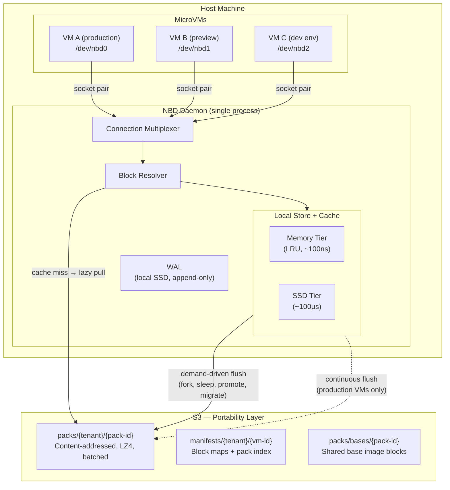

**During active operation**, all I/O stays within the host box. S3 is only touched on cross-host transitions or for cache misses on blocks that haven't been loaded locally yet.

---

## Flush Modes

The flush mode controls **when** blocks are uploaded from local SSD to S3. The architecture is identical across all modes — only the flush scheduler changes.

### Demand-Driven (Default)

S3 is touched only when data needs to cross a host boundary:

| Trigger | What happens |
|---------|-------------|
| **Fork request** | Flush source VM's dirty blocks + manifest to S3, then copy manifest |
| **Portable sleep** | Flush dirty blocks + manifest to S3, release host resources |
| **Promote** | Flush source → fork production → restore checkpoint → build |
| **Migrate** | Flush dirty blocks + manifest → start on destination |
| **Delete** | Discard local state. No S3 flush (it's ephemeral). |

During active operation: **zero S3 traffic.** All writes hit local SSD. All reads hit local cache (or S3 on cache miss for blocks not yet loaded, e.g., base image blocks during first boot).

**Durability guarantee:** Local SSD only. Host death = data loss back to last S3 checkpoint. For preview environments, dev servers, and promotion builds, this is the right tradeoff. The VM was forked from a known state and can be recreated.

### Continuous (Opt-In for Production)

Production VMs are the fork source — someone might create a preview at any time. Background flush keeps S3 current so forks don't stall on a flush.

| Interval | Operation |
|----------|-----------|
| ~5 seconds | Flush dirty blocks to S3 as packs |
| ~60 seconds | Sync manifest (block map + pack index) to S3 |

**Durability guarantee:** Host death loses at most ~5 seconds of writes (bounded by block flush interval). The manifest may be up to 60 seconds stale, but the WAL bridges the gap on recovery.

**In practice, production VMs barely write after boot.** A web server processes requests in memory and writes to a database (separate VM). Filesystem writes are log rotation and temp files — a few blocks per minute. The continuous flush traffic from a steady-state production VM is negligible.

### Configuration

The daemon doesn't know what a "preview" or "production" VM is. The control plane owns that policy and tells the daemon what to do.

**On export creation:**

```
PUT /api/exports/{name}
{
  "size_gb": 100,
  "s3_prefix": "tenants/acme/vm-preview-abc",
  "flush_mode": "demand_driven"
}
```

`flush_mode` is `"demand_driven"` (default) or `"continuous"`. The daemon starts the appropriate flush scheduler.

**Runtime switch** (e.g., promotion turns a preview into a fork source):

```
POST /api/exports/{name}/flush-mode
{ "flush_mode": "continuous" }
```

Takes effect immediately — starts the background flush scheduler without restarting the VM. The control plane calls this after a promotion completes and the new VM becomes the fork source.

**That's it.** Two values, one API field, one mutation endpoint. The control plane maps Box lifecycle to flush mode:

| Box role | Flush mode | When set |
|----------|-----------|----------|
| Preview / dev env | `demand_driven` | At creation |
| Promotion build | `demand_driven` | At creation |
| Production (fork source) | `continuous` | At creation, or switched at promotion |

### Why Not Just Flush On Fork?

You could make even production demand-driven: flush when a fork is requested, accept a few seconds of latency. This works — the flush is proportional to dirty data, which is small for a steady-state production VM. The tradeoff is a 1-5 second delay on preview creation. If that's acceptable, production can use demand-driven too. Continuous is the conservative default for fork-source VMs.

---

## Box Lifecycle Mapping

How the storage layer maps to every Box operation:

### Create (Fork from Production)

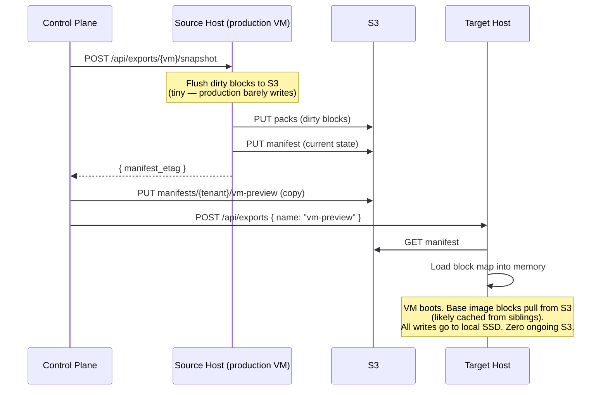

The preview VM is now fully local. It installs dependencies, builds, runs tests — all on local SSD. No S3 traffic until it sleeps, gets forked, or is deleted.

### Sleep / Wake

```
Same-host sleep:                     Same-host wake:
  1. Stop VM                           1. Load block map from local file
  2. Done. (~milliseconds)             2. Start VM. (~milliseconds)
                                       3. Cache is warm. Zero S3.

Portable sleep:                      Cross-host wake:
  1. Stop VM                           1. Load manifest from S3 (one GET)
  2. Pack dirty blocks → S3            2. Start VM
  3. Write manifest → S3               3. Reads pull lazily from S3
  4. Release host resources            4. Base blocks warm from siblings
  (~seconds, proportional to dirty)    5. Cache warms organically
```

Same-host sleep/wake is the common case — an idle preview goes to sleep, the developer comes back, it wakes on the same host. Instant. Zero S3.

Portable sleep is for when the host needs to be released (spot instance reclaim, rebalancing) or the VM might wake on a different host. The flush cost is proportional to dirty data since the last S3 checkpoint.

### Promote

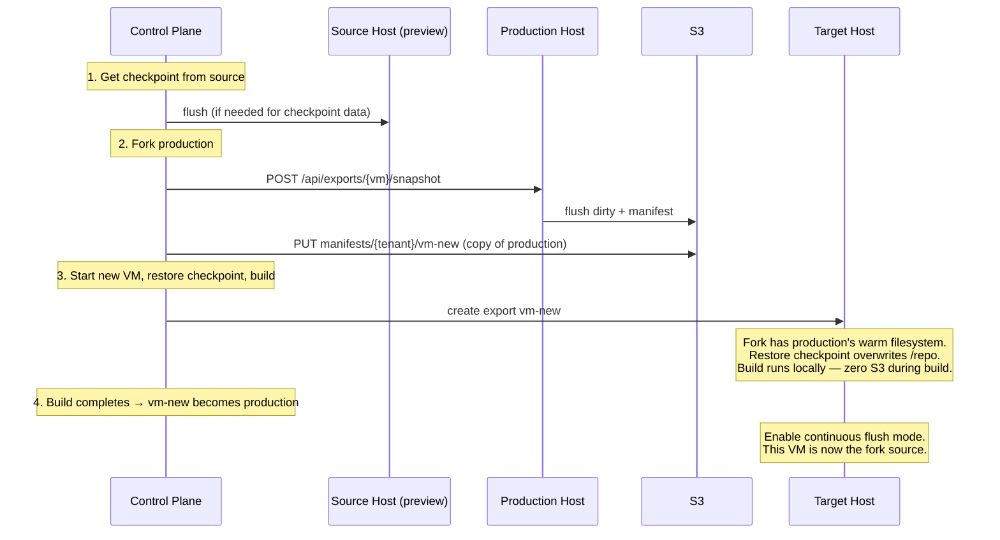

The build phase generates heavy I/O (npm install, compilation) — all on local SSD. Zero S3 traffic. Only after the VM becomes production does continuous flush kick in.

### Migrate

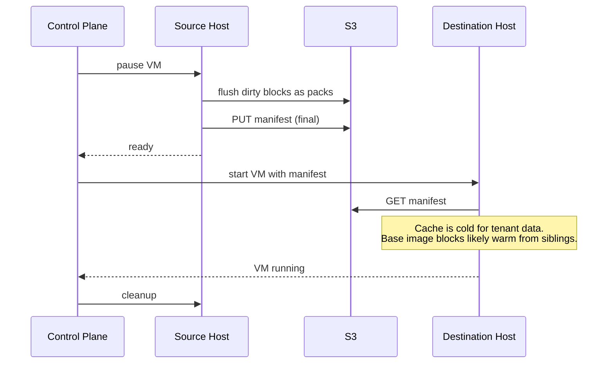

Migration cost is proportional to unflushed dirty data, not disk size. A 100G VM with 10MB of dirty blocks costs 10MB to migrate.

### Delete

For ephemeral VMs (previews, dev envs): stop the VM, release local resources. No S3 flush — the data is ephemeral. If the VM had been flushed to S3 at some point (portable sleep, fork source), GC cleans up orphaned blocks on its normal schedule.

---

## S3 Cost Analysis

Typical tenant, typical day: 3 production VMs, 20 preview creates, 5 promotions, 10 dev environment wake-ups.

| Operation | S3 PUTs | S3 GETs |
|-----------|---------|---------|
| Production flushes (on fork requests) | 25 × ~4 packs = 100 | — |
| Manifest writes | 25 | — |
| Fork manifest reads | — | 20 |
| Cross-host wake (lazy load) | — | 10 × ~50 packs = 500 |
| **Daily total** | **~125** | **~520** |
| **Monthly total** | **~3,750** | **~15,600** |

**Monthly S3 cost: $0.02 (PUTs) + $0.006 (GETs) = $0.03**

At 10x scale (30 production VMs, 200 previews/day, 50 promotions): **$0.30/month.**

Storage costs are similarly minimal — content-addressing deduplicates aggressively, and preview VMs that never flush to S3 consume zero S3 storage.

---

## Read Path

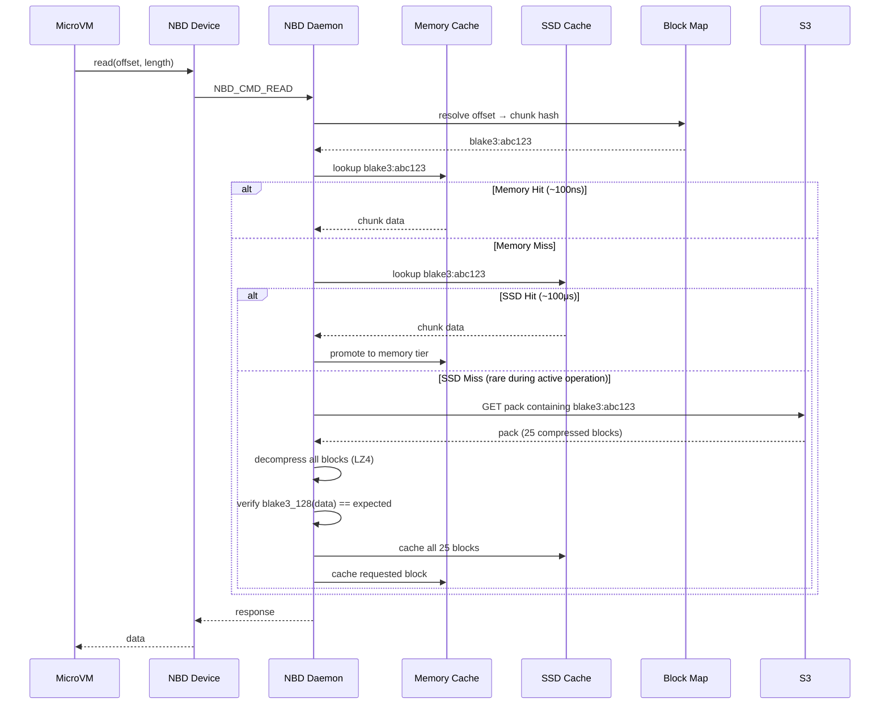

Cache misses that hit S3 are primarily during initial boot (base image blocks) and cross-host wake (tenant data not yet local). During steady-state active operation, the cache hit rate approaches 100% — everything the VM has touched is on local SSD.

**Pack-level prefetch:** On a cache miss, the daemon fetches the entire pack (~3.2MB, 25 blocks) instead of a single block. The S3 first-byte latency (10-50ms) dominates — the extra ~3MB of transfer is negligible. This prefetches temporally related blocks (written in the same flush cycle, often accessed together), warming 25 cache entries per miss.

---

## Write Path

Writes are acked after hitting the local WAL and cache. S3 upload happens on demand (or in the background for continuous-flush VMs).

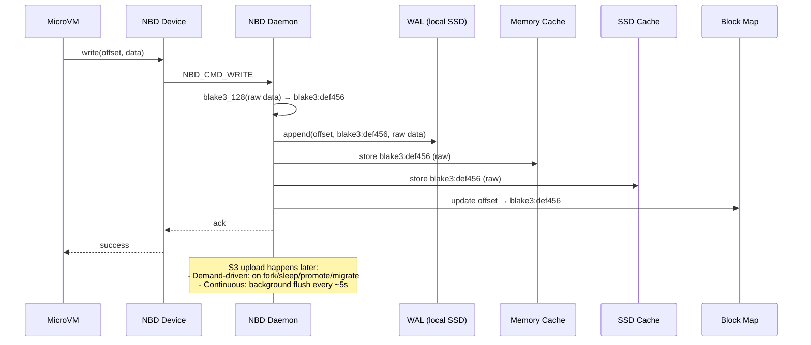

**Key detail:** BLAKE3-128 hashing is always done on raw (uncompressed) data. This ensures dedup works correctly — the same raw content always produces the same hash regardless of compression. Compression happens only at the S3 boundary.

### S3 Flush (When Triggered)

Whether triggered by a fork request, portable sleep, or the continuous flush timer:

1. Collect dirty blocks from WAL
2. Deduplicate: skip blocks whose hash already exists in the pack index
3. Compress each new block with LZ4
4. Assemble into a pack (index header + compressed blocks)
5. Single S3 PUT per pack (~3.2MB, 25 blocks)
6. Update pack index: hash → (pack-id, offset, length)
7. Mark WAL entries as flushed
8. Sync manifest to S3 (block map + pack index)

### TRIM / Discard

When a guest filesystem deletes files, it issues TRIM commands to reclaim blocks. Without handling these, the block map grows monotonically.

**Implementation:** Handle `NBD_CMD_TRIM` by resetting trimmed block map entries to the well-known zero-block hash.

- **Metadata-only.** No data uploaded to S3. The WAL records the TRIM for crash recovery, but the entry carries no block data — just the offset and zero hash.
- **Immediate memory savings.** Sparse block map drops zero entries. A VM that wrote 50GB and trimmed 40GB holds ~80K entries (~1.3MB), not ~400K (~6.5MB).
- **Storage reclaimed by GC.** Orphaned blocks are swept on the next GC cycle (subject to grace period). No special TRIM-aware GC needed.
- **Guest opt-in.** The guest filesystem must be mounted with `discard` option or use periodic `fstrim`.

---

## Chunk Size & Write Amplification

**Default: 128KB chunks.**

| Chunk Size | Write Amp (4KB write) | Block Map Size (100GB disk) | Block Map Memory | S3 Objects (100GB) |
|------------|----------------------|----------------------------|-----------------|-------------------|
| 4MB | 1000x | ~25K entries | ~415KB | ~25K |
| 1MB | 256x | ~100K entries | ~1.7MB | ~100K |
| 128KB | 32x | ~800K entries | ~13MB | ~800K |
| 64KB | 16x | ~1.6M entries | ~26MB | ~1.6M |

128KB is the sweet spot:

- **32x write amplification is acceptable.** It only affects local SSD writes (fast, ~20μs) and S3 flushes (infrequent in demand-driven mode). Typical VM workloads do mostly large sequential writes (package installs, builds) where write amp is close to 1x. The 32x case only hits on small random writes.
- **13MB block map per VM is manageable.** At 100 VMs per host with sparse representation (typical), it's ~133MB total.
- **Matches v1's proven chunk size.** v1 uses 128KB blocks and it works. Don't fix what isn't broken.

**Future optimization: sub-chunk dirty tracking.** For workloads with heavy small random writes, track dirty regions within a chunk and only upload the changed portions. Build it only if write amplification becomes a measured problem at scale.

---

## Block Map Design

The block map is the critical metadata structure. Every read and write resolves through it. Must be fast, memory footprint predictable.

**Structure:** An ordered array mapping chunk index → (content hash, source).

```
Block Map for VM-A (100GB disk, 128KB chunks):
  Index 0      → (blake3:aabbccdd..., base)    (bytes 0 - 128KB)
  Index 1      → (blake3:ddeeff00..., base)    (bytes 128KB - 256KB)
  Index 2      → (blake3:ff112233..., tenant)  (bytes 256KB - 384KB)
  ...
  Index 819199 → (blake3:11223344..., base)    (bytes 99.99GB - 100GB)
```

**Per-entry size:** 17 bytes (16-byte BLAKE3-128 hash + 1-byte source tag). No offset needed — the array index *is* the offset (index × chunk_size = byte offset). The source tag (`base` or `tenant`) tells the daemon exactly where to resolve the block — `packs/bases/{pack-id}` or `packs/tenants/{tenant}/{pack-id}` — avoiding a 404 fallback chain.

**Why BLAKE3-128 over SHA256:** Content-addressing needs collision resistance, not cryptographic security against adversaries. 128 bits gives a birthday bound of ~2^64 blocks — at 128KB per block, that's 2 exabytes of unique data per tenant. BLAKE3 is ~3-4x faster than SHA256, reducing hashing cost on the write path (~5μs for 128KB vs ~20μs). Shorter hashes mean smaller block maps, smaller manifests, shorter S3 keys.

**Memory analysis:**

| VMs per host | Block map memory (100GB disks) | Block map memory (10GB actual) |
|-------------|-------------------------------|-------------------------------|
| 10 | 133MB | 13MB |
| 50 | 664MB | 66MB |
| 100 | 1.33GB | 133MB |
| 500 | 6.64GB | 664MB |

**Sparse representation:** Most VMs don't touch all 100GB. Unwritten regions point to a well-known "zero block" hash. A sparse map only stores non-zero entries. A VM with 10GB of written data on a 100GB disk stores ~80K entries (~1.3MB), not 800K (~13MB).

### Local Persistence

The block map is persisted to local SSD on a fast schedule (every few seconds, local fsync only). This enables:
- **Same-host wake:** Load block map from local file. No S3 needed.
- **Daemon restart recovery:** Load local block map + replay local WAL. No S3 needed.

### S3 Manifest

The manifest (block map + pack index) is synced to S3 only when data needs to be portable:
- On demand-driven flush (fork, portable sleep, promote, migrate)
- On continuous-flush schedule (~60 seconds) for production VMs

Manifest size for a 100GB fully-written disk: ~32MB uncompressed (~13MB block map + ~19MB pack index), ~10-15MB compressed. For a typical 10GB VM: ~3.2MB uncompressed, ~1MB compressed.

---

## Fork Operation

The key feature this architecture enables. Forking a 100G VM is a metadata copy, not a data copy. Works across hosts.

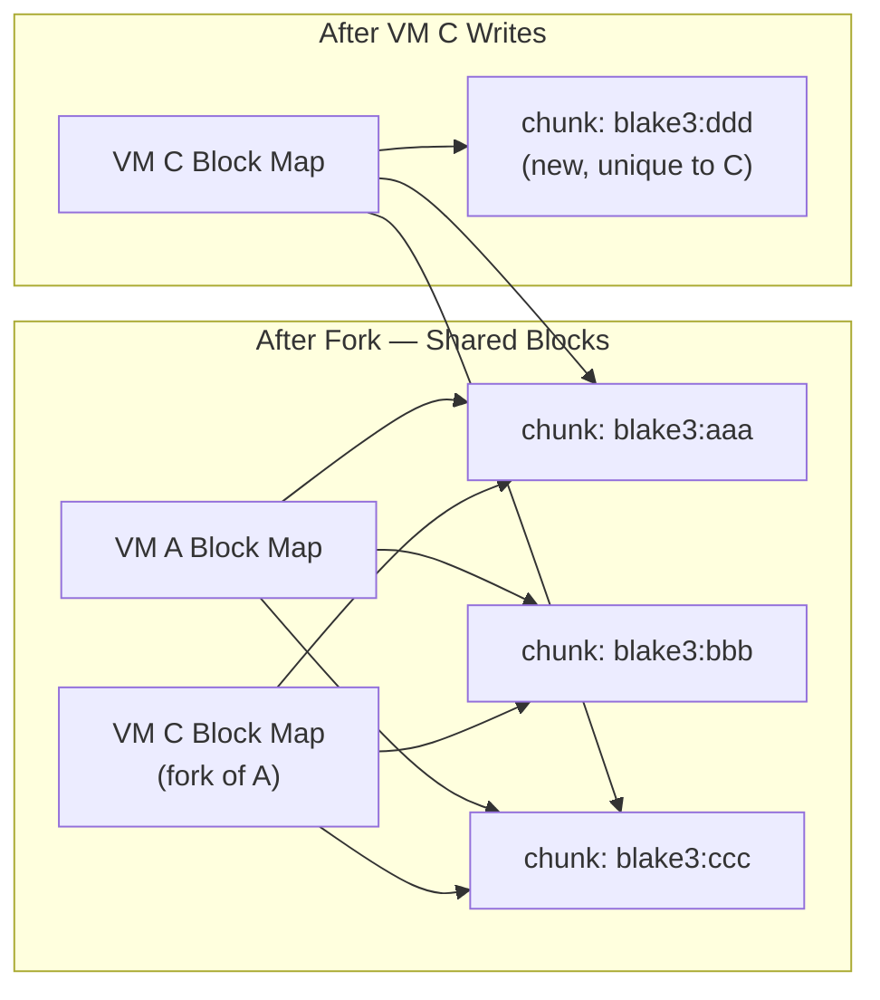

### The Consistency Problem

The source VM is alive and writing. Its state exists in three places:

```
S3 manifest          ← last flush (could be minutes or hours old in demand-driven mode)
S3 blocks            ← all blocks flushed so far
Host WAL + SSD       ← writes since last flush (not in S3 yet)
Host memory          ← block map updates not yet persisted
```

### Two Fork Modes

**Consistent fork (default for Boxes)** — ask the source host to flush first. The fork gets the exact current state.

**Lazy fork** — copy the S3 manifest as-is. No coordination with the source host. The fork gets the state as of the last S3 checkpoint. For demand-driven VMs that haven't flushed recently, this could be stale.

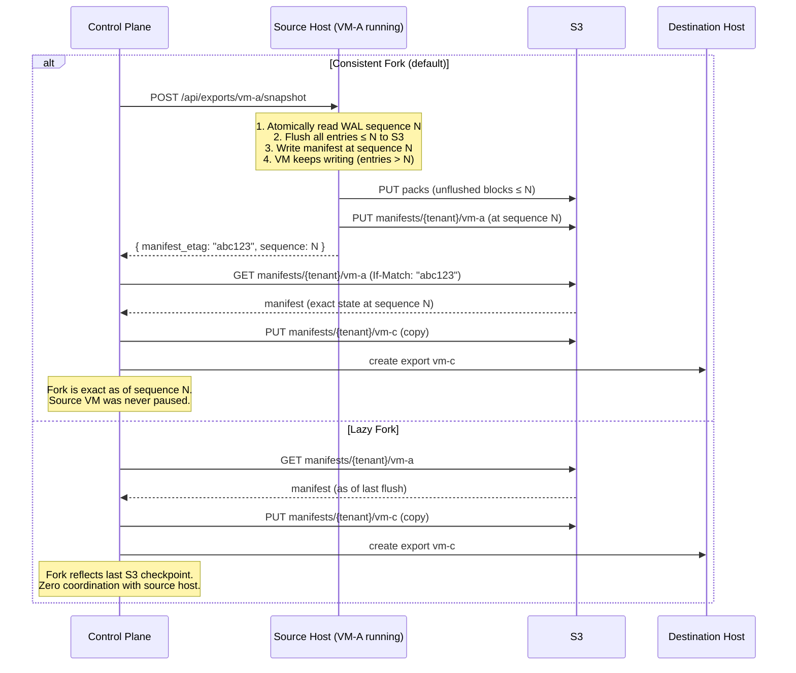

### Why Consistent Fork Is the Right Default for Boxes

`POST /boxes` (create preview) forks production. Production in continuous-flush mode has a manifest that's at most ~60 seconds stale — lazy fork is fine. But production in demand-driven mode may not have flushed in hours. Consistent fork triggers a flush, which is fast for a steady-state production VM (tiny amount of dirty data), and gives an exact point-in-time copy.

Lazy fork is available for cases where staleness is acceptable (e.g., forking a development environment you don't need to be perfectly current).

### The Snapshot Mechanism

The key mechanism is the **WAL sequence number**:

```
WAL entries:
  seq 1: write block 42 → blake3:aaa
  seq 2: write block 17 → blake3:bbb
  seq 3: write block 42 → blake3:ccc    ← overwrote block 42
  ─── snapshot requested, cut point = seq 3 ───
  seq 4: write block 99 → blake3:ddd    ← after snapshot, not included
  seq 5: write block 17 → blake3:eee    ← after snapshot, not included
```

The snapshot operation:
1. Atomically read the current WAL sequence (e.g., N=3). Single atomic load — no lock, no pause.
2. Flush all WAL entries with sequence ≤ N to S3 (blocks + manifest).
3. Return the manifest ETag to the caller.
4. The source VM keeps writing normally. Entries with sequence > N are unaffected.

The source VM is **never paused**. The only cost is a flush of pending dirty data.

### Race Conditions

**Fork during write:** A write arrives at the source between the manifest read and the fork's first access. Not a problem — the fork's manifest doesn't reference the new block. The fork has a consistent snapshot.

**Fork during fork:** Two forks of the same VM requested simultaneously. Both read the same manifest (or close versions). Both produce independent copies. No conflict — manifest PUTs are to different keys.

**Source VM deleted during fork:** The fork's manifest is already written to S3. It references blocks by hash. GC won't touch those blocks — they're in the fork's manifest, which is in the live set. The fork survives independently.

**Fork of a fork:** Same operation. Copy the manifest. Blocks are shared transitively. GC sees all manifests, keeps all referenced blocks.

**Consistent fork + concurrent writes:** The WAL sequence cut is atomic. Writes after the cut get sequence > N and aren't included. The manifest at sequence N is internally consistent.

### Self-Containment Property

The S3 manifest is always self-contained. Every hash in it corresponds to a block that exists in S3 (either in `packs/bases/` or `packs/tenants/{tid}/`). Unflushed blocks exist only in the WAL and local cache — they aren't in any manifest. You can copy a manifest to any host and it resolves completely. No dangling references.

---

## Pack Files (S3 Write Batching)

Content-addressing at the logical level (block map, hashing, dedup). Pack files at the physical level (S3 storage). Same idea as git packfiles: the hash is the address, the packfile is the storage.

### Concept

Each flush cycle collects dirty blocks, compresses them, assembles a pack with a small index header, and uploads with a single PUT. Default: 25 blocks per pack (~3.2MB), matching v1's proven batch size.

```
packs/tenants/t1/pack-0042
  ├─ blake3:aaa (compressed)
  ├─ blake3:bbb (compressed)
  ├─ blake3:ccc (compressed)
  └─ index: [{hash, offset, length}]
```

25x fewer S3 PUTs, 25x fewer S3 objects, 25x faster GC LIST operations.

### Pack Index

Maps `hash → (pack-id, offset, compressed_length)` for every block in S3. Maintained in memory, persisted as part of the manifest.

**Memory cost:** ~24 bytes per unique block (16-byte hash key + 4-byte pack-id + 4-byte offset/length).

| Scenario | Pack index memory | Block map memory | Total |
|----------|------------------|-----------------|-------|
| 10GB actual data (80K blocks) | ~1.9MB | ~1.3MB | ~3.2MB |
| 100GB fully written (800K blocks) | ~19MB | ~13MB | ~32MB |
| 100 VMs × 10GB each | ~190MB | ~133MB | ~323MB |

Within a tenant, forked VMs share pack index entries — a fork that hasn't diverged adds zero index overhead.

### Read Path with Packs

On a cache miss, fetch the entire pack and cache all 25 blocks. One cache miss warms 25 entries — temporal locality means blocks written together are often read together.

### GC with Packs

- **Mark:** Build live set of hashes from all manifests (unchanged).
- **Sweep:** For each pack, check if *any* block is in the live set.
  - No live blocks + older than grace period → **delete pack**.
  - Any live block → **keep entire pack**.
- **No compaction.** A pack with mixed liveness (some dead, some live blocks) is kept whole until every block is unreferenced.

**Why not compact mixed packs?** Compaction rewrites live blocks into a new pack. But the old pack may be referenced by manifests on other hosts — a forked VM's pack index points to (hash, old-pack-id, offset). Updating a remote daemon's in-memory pack index requires cross-host coordination. This is distributed coordination — exactly what this design avoids.

**Storage cost of mixed packs:** Bounded and small. A pack is 3.2MB. Worst case: parent VM deleted, fork shares 1 block per pack, 24 dead blocks per pack. For a 10GB parent with 3,200 packs where ~10% are mixed: 320 × 24 × 128KB ≈ 960MB wasted, or ~$0.02/month at S3 pricing. Resolves naturally when the fork is deleted or overwrites the shared blocks.

### S3 Key Layout

```
packs/
  bases/{pack-id}                ← base image packs (from bless pipeline)
  tenants/{tenant-id}/{pack-id}  ← tenant packs

manifests/
  {tenant-id}/{vm-id}           ← always tenant-scoped
```

---

## Compression

All blocks are compressed with LZ4 before upload to S3. LZ4 is chosen for its speed — compression and decompression are essentially free relative to I/O latency.

**Pipeline:**

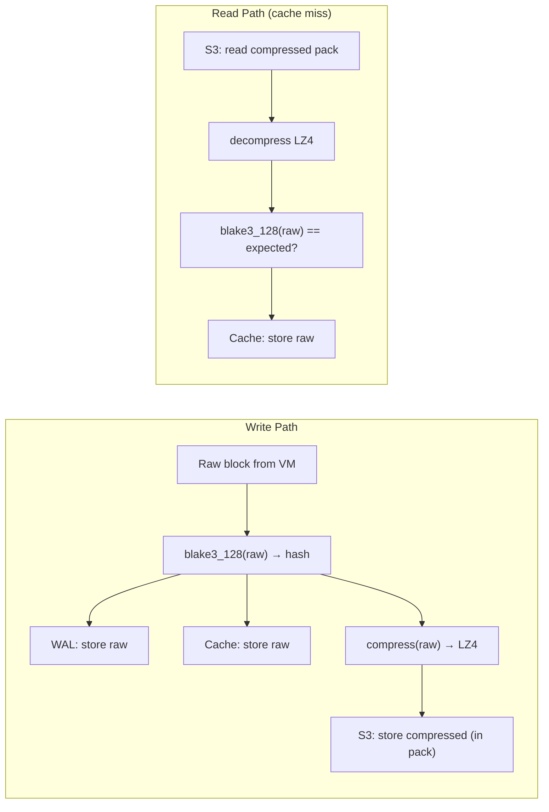

- **Hash before compress.** Same raw data → same hash, regardless of LZ4 version. Critical for dedup.
- **Cache stores raw.** No decompression on the hot path.
- **WAL stores raw.** Compression happens during flush, off the critical path.
- **S3 stores compressed.** ~1.5-2x ratio for typical OS/app data. ~40-50% S3 bill reduction.

---

## Cache Design

Two-tier cache: in-memory LRU for hot blocks, SSD-backed for warm blocks.

**Memory tier:**
- Configurable size per host (`memory_cache_gb`).
- LRU eviction. Evicted blocks fall to SSD tier.
- ~100ns reads. 1000x faster than SSD.

**SSD tier:**
- Bounded by available SSD space. Much larger than memory tier.
- LRU eviction. Evicted blocks re-pulled from S3 on next access.
- Stores uncompressed blocks. ~100μs reads.

**Key properties:**
- During active operation, the SSD tier contains *everything the VM has ever read or written*. Cache hit rate approaches 100%.
- Blocks are immutable (content-addressed), so cached blocks are always valid. No coherence protocol.
- Boot prefetching: base images have a known hot set (kernel, init, core libs). Prefetch into memory cache when a VM is scheduled, before it starts.
- On same-host wake: cache is fully warm. No S3 reads needed.
- On cross-host wake: cache starts cold. Base image blocks likely warm from siblings. Tenant data warms organically.

---

## Crash Recovery (WAL)

The WAL handles two distinct recovery scenarios:

### Local Recovery (Daemon Restart)

The daemon crashes but the host and SSD are fine. Load the locally persisted block map and replay the local WAL. No S3 involved.

1. Load block map from local SSD file
2. Replay unflushed WAL entries (update block map, populate cache)
3. Resume serving

Fast — milliseconds to seconds depending on WAL size.

### Cross-Host Recovery (Host Death)

The host dies. WAL and local cache are gone. Fall back to the last S3 manifest.

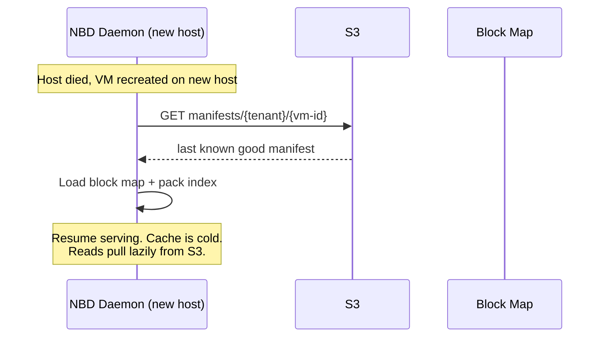

**Data loss:** Writes since the last S3 manifest are lost. In demand-driven mode, this could be everything since the last fork/sleep/promote. In continuous mode, bounded by the flush interval (~5 seconds).

For preview VMs: acceptable. Recreate from the fork point.
For production VMs: continuous flush bounds the loss to seconds.

### WAL Properties

- Append-only file on local SSD. Sequential writes only — fast and predictable.
- Each entry: `(vm-id, offset, blake3_128_hash, raw_chunk_data)`. Self-contained for replay.
- Entries marked flushed after S3 confirms block upload (in continuous or demand-driven flush).
- Truncated after full flush. Keeps disk usage bounded.
- In demand-driven mode, the WAL grows as long as the VM is active without an S3 flush. This is fine — it's just local SSD space. A VM writing at 100MB/s for an hour generates ~360GB of WAL. On modern NVMe (2-4TB), this is manageable. The WAL is truncated on the next S3 flush (sleep, fork, etc.).

### Failure Modes

- **Daemon crash, WAL intact:** Full local recovery. Replay unflushed entries.
- **Daemon crash, WAL partially written:** Last incomplete entry is discarded. That single in-flight write is lost. Same as a power loss on bare metal.
- **Host dies, SSD dead:** Fall back to last S3 manifest. Writes since last S3 flush are lost.

---

## Tenant Isolation Model

Cross-tenant deduplication is a side-channel risk (deduplication oracle attack). The design uses a tiered isolation model.

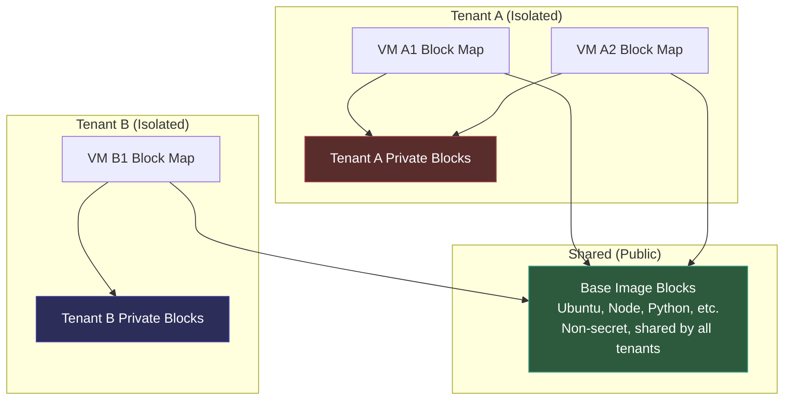

**Rules:**
- Base image blocks are blessed, public, and shared across all tenants
- Any block written by a tenant is keyed to that tenant's namespace
- Dedup happens freely *within* a tenant (their own VMs share blocks)
- Cross-tenant dedup only happens against the shared base set

### Block Resolution with Source Tags

The source tag in each block map entry tells the daemon exactly where to look:

```
1. Memory cache    → hit? serve it  (~100ns)
2. SSD cache       → hit? serve it  (~100μs)
3. S3              → source tag == base?
                       packs/bases/{pack-id}          (10-50ms)
                     source tag == tenant?
                       packs/tenants/{tenant}/{pack-id} (10-50ms)
```

No 404 fallback chain. The block map is the source of truth for both *what* block and *where* it lives.

---

## Base Image Registry

Base images are the shared foundation — Ubuntu, Node runtimes, Python environments. Chunked, uploaded, and made available to all tenants via an offline pipeline.

### Bless Pipeline

```bash
glidefs bless --image ubuntu-22.04-node20.raw --name ubuntu-22.04-node20-v3
```

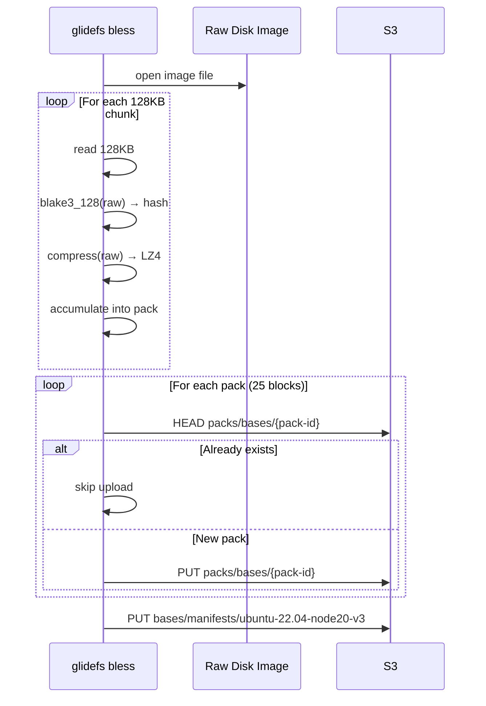

**Properties:**
- **Dedup across base versions.** Ubuntu 22.04 + Node 18 and Ubuntu 22.04 + Node 20 share ~95% of their OS blocks. Only genuinely new chunks get uploaded.
- **Idempotent.** Same image → same hashes → same manifest. A no-op on re-run.
- **Offline.** No daemon involvement. CLI talks directly to S3. Runs in CI or on a dev machine.
- **No layers.** A base image is a flat disk image. Content-addressing handles deduplication.

### Creating a VM from a Base Image

The VM's manifest starts as a copy of the base manifest. Every entry has source tag `base`. As the VM writes, individual entries flip to `(new_hash, tenant)`. Unmodified chunks continue resolving from the shared base namespace — no data copied, no storage consumed.

### Base Block GC

**Solution: reference counting as a fast path, mark-and-sweep as the source of truth.**

- Refcount stored per base image, updated by the control plane on VM create/delete.
- Refcount > 0: skip GC scan. Refcount == 0: full sweep to confirm.
- The refcount is an optimization hint, not a correctness mechanism. Drift is corrected by periodic reconciliation.
- Failure mode is always conservative: keep blocks too long, never delete too early.

---

## Garbage Collection

When VMs are deleted or blocks are overwritten, orphaned blocks (in packs) accumulate in S3.

**Approach: mark-and-sweep with a grace period.**

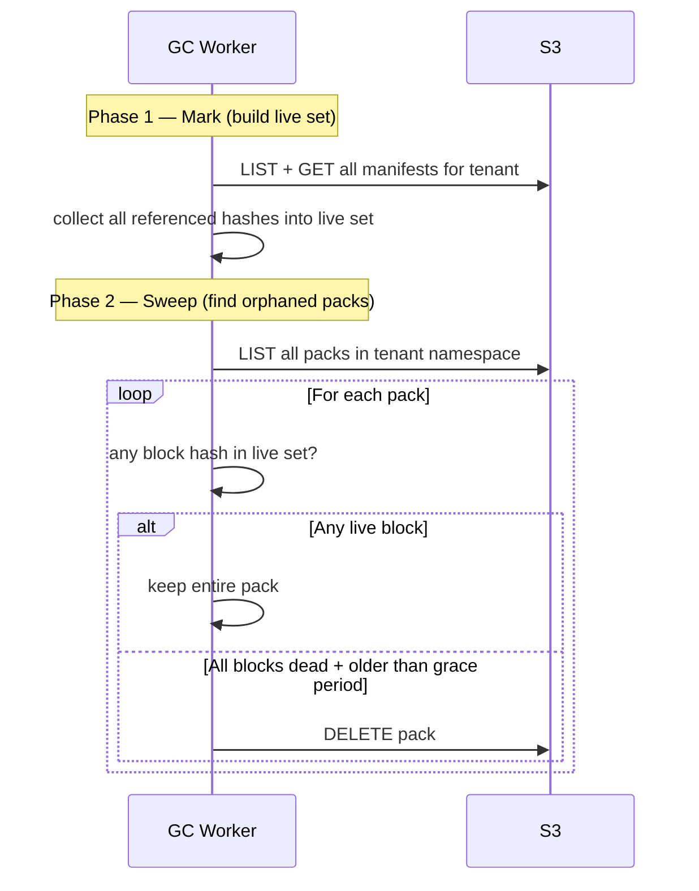

**Grace period (24 hours):** Packs younger than the grace period are never deleted, even if unreferenced. This protects against races: a flush creates blocks that aren't yet in any manifest, a fork copies a manifest while blocks are in flight, WAL replay uploads blocks during recovery.

**Operational design:**
- **Frequency:** Daily or every few hours.
- **Scope:** Per-tenant. Base image packs have their own GC with refcount-accelerated sweep.
- **Failure mode:** Always conservative. GC crash = orphans survive until next run. Never deletes live data.

---

## Encryption at Rest

Per-tenant encryption using S3 server-side encryption with KMS (SSE-KMS).

- **Shared base image packs:** SSE-S3 (AWS-managed key). Not secret — public OS/runtime images.
- **Tenant packs:** SSE-KMS with per-tenant KMS key. Transparent encryption/decryption on PUT/GET.
- **Manifests:** SSE-KMS with tenant's key. Block maps reveal which blocks a tenant uses.
- **No application-layer encryption needed.** S3 + KMS handles it. The daemon doesn't touch keys.

---

## I/O QoS

Linux cgroup v2 block I/O controllers. The kernel handles scheduling. The NBD daemon stays dumb.

- `io.max` — hard limits (tiered plans): "This VM gets at most X IOPS and Y MB/s."
- `io.weight` — proportional sharing: "When contended, divide bandwidth by weight."

Zero QoS code in the daemon. Policy is a control plane concern — set cgroup limits when creating the VM. Composable with CPU and memory cgroups.

---

## Block Integrity Verification

Content-addressing gives free integrity checks.

- **S3 reads (cache miss):** Always verify. Decompress, hash, compare. This is the ingestion boundary.
- **Cache reads (hit):** Don't verify on every read. Trust local SSD/memory.
- **Background scrubber:** Periodically re-verify cached blocks. Catches silent bit rot off the hot path.
- **On mismatch:** Retry once (transient corruption), then alert.

---

## Component Summary

| Component | Role | Implementation Notes |
|-----------|------|---------------------|
| **NBD Device** | 1:1 per VM, block device interface | Linux kernel NBD, socket pair to daemon |
| **NBD Daemon** | Single process, multiplexes all VMs | Event loop, resolves offsets via block maps, no QoS logic |
| **Flush Scheduler** | Controls when blocks go to S3 | Demand-driven (default) or continuous (production). Per-VM policy. |
| **WAL** | Local crash recovery + S3 flush source | Append-only on local SSD, sequence-numbered, raw blocks |
| **Block Map** | Ordered array of (hash, source) per VM | 17 bytes/entry. Persisted locally (fast) + S3 (on flush). Sparse for unwritten regions. |
| **Memory Cache** | In-memory LRU, hot blocks | Configurable size, ~100ns reads, evicts to SSD tier |
| **SSD Cache** | SSD-backed, warm blocks | ~100μs reads, stores uncompressed, verified on ingestion |
| **Pack Files** | Batched S3 storage format | 25 blocks/pack (~3.2MB). 25x fewer S3 PUTs. Whole-pack prefetch. |
| **Pack Index** | Hash → pack location mapping | ~24 bytes/block. In manifest. No compaction — keep packs with any live block. |
| **TRIM Handler** | Reclaim deleted blocks | Reset to zero-block hash. Metadata-only. Orphans cleaned by GC. |
| **Compression** | LZ4 at S3 boundary | Hash raw → compress → pack → S3. ~1.5-2x ratio. |
| **Base Image Registry** | Blessed shared blocks | Offline CLI pipeline (`glidefs bless`). Packed, deduped across versions. |
| **Tenant GC** | Orphan pack cleanup | Mark-and-sweep, 24h grace period, per-tenant, daily. Pack-level sweep. |
| **Base GC** | Base image pack cleanup | Refcount fast path + mark-and-sweep. Scans all tenants only when refcount hits 0. |
| **cgroup v2 I/O** | Per-VM IOPS/throughput limits | Kernel-level, configured by control plane |
| **Background Scrubber** | Cache integrity verification | Periodic re-hash of cached blocks, off hot path |

---

## What We're Replacing (and Why)

| ZFS Capability | Replacement | Why |
|---------------|-------------|-----|
| **Local snapshots/clones** | Block map copy in S3 | ZFS clones are local-only. Block map copy works cross-host. |
| **LZ4 compression** | LZ4 at S3 boundary | Same algorithm, different layer. Equivalent ratio. |
| **Block integrity** | BLAKE3-128 content-addressing + scrubber | Every block verified by re-hashing. |
| **ARC (adaptive read cache)** | Two-tier memory + SSD cache | LRU instead of ARC. Simpler, may revisit if hit rates are poor. |
| **Copy-on-write** | Content-addressed writes | Every write produces a new block. Old blocks remain until GC. |
| **Durability (ZIL/SLOG)** | WAL on local SSD | Same concept. WAL entries flush to S3 on demand instead of locally. |
| **Deduplication** | Content-addressing (inherent) | Same content → same hash → same block. Automatic. |

---

## Open Questions

1. **Memory cache sizing** — What's the right default for `memory_cache_gb`? Needs profiling under realistic load.
2. **Continuous flush intervals** — Block flush at ~5s, manifest at ~60s is the starting point for production VMs. Both tunable.
3. **Cache warming on cross-host wake** — Is the boot hot set predictable enough to preload? Start without it, measure, add if needed.
4. **cgroup I/O limits by tier** — What are the actual IOPS/throughput numbers per tier?
5. **GC grace period tuning** — 24 hours is conservative. Could be shorter if we can bound the max time between block creation and manifest update.
6. **Sub-chunk dirty tracking** — Deferred until write amplification is a measured problem.
7. **WAL size bound (continuous mode)** — At what size do we back-pressure writes if S3 is slow?
8. **ARC vs LRU** — Start with LRU. Consider ARC if hit rates are poor.
9. **Pack size** — 25 blocks (3.2MB) matches v1. Profile to find the sweet spot between S3 ops and mixed-pack waste.
10. **Demand-driven for production** — Should production default to demand-driven (flush on fork request) instead of continuous? Saves S3 traffic at the cost of 1-5 seconds of fork latency. Depends on preview creation frequency.
