# MicroVM Storage Architecture

## Design Document — NBD + Content-Addressed Block Store + S3

---

## Overview

A storage layer for microVMs that provides fast boot, cheap cross-host forks, durable persistence, and tenant isolation.

**Core insight:** Separate the interface the VM sees (block device) from how we store data (content-addressed chunks in S3, cached locally). The VM gets a normal disk. We get deduplication, lazy loading, and fork-as-metadata-copy.

**Why not ZFS?** ZFS is good at what it does — compression, integrity, local snapshots. The problem is that it's local. The killer feature this architecture unlocks is cross-host fork: copy a manifest in S3 and a VM materializes on any host, instantly, with zero data transfer. ZFS clone can't cross a host boundary without shipping data. Everything else in this design (WAL, content-addressing, compression, integrity checking) replaces ZFS's local responsibilities to make that cross-host capability possible. We're not removing ZFS because it's bad — we're removing it because we need something it can't do.

---

## Benefits

**Fast boot.** VMs don't wait for a full disk image to materialize. The NBD device is available immediately, and blocks pull lazily from S3 on first access. Boot only touches the kernel, init, and core libs — a few hundred MB at most, much of which is already cached from sibling VMs. Sub-second to first instruction is achievable.

**Cheap cross-host forks.** Forking a 100G VM is a metadata copy — duplicate the block map in S3, done. Zero data copied. The forked VM shares 100% of its blocks with the parent until it writes. Storage cost is proportional to unique writes, not total disk size. This works across hosts — the fork can materialize anywhere. This unlocks preview environments, branch deploys, and dev/prod parity at near-zero cost.

**Storage efficiency.** Content-addressing deduplicates automatically within a tenant. Ten VMs running the same Node app share one copy of the base OS, runtime, and dependencies. LZ4 compression before upload further reduces S3 storage by ~1.5-2x for typical OS/application data. Combined with shared base images across tenants, actual S3 usage is a small fraction of total allocated disk space.

**Simple durability model.** WAL on local SSD for fast acks, background flush to S3 for durability. S3 is the source of truth. Cache and WAL are ephemeral — losing them means slower reads and replaying a small log, not data loss. No distributed consensus, no replication factor to manage.

**Clean migration.** Moving a VM between hosts requires flushing the WAL and pointing the destination at the manifest in S3. No bulk data transfer. Base image blocks are likely already warm on the destination. The improvement over v1 is that the WAL lets us resume the VM on the destination while the flush completes, rather than blocking on a full drain.

**Operational simplicity.** No ZFS to tune (ARC, zpool, scrub schedules). No distributed filesystem to operate (quorum, rebalancing, split-brain). No QoS code in the daemon (cgroup v2 handles it). No application-layer encryption (SSE-KMS handles it). Each component does one thing.

**Tenant isolation without sacrificing efficiency.** Shared base image blocks give most of the cross-tenant dedup savings. Tenant-written blocks are namespace-isolated, closing the deduplication oracle side channel. Per-tenant KMS keys mean a compromised S3 bucket doesn't expose all tenants' data.

**Integrity for free.** Content-addressing means every block can be verified by re-hashing. No separate checksum database to maintain. Corruption is detectable at read time and by background scrubbing.

---

## Tradeoffs

**S3 latency on cache miss.** A cold read hits S3, which is 10-50ms depending on region and object size. For sequential I/O patterns or large working sets that don't fit in cache, this shows up as tail latency. Mitigation: memory cache tier for hot blocks (~100ns), SSD cache for warm blocks (~100μs), aggressive prefetching of known hot sets. But there's no avoiding it for truly cold data — this architecture trades peak local disk performance for cross-host capabilities.

**WAL is a single point of failure on the host.** If both the host and the SSD die simultaneously (e.g., full machine loss), unflushed WAL entries are gone. Data loss is bounded by the WAL flush interval — the window between last S3-confirmed manifest and the crash. Mitigation: tune flush frequency. A 5-second interval means at most 5 seconds of writes lost in a total machine failure. For most workloads, this is acceptable. For those where it isn't, you'd need synchronous S3 writes (back to write-through) and the latency hit that comes with it.

**S3 availability = write availability (eventually).** Background flush means a brief S3 blip is absorbed by the WAL. But a sustained S3 outage means the WAL grows unbounded until you hit the back-pressure threshold and stall writes. S3's availability is 99.99%, so this is a rare event, but "rare" isn't "never." There's no local-only fallback that preserves durability guarantees.

**Write amplification.** Content-addressing means every write to a chunk produces a new block, even if only a small portion changed. With 128KB chunks, a 4KB random write still produces a 128KB new block — 32x amplification. This is substantially better than naive 4MB chunks (1000x) but still real. Workloads with heavy small random writes (databases, logging) will generate more S3 traffic and storage than the raw write volume suggests. See the Chunk Size & Write Amplification section for the full analysis and mitigations.

**Block map memory at scale.** A 100GB disk with 128KB chunks = ~800K entries per VM. At 32 bytes per entry (offset + hash), that's ~25MB per VM. 100 VMs per host = ~2.5GB of block map memory. This is manageable but not negligible — it needs to be accounted for in host memory planning. See the Block Map section for the full analysis.

**Garbage collection is a real system.** Deleted VMs leave orphaned blocks in S3. Cleaning these up under concurrent fork/delete/write operations is one of the harder parts of the design. It requires its own concrete design, not just a passing mention. See the Garbage Collection section.

**Cold cache on migration.** The destination host starts with an empty cache for the migrated VM. Reads will hit S3 until the cache warms. For I/O-heavy workloads, this is a noticeable latency cliff post-migration. Base image blocks help (likely already warm from siblings), but tenant-specific hot data will be cold. This is better than shipping the full cache, but it's still a transient degradation.

**cgroup v2 QoS requires kernel support.** The host kernel needs cgroup v2 with io controller enabled. Older kernels or misconfigured hosts won't enforce I/O limits. Not a design issue, but a deployment prerequisite to validate.

---

## Architecture


---

## Read Path

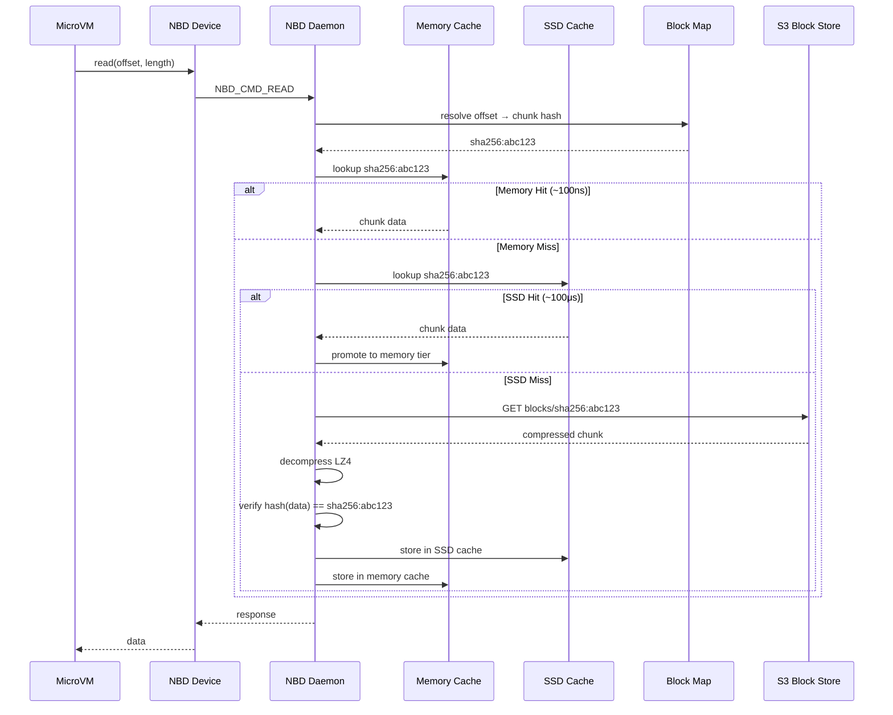

---

## Write Path

Writes are acked after hitting the local WAL and cache. S3 upload happens in the background. Blocks are compressed with LZ4 before upload.

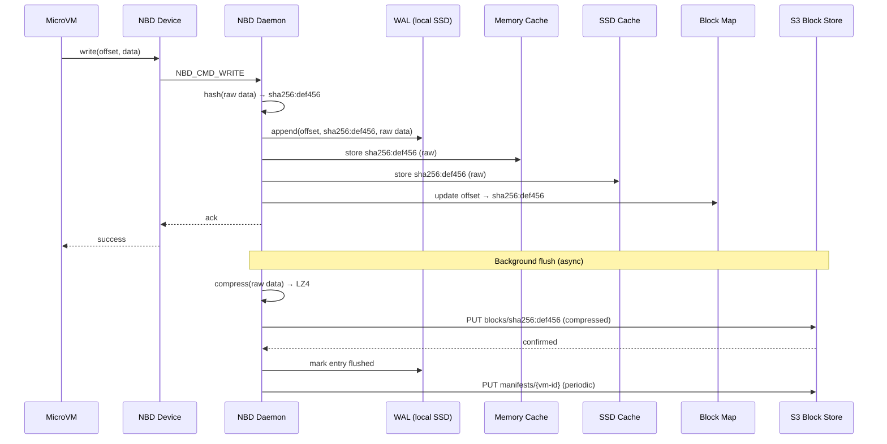

**Key detail:** Hashing is always done on raw (uncompressed) data. This ensures dedup works correctly — the same raw content always produces the same hash regardless of compression. Compression happens only at the S3 boundary.

---

## Chunk Size & Write Amplification

This is one of the most important design decisions. The chunk size determines the tradeoff between write amplification, metadata overhead, and S3 request volume.

**Default: 128KB chunks.**

| Chunk Size | Write Amp (4KB write) | Block Map Size (100GB disk) | Block Map Memory | S3 Objects (100GB) |
|------------|----------------------|----------------------------|-----------------|-------------------|
| 4MB | 1000x | ~25K entries | ~800KB | ~25K |
| 1MB | 256x | ~100K entries | ~3.2MB | ~100K |
| 128KB | 32x | ~800K entries | ~25MB | ~800K |
| 64KB | 16x | ~1.6M entries | ~50MB | ~1.6M |

128KB is the sweet spot. Rationale:

- **32x write amplification is acceptable.** Typical VM workloads (app servers, build systems) do mostly large sequential writes (package installs, log writes, artifact creation) where write amp is close to 1x. The 32x case only hits on small random writes, which are a minority of I/O for these workloads. For database-heavy VMs, this is a known cost.
- **25MB block map per VM is manageable.** At 100 VMs per host, that's 2.5GB — significant but well within typical host memory budgets. Block maps are read-heavy (every I/O resolves through them) so they should be fully in memory.
- **800K S3 objects per full 100GB disk is fine.** Most VMs don't touch all 100GB. A VM with 10GB of actual written data has ~80K objects. S3 handles this without issue. LIST operations for GC are the concern at scale — addressed in the GC section.
- **Matches v1's proven chunk size.** v1 uses 128KB blocks with positional batching and it works. Don't fix what isn't broken.

**Future optimization: sub-chunk dirty tracking.** For workloads with heavy small random writes, we could track dirty regions within a chunk and only upload the changed portions. The chunk boundary stays at 128KB for addressing and dedup, but the S3 object stores a base + delta. This adds real complexity — build it only if write amplification becomes a measured problem at scale.

---

## Block Map Design

The block map is the critical metadata structure. Every read and write resolves through it. It must be fast and its memory footprint must be predictable.

**Structure:** An ordered array mapping chunk index → content hash.

```
Block Map for VM-A (100GB disk, 128KB chunks):
  Index 0      → sha256:aabbcc...  (bytes 0 - 128KB)
  Index 1      → sha256:ddeeff...  (bytes 128KB - 256KB)
  ...
  Index 819199 → sha256:112233...  (bytes 99.99GB - 100GB)
```

**Per-entry size:** 32 bytes (sha256 hash). No offset needed — the array index *is* the offset (index × chunk_size = byte offset).

**Memory analysis:**

| VMs per host | Block map memory (100GB disks) | Block map memory (10GB actual) |
|-------------|-------------------------------|-------------------------------|
| 10 | 250MB | 25MB |
| 50 | 1.25GB | 125MB |
| 100 | 2.5GB | 250MB |
| 500 | 12.5GB | 1.25GB |

**Sparse representation:** Most VMs don't touch all 100GB. Unwritten regions point to a well-known "zero block" hash. A sparse map only stores non-zero entries, dramatically reducing actual memory usage. A VM with 10GB of written data on a 100GB disk stores ~80K entries (~2.5MB), not 800K (~25MB).

**Manifest sync to S3:** The full block map is serialized and uploaded to S3 periodically (every N seconds or M writes). This is the checkpoint. On crash recovery, the last manifest + WAL replay reconstructs the current state. Manifest size for a 100GB fully-written disk: ~25MB uncompressed, ~5-10MB compressed. Acceptable for periodic S3 PUTs.

---

## Fork Operation

The key feature this architecture enables. Forking a 100G VM is a metadata copy, not a data copy. Works across hosts.

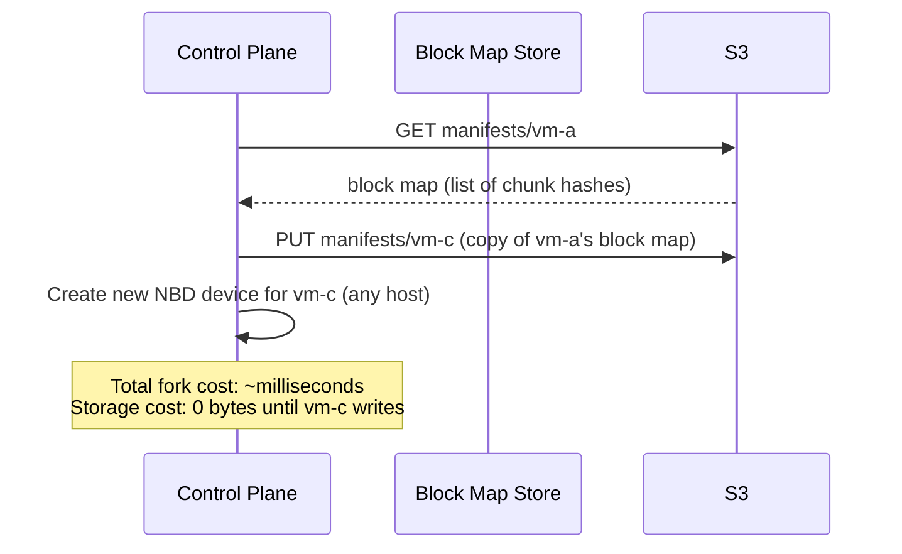

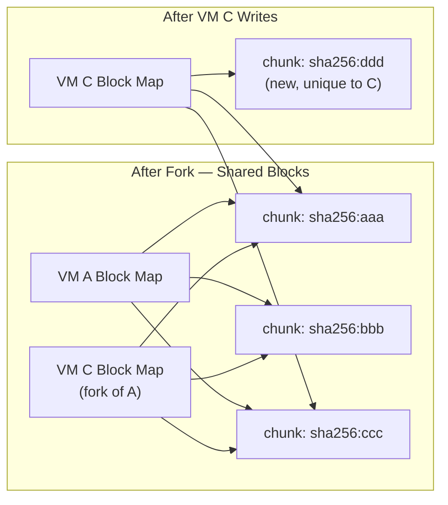

---

## Tenant Isolation Model

Cross-tenant deduplication is a side-channel risk (deduplication oracle attack). The design uses a tiered isolation model.

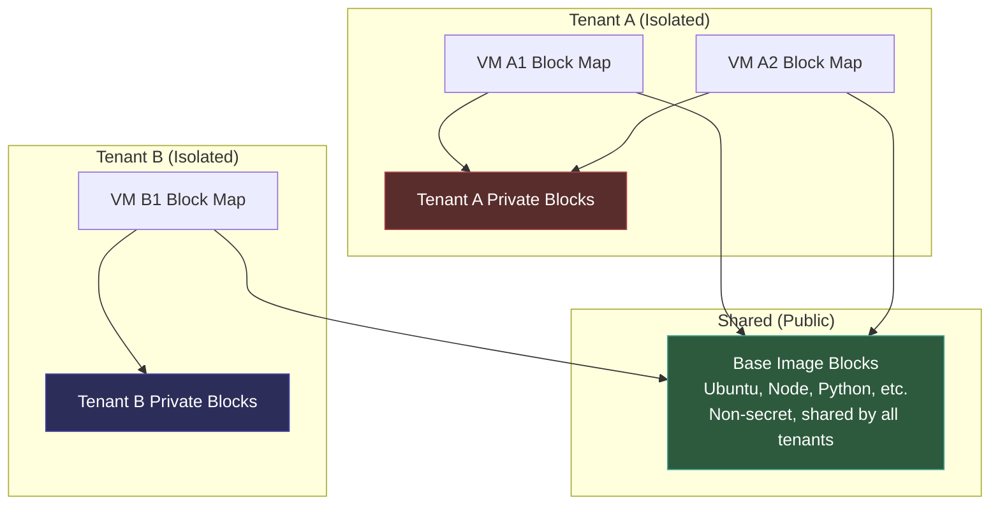

**Rules:**
- Base image blocks are blessed, public, and shared across all tenants
- Any block written by a tenant is keyed to that tenant's namespace
- Dedup happens freely *within* a tenant (their own VMs share blocks)
- Cross-tenant dedup only happens against the shared base set

**S3 Key Layout:**

```
blocks/
  bases/{sha256}          ← shared, anyone can read
  tenants/{tenant-id}/{sha256}  ← isolated, tenant-scoped

manifests/
  {tenant-id}/{vm-id}     ← always tenant-scoped
```

---

## Cache Design

Two-tier cache: in-memory LRU for hot blocks, SSD-backed LRU for warm blocks.

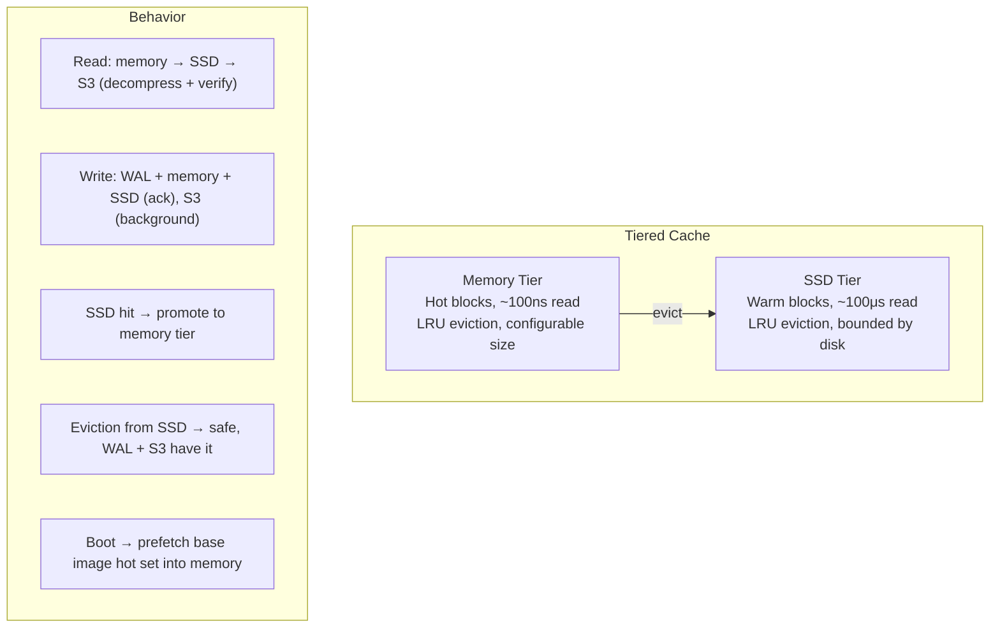

**Memory tier:**
- Configurable size per host (e.g., `memory_cache_gb`). Sized relative to workload — hosts running many small VMs need more cache breadth, hosts running few large VMs need more cache depth.
- LRU eviction. Evicted blocks fall to SSD tier, not lost.
- 1000x faster than SSD for hot-path reads. This matters for database workloads and any VM with a tight working set.

**SSD tier:**
- Bounded by available SSD space. Much larger than memory tier.
- LRU eviction. Evicted blocks are simply gone from cache — re-pulled from S3 on next access.
- Blocks are stored uncompressed on SSD (already decompressed on ingestion from S3). Avoids decompression on the SSD read path.

**Key properties:**
- Both tiers are pure optimization. Losing them means slower reads, not data loss (WAL + S3 are the durability story).
- Blocks are immutable (content-addressed), so cached blocks are always valid. No coherence protocol needed.
- Boot prefetching: base images have a known hot set (kernel, init, core libs). Prefetch into memory cache when a VM is scheduled, before it starts.

---

## Compression

All blocks are compressed with LZ4 before upload to S3. LZ4 is chosen for its speed — compression and decompression are essentially free relative to I/O latency.

**Where compression happens in the pipeline:**

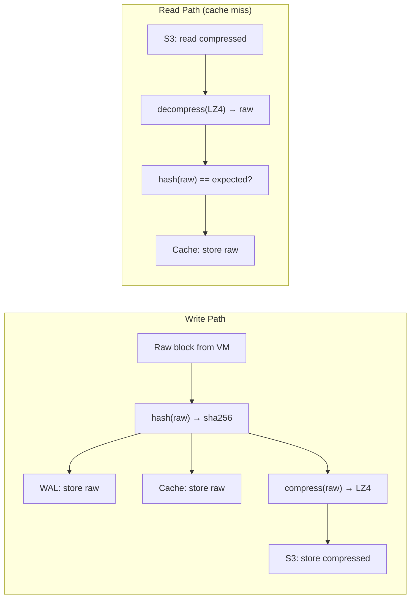

**Design decisions:**
- **Hash before compress.** Dedup is based on raw content hashes. Same raw data always produces the same hash, regardless of LZ4 version or compression level. This is critical — if we hashed compressed data, different compression runs of identical content could produce different hashes, breaking dedup.
- **Cache stores raw (uncompressed) blocks.** Cache reads are on the hot path. Decompression on every cache hit adds CPU cost for no benefit — the cache exists to be fast.
- **WAL stores raw blocks.** WAL replay needs to re-upload to S3, which means compressing during replay. Storing raw in the WAL keeps the write path simple (no compression before ack) and pays the compression cost during background flush, off the critical path.
- **S3 stores compressed blocks.** This is where compression pays for itself — reduced storage cost (~1.5-2x for typical OS/app data) and reduced transfer time on cache misses.

**Expected savings:**
- OS and application data: 1.5-2x compression ratio with LZ4
- Already-compressed data (images, archives): ~1x (LZ4 detects incompressible data and passes through with minimal overhead)
- Effective S3 bill reduction: ~40-50% for typical workloads

---

## Crash Recovery (WAL)

The WAL (write-ahead log) is the durability mechanism. S3 is the long-term store, but writes are acked locally before S3 confirms. The WAL bridges the gap.

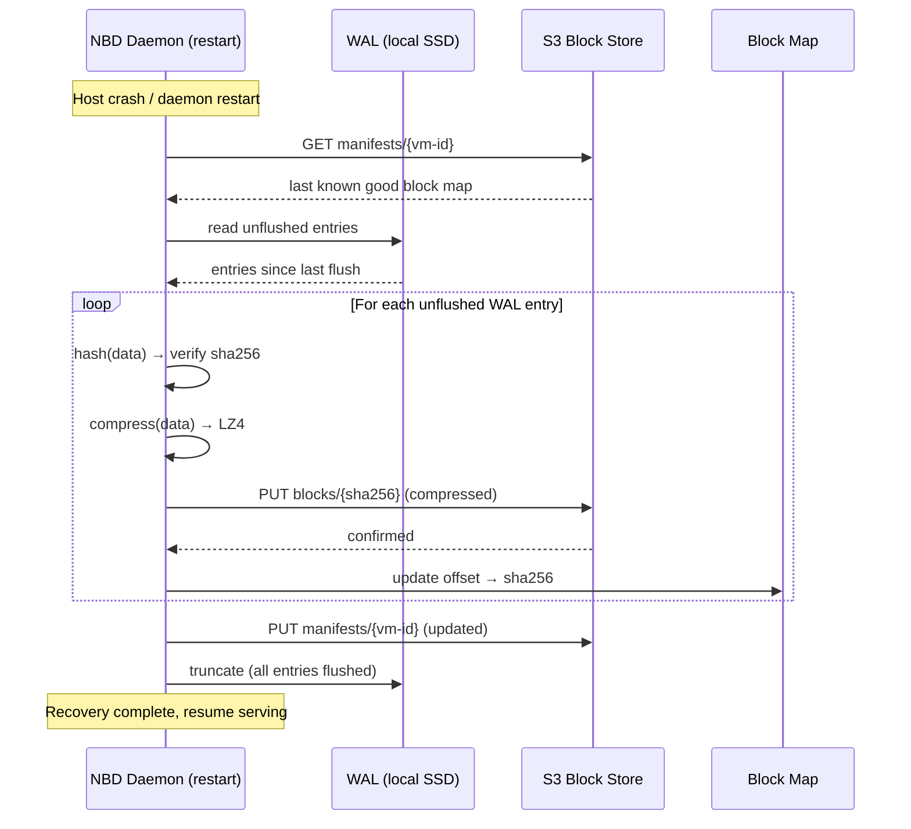

**WAL properties:**
- Append-only file on local SSD. Sequential writes only — fast and predictable.
- Each entry: `(vm-id, offset, chunk_hash, raw_chunk_data)`. Self-contained for replay.
- Entries are marked flushed after S3 confirms the block upload.
- Manifest is persisted to S3 periodically (e.g., every N seconds or M entries), not on every write.
- On recovery: load last-known-good manifest from S3, replay unflushed WAL entries, done.
- WAL is truncated after full flush. Keeps disk usage bounded.

**Failure modes:**
- **Host dies, WAL intact:** Full recovery. Replay unflushed entries.
- **Host dies, WAL partially written:** Last incomplete entry is discarded. That single in-flight write is lost. The VM sees it as a write that didn't ack — same as a power loss on bare metal. Acceptable.
- **Host dies, SSD dead:** WAL and cache are both gone. Fall back to last manifest in S3. Unflushed writes since last manifest sync are lost. This is the worst case — bounded by manifest flush interval.

---

## Live Migration

Moving a VM between hosts. The source of truth is S3, not local state.

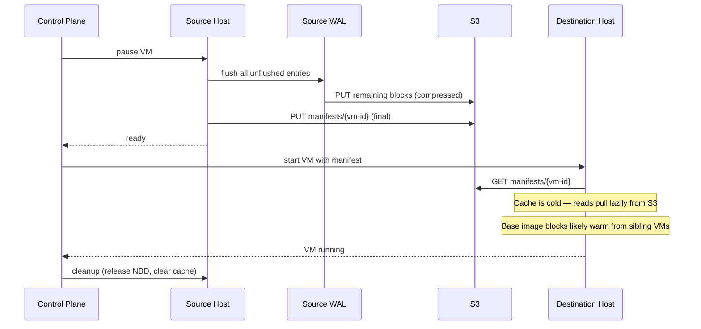

**Comparison with v1:**
- v1 already does drain-dirty-blocks → point new host at S3. This design doesn't fundamentally change that flow.
- The meaningful improvement: the WAL means we can bound the flush to only unflushed entries, and potentially resume the VM on the destination before the flush fully completes (serve reads from S3 while WAL replays in the background). v1 blocks on a full drain.
- Base image blocks are likely already warm on the destination from sibling VMs, so the cold-cache penalty is mostly limited to tenant-specific data.
- Migration cost is proportional to WAL flush size, not disk size. A 100G VM with 10MB of unflushed writes costs 10MB to migrate.

**Cache warming:** Not strictly necessary. The destination cache warms organically. For latency-sensitive workloads, the control plane *could* hint the destination to prefetch the source's hot set, but this is an optimization to consider later, not a launch requirement.

---

## Garbage Collection

This is one of the harder parts of the system. When VMs are deleted or blocks are overwritten, orphaned blocks accumulate in S3. They need to be cleaned up without racing against concurrent forks, writes, or deletes.

**Approach: mark-and-sweep with a grace period.**

Reference counting was considered and rejected. Under concurrent fork + delete + write, maintaining accurate reference counts requires distributed coordination (or serialization through a single counter) that adds complexity and fragility. A count that goes wrong means either storage leaks (count too high) or data loss (count hits zero while still referenced). Mark-and-sweep is simpler and its failure mode is always conservative — worst case, you keep blocks too long.

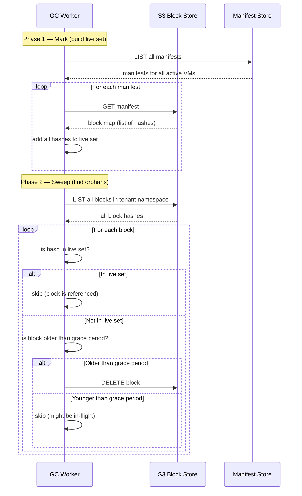

**Grace period:** Blocks younger than the grace period (e.g., 24 hours) are never deleted, even if unreferenced. This protects against races:
- A write creates a block in S3 but hasn't updated the manifest yet. Without the grace period, GC could delete it.
- A fork copies a manifest, and the source VM deletes a block between the manifest read and the fork's first access. The grace period keeps the block alive.
- WAL replay after a crash uploads blocks that aren't yet in any manifest. Grace period covers the recovery window.

**Operational design:**
- **Frequency:** Daily or every few hours. GC is not latency-sensitive — running it less frequently means slightly more orphaned storage, not correctness issues.
- **Scope:** Per-tenant. Each tenant's blocks are GC'd independently. Shared base image blocks are never GC'd (they're managed separately as part of the base image registry).
- **Cost:** The main cost is S3 LIST operations. For a tenant with 1M blocks, a full LIST is ~1000 requests (1000 keys per page). At current S3 pricing, this is negligible. The live set construction requires reading all manifests — for a tenant with 100 VMs, that's 100 GET requests.
- **Consistency:** GC is eventually consistent. A sweep might miss a block that was just orphaned. It'll be caught on the next sweep. This is fine — the cost is a few hours of extra storage, not correctness.

**Failure modes:**
- **GC crashes mid-sweep:** No harm. Incomplete sweep means some orphans survive until the next run. Conservative failure.
- **GC deletes a block that's still needed:** Can only happen if the block is older than the grace period AND not in any manifest. The grace period must be longer than the longest possible window between block creation and manifest update (WAL flush interval + manifest sync interval + buffer). A 24-hour grace period is extremely conservative.
- **GC runs during a fork operation:** The fork copies a manifest atomically (single S3 GET + PUT). GC sees either the old manifest or the new one. Either way, all blocks referenced by the visible manifest are in the live set.

---

## Encryption at Rest

Tenant data in S3 is encrypted per-tenant using S3 server-side encryption with KMS (SSE-KMS).

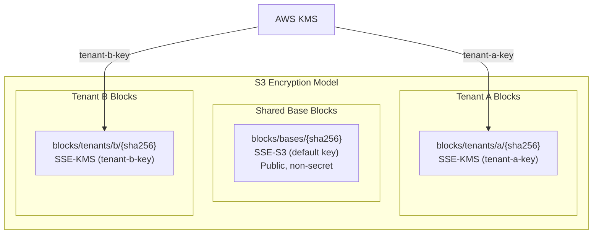

**Rules:**
- Shared base image blocks: SSE-S3 (AWS-managed key). These aren't secret — they're public OS/runtime images.
- Tenant-written blocks: SSE-KMS with a per-tenant KMS key. Encryption and decryption handled transparently by S3 on PUT/GET.
- Manifests: SSE-KMS with the tenant's key. The block map itself reveals which blocks a tenant is using.
- No application-layer encryption needed. S3 + KMS handles it. The daemon doesn't touch keys.

---

## I/O QoS

Use Linux cgroup v2 block I/O controllers. The kernel handles scheduling and fairness. The NBD daemon stays dumb.

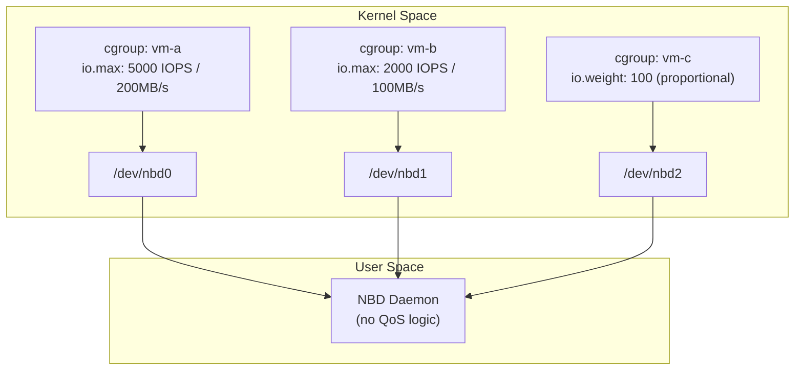

**Two modes available:**
- `io.max` — hard limits. "This VM gets at most X IOPS and Y MB/s." Good for tiered plans.
- `io.weight` — proportional sharing. "When contended, divide bandwidth by weight." Good for fair sharing among same-tier VMs.

**Why this is the right move:**
- Zero QoS code in the daemon. No token buckets, no priority queues, no scheduling logic.
- The kernel's block layer is already optimized for this. Battle-tested, low overhead.
- QoS policy becomes a control plane concern — set cgroup limits when creating the VM. The daemon doesn't know or care about tiers.
- Composable with CPU and memory cgroups the microVM runtime is already using.

---

## Block Integrity Verification

Content-addressing gives us free integrity checks. Every block is keyed by its hash — verification is just re-hashing and comparing.


**Strategy: trust-but-verify, off the hot path.**
- **S3 reads (cache miss):** Always verify. Decompress, then hash the raw block, compare to the expected hash. This is the ingestion boundary — verify here, trust the cache after.
- **Cache reads (cache hit):** Don't verify on every read. Hashing on the hot path adds CPU latency to every I/O. The local SSD and memory are trusted for transient storage.
- **Background scrubber:** Periodically re-verify cached blocks against their hashes. Catches silent bit rot on the SSD without touching the hot path. Frequency tunable — hourly is probably fine.
- **On mismatch from S3:** Retry once (could be transient network corruption). If it fails again, the block is corrupt in S3 — raise an alert. This shouldn't happen given S3's own integrity guarantees, but defense in depth.

---

## Component Summary

| Component | Role | Implementation Notes |
|-----------|------|---------------------|
| **NBD Device** | 1:1 per VM, block device interface | Linux kernel NBD, socket pair to daemon |
| **NBD Daemon** | Single process, multiplexes all VMs | Event loop, resolves offsets via block maps, no QoS logic |
| **WAL** | Crash recovery, durability bridge | Append-only on local SSD, stores raw blocks, replayed on recovery |
| **Block Map** | Ordered array of chunk hashes per VM | ~25MB per 100GB disk at 128KB chunks. Sparse for unwritten regions. Fully in memory. |
| **Memory Cache** | In-memory LRU, hot blocks | Configurable size (`memory_cache_gb`), ~100ns reads, evicts to SSD tier |
| **SSD Cache** | SSD-backed LRU, warm blocks | ~100μs reads, stores uncompressed blocks, verified on ingestion |
| **Compression** | LZ4 at S3 boundary | Hash raw → compress → store. Decompress → verify → cache. ~1.5-2x ratio. |
| **S3 Block Store** | Durable, content-addressed chunks | LZ4 compressed, 128KB chunk size, SSE-KMS per tenant |
| **Base Image Registry** | Blessed shared blocks | Pre-chunked base images, SSE-S3, shared by all tenants |
| **GC Worker** | Orphan block cleanup | Mark-and-sweep with 24h grace period, per-tenant, daily |
| **cgroup v2 I/O** | Per-VM IOPS/throughput limits | Kernel-level, configured by control plane at VM creation |
| **Background Scrubber** | Cache integrity verification | Periodic re-hash of cached blocks, off hot path |

---

## What We're Replacing (and Why)

| ZFS Capability | Replacement | Why |
|---------------|-------------|-----|
| **Local snapshots/clones** | Block map copy in S3 | ZFS clones are local-only. Block map copy works cross-host — this is the primary motivation for the entire design. |
| **LZ4 compression** | LZ4 at S3 boundary | Same algorithm, applied at a different layer. Compression ratio is equivalent. |
| **Block integrity (checksums)** | Content-addressed hashing + scrubber | Every block is verified by its hash. Background scrubber catches bit rot. |
| **ARC (adaptive read cache)** | Two-tier memory + SSD cache | Memory tier replaces ARC's L1. SSD tier replaces ARC's L2. LRU instead of ARC's adaptive algorithm — simpler, may revisit if hit rates are poor. |
| **Copy-on-write** | Content-addressed writes | Every write produces a new block by definition. Old blocks remain until GC. |
| **Durability (ZIL/SLOG)** | WAL on local SSD | Same concept, different implementation. WAL entries flush to S3 instead of being replayed locally. |
| **Deduplication** | Content-addressing (inherent) | Same content → same hash → same block. Dedup is automatic, not a feature flag. |

---

## Open Questions

1. **Memory cache sizing** — What's the right default for `memory_cache_gb`? This depends on workload mix. Needs profiling under realistic load to find the knee of the hit-rate curve.
2. **WAL flush interval** — How frequently do we flush the manifest to S3? This determines the worst-case data loss window if both the host and SSD die simultaneously. Every 5s? Every 100 entries? Tunable per workload?
3. **Cache warming strategy** — How aggressively do we prefetch on VM create? Is the boot hot set predictable enough to preload? Start without it, measure cold-boot latency, add if needed.
4. **cgroup I/O limits by tier** — What are the actual IOPS/throughput numbers per tier? Use `io.max` for hard caps (paid tiers) or `io.weight` for proportional sharing (shared environments)?
5. **GC grace period tuning** — 24 hours is conservative. Could be shorter if we can bound the maximum time between block creation and manifest update. Shorter grace period = less orphan accumulation.
6. **Sub-chunk dirty tracking** — If write amplification becomes a measured problem for database-heavy workloads, implement delta tracking within chunks. Deferred until we have data showing it matters.
7. **WAL size bound** — If S3 is slow or temporarily unavailable, the WAL grows. At what size do we start back-pressuring writes? This is the release valve for S3 outages.
8. **ARC vs LRU** — The memory cache uses simple LRU. ZFS's ARC algorithm adapts between recency and frequency. If cache hit rates are poor under realistic workloads, consider implementing ARC or LIRS. Start with LRU — it's simpler and might be good enough.
