# Glide v2 — MicroVM Storage for Boxes

## Design Document — NBD + Content-Addressed Block Store + S3

---

## Overview

A storage layer for Boxes — Paraglide's microVMs. Provides fast boot, near-instant same-host sleep/wake, cheap cross-host forks, and storage efficiency through content-addressing.

**Core insight: S3 is the portability layer, not the durability layer.** During active operation, all I/O hits local SSD. S3 is only touched when data needs to cross a host boundary — fork, portable sleep, promote, migrate. A preview VM that boots, builds, runs tests, and gets deleted may never touch S3 at all beyond its initial fork.

**Why this works for Boxes:** Almost every VM is ephemeral — previews, dev environments, promotion builds. They fork from production, do their work locally, and get deleted. The only long-lived VMs are production, and production barely writes after its initial build (web servers process requests in memory, databases are separate VMs). S3 traffic is proportional to cross-host transitions, not VM uptime.

**Why not ZFS?** ZFS is good at what it does — compression, integrity, local snapshots. The problem is that it's local. The killer feature this architecture unlocks is cross-host fork: copy a manifest in S3 and a VM materializes on any host, instantly, with zero data transfer. ZFS clone can't cross a host boundary without shipping data. Everything else in this design (WAL, content-addressing, compression, integrity checking) replaces ZFS's local responsibilities to make that cross-host capability possible. We're not removing ZFS because it's bad — we're removing it because we need something it can't do.

---

## Benefits

**Near-instant same-host sleep/wake.** Sleeping a VM on the same host is just stopping it — all data is on local SSD. Waking it is loading the block map from a local file. No S3 round-trip, no data transfer, no cache warming. Milliseconds.

**Zero S3 traffic during active operation.** Writes go to local SSD. Reads hit local cache. The default flush mode touches S3 only on cross-host transitions (fork, portable sleep, migrate). A preview VM that lives and dies on one host generates zero ongoing S3 operations.

**Fast boot.** VMs don't wait for a full disk image to materialize. The NBD device is available immediately, and blocks pull lazily from S3 on first access. Boot only touches the kernel, init, and core libs — a few hundred MB at most, much of which is already cached from sibling VMs. Sub-second to first instruction is achievable.

**Cheap cross-host forks.** Forking a 100G VM is a metadata copy — duplicate the block map in S3, done. Zero data copied. The forked VM shares 100% of its blocks with the parent until it writes. Storage cost is proportional to unique writes, not total disk size. This works across hosts — the fork can materialize anywhere. This unlocks preview environments, branch deploys, and dev/prod parity at near-zero cost.

**Storage efficiency.** Content-addressing deduplicates automatically across all tenants. A thousand tenants running Next.js apps share one copy of the base OS, Node runtime, and common npm packages — ~2.7GB stored once instead of ~3TB of per-tenant copies (15x reduction). LZ4 compression before upload further reduces S3 storage by ~1.5-2x for typical OS/application data. The marginal S3 cost of tenant N+1 converges to the cost of storing their unique source code (~50-200MB).

**Operational simplicity.** No ZFS to tune (ARC, zpool, scrub schedules). No distributed filesystem to operate (quorum, rebalancing, split-brain). No QoS code in the daemon (cgroup v2 handles it). No application-layer encryption (SSE-KMS handles it). One global block namespace, one GC. Each component does one thing.

**Integrity for free.** Content-addressing means every block can be verified by re-hashing. No separate checksum database to maintain. Corruption is detectable at read time and by background scrubbing.

---

## Tradeoffs

**Host death during active operation = data loss.** In the default flush mode (demand-driven), unflushed blocks exist only on local SSD. If the host and SSD die simultaneously, writes since the last S3 checkpoint are lost. For preview environments and dev servers, this is acceptable — the VM was forked from a known state and can be recreated. For production VMs using continuous flush mode, the loss window is bounded by the flush interval (~5 seconds). For VMs where even that isn't acceptable, synchronous S3 writes are possible at the cost of write latency.

**S3 latency on cache miss.** A cold read hits S3, which is 10-50ms depending on region and object size. Mitigation: memory cache tier for hot blocks (~100ns), SSD cache for warm blocks (~100μs), pack-level prefetching that warms 25 blocks per cache miss. Same-host wake has zero cold reads (cache is warm). Cross-host wake has cold reads for tenant-specific data, but base image blocks are likely warm from sibling VMs.

**Write amplification.** Content-addressing means every write to a chunk produces a new block, even if only a small portion changed. With 128KB chunks, a 4KB random write still produces a 128KB new block — 32x amplification. This only affects local SSD writes (fast) and S3 flushes (infrequent in demand-driven mode). Typical VM workloads (app servers, build systems) do mostly large sequential writes where write amp is close to 1x. The 32x case only hits on small random writes. See the Chunk Size section for the full analysis.

**Block map memory at scale.** A 100GB disk with 128KB chunks = ~800K entries per VM. At 17 bytes per entry (BLAKE3-128 hash + flags), that's ~13MB per VM in the dense case. With sparse representation (typical 10GB of actual written data), it's ~1.3MB per VM. At 100 VMs per host, block maps consume ~133MB total in practice — manageable. See the Block Map section for the full analysis.

**Garbage collection is a real system.** Deleted VMs leave orphaned blocks in S3. Event-driven refcounts make GC O(1) per lifecycle event — no manifest scanning. A monthly reconciliation sweep catches any drift. See the Garbage Collection section.

**Cold cache on cross-host wake.** When a VM wakes on a different host, its SSD cache is empty. Reads hit S3 until the cache warms. Base image blocks help (likely warm from siblings), but tenant-specific hot data will be cold. This is a transient degradation, not a steady state.

**cgroup v2 QoS requires kernel support.** The host kernel needs cgroup v2 with io controller enabled. Not a design issue, but a deployment prerequisite.

---

## Architecture

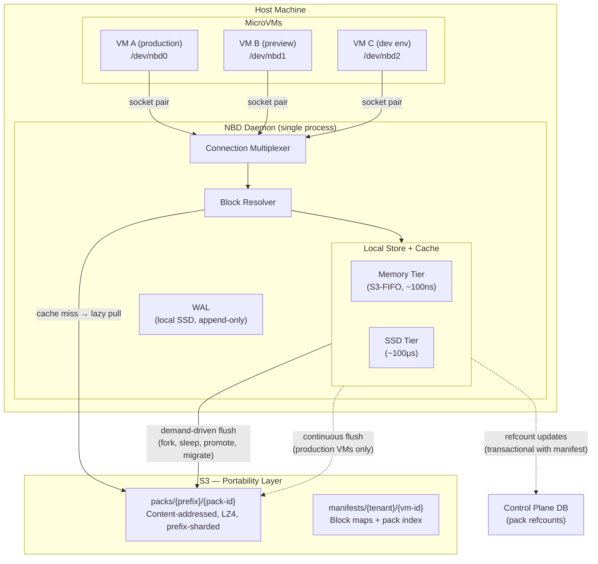

**During active operation**, all I/O stays within the host box. S3 is only touched on cross-host transitions or for cache misses on blocks that haven't been loaded locally yet. Refcount updates to the control plane DB are piggybacked on manifest writes — not on the read/write hot path.

---

## Flush Modes

The flush mode controls **when** blocks are uploaded from local SSD to S3. The architecture is identical across all modes — only the flush scheduler changes.

### Demand-Driven (Default)

S3 is touched only when data needs to cross a host boundary:

| Trigger | What happens |
|---------|-------------|
| **Fork request** | Flush source VM's dirty blocks + manifest to S3, then copy manifest |
| **Portable sleep** | Flush dirty blocks + manifest to S3, release host resources |
| **Promote** | Flush source → fork production → restore checkpoint → build |
| **Migrate** | Flush dirty blocks + manifest → start on destination |
| **Delete** | Discard local state. No S3 flush (it's ephemeral). |

During active operation: **zero S3 traffic.** All writes hit local SSD. All reads hit local cache (or S3 on cache miss for blocks not yet loaded, e.g., base image blocks during first boot).

**Durability guarantee:** Local SSD only. Host death = data loss back to last S3 checkpoint. For preview environments, dev servers, and promotion builds, this is the right tradeoff. The VM was forked from a known state and can be recreated.

### Continuous (Opt-In for Production)

Production VMs are the fork source — someone might create a preview at any time. Background flush keeps S3 current so forks don't stall on a flush.

| Interval | Operation |
|----------|-----------|
| ~5 seconds | Flush dirty blocks to S3 as packs |
| ~60 seconds | Sync manifest (block map + pack index) to S3 |

**Durability guarantee:** Host death loses at most ~5 seconds of writes (bounded by block flush interval). The manifest may be up to 60 seconds stale, but blocks flushed to S3 between manifest syncs are recoverable — they exist as packs in S3 and the pack index can be reconstructed on recovery.

**In practice, production VMs barely write after boot.** A web server processes requests in memory and writes to a database (separate VM). Filesystem writes are log rotation and temp files — a few blocks per minute. The continuous flush traffic from a steady-state production VM is negligible.

**Adaptive intervals:** The fixed 5s/60s intervals are the default. The flush scheduler adapts based on dirty set size (O(1) check) — flush more frequently under heavy writes (reduces the data loss window), skip flushes entirely when the dirty set is empty. Simple heuristic: `flush_interval = max(1s, base_interval × (threshold / dirty_set.len()))`. Clamped between 1s and the base interval.

### Configuration

The daemon doesn't know what a "preview" or "production" VM is. The control plane owns that policy and tells the daemon what to do.

**On export creation:**

```
PUT /api/exports/{name}
{
  "size_gb": 100,
  "s3_prefix": "tenants/acme/vm-preview-abc",
  "flush_mode": "demand_driven"
}
```

`flush_mode` is `"demand_driven"` (default) or `"continuous"`. The daemon starts the appropriate flush scheduler.

**Runtime switch** (e.g., promotion turns a preview into a fork source):

```
POST /api/exports/{name}/flush-mode
{ "flush_mode": "continuous" }
```

Takes effect immediately — starts the background flush scheduler without restarting the VM. The control plane calls this after a promotion completes and the new VM becomes the fork source.

**That's it.** Two values, one API field, one mutation endpoint. The control plane maps Box lifecycle to flush mode:

| Box role | Flush mode | When set |
|----------|-----------|----------|
| Preview / dev env | `demand_driven` | At creation |
| Promotion build | `demand_driven` | At creation |
| Production (fork source) | `continuous` | At creation, or switched at promotion |

### Why Not Just Flush On Fork?

You could make even production demand-driven: flush when a fork is requested, accept a few seconds of latency. This works — the flush is proportional to dirty data, which is small for a steady-state production VM. The tradeoff is a 1-5 second delay on preview creation. If that's acceptable, production can use demand-driven too. Continuous is the conservative default for fork-source VMs.

---

## Box Lifecycle Mapping

How the storage layer maps to every Box operation:

### Create (Fork from Production)

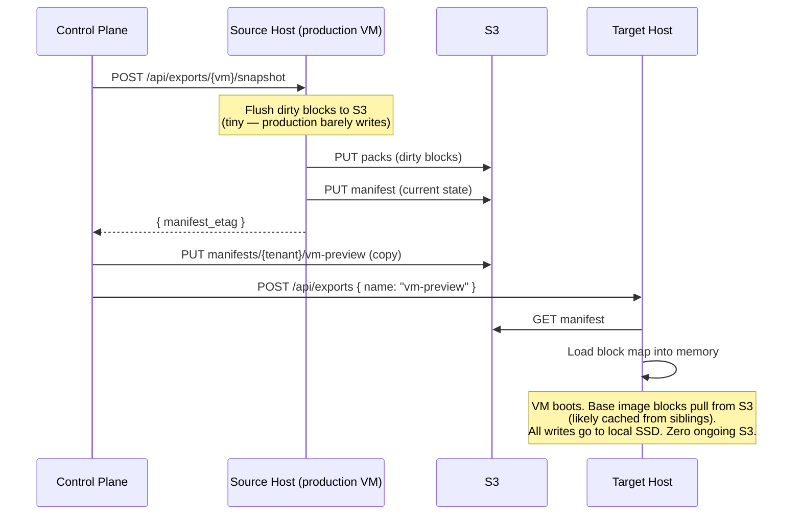

The preview VM is now fully local. It installs dependencies, builds, runs tests — all on local SSD. No S3 traffic until it sleeps, gets forked, or is deleted.

### Sleep / Wake

```
Same-host sleep:                     Same-host wake:
  1. Stop VM                           1. Load block map from local file
  2. Done. (~milliseconds)             2. Start VM. (~milliseconds)
                                       3. Cache is warm. Zero S3.

Portable sleep:                      Cross-host wake:
  1. Stop VM                           1. Load manifest from S3 (one GET)
  2. Pack dirty blocks → S3            2. Start VM
  3. Write manifest → S3               3. Reads pull lazily from S3
  4. Release host resources            4. Base blocks warm from siblings
  (~seconds, proportional to dirty)    5. Cache warms organically
```

Same-host sleep/wake is the common case — an idle preview goes to sleep, the developer comes back, it wakes on the same host. Instant. Zero S3.

Portable sleep is for when the host needs to be released (spot instance reclaim, rebalancing) or the VM might wake on a different host. The flush cost is proportional to dirty data since the last S3 checkpoint.

### Promote

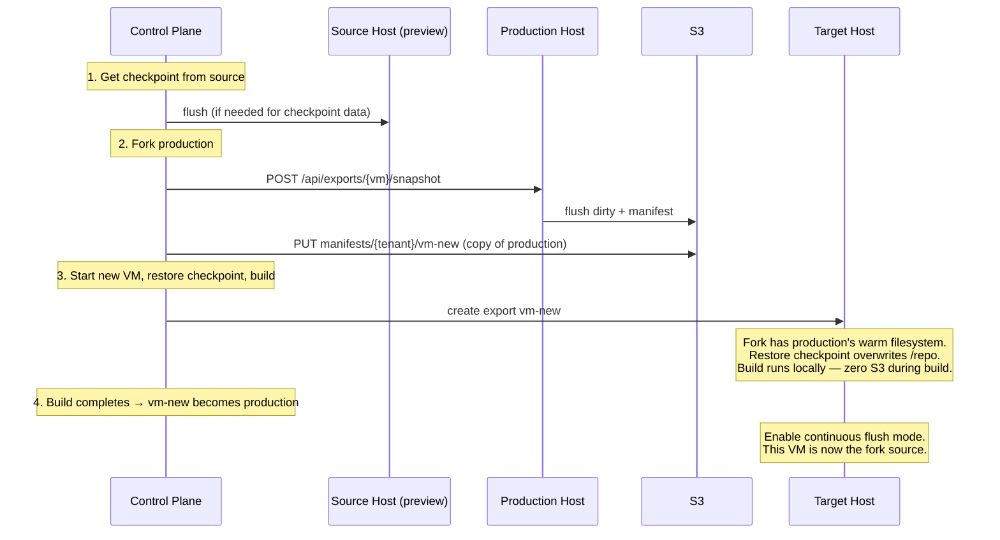

The build phase generates heavy I/O (npm install, compilation) — all on local SSD. Zero S3 traffic. Only after the VM becomes production does continuous flush kick in.

### Migrate

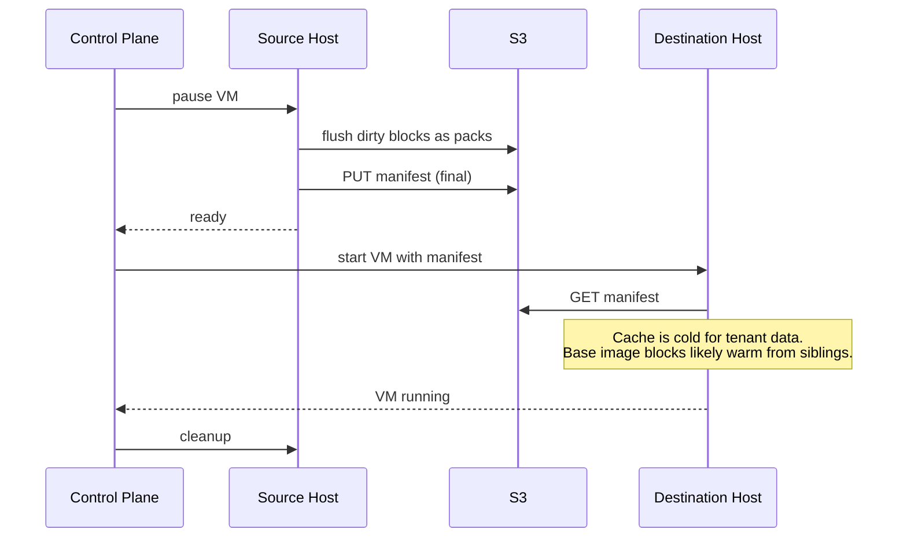

Migration cost is proportional to unflushed dirty data, not disk size. A 100G VM with 10MB of dirty blocks costs 10MB to migrate.

### Delete

For ephemeral VMs (previews, dev envs): stop the VM, release local resources. No S3 flush — the data is ephemeral. If the VM had been flushed to S3 at some point (portable sleep, fork source), GC cleans up orphaned blocks on its normal schedule.

---

## S3 Cost Analysis

Typical tenant, typical day: 3 production VMs, 20 preview creates, 5 promotions, 10 dev environment wake-ups.

| Operation | S3 PUTs | S3 GETs |
|-----------|---------|---------|
| Production flushes (on fork requests) | 25 × ~4 packs = 100 | — |
| Manifest writes | 25 | — |
| Fork manifest reads | — | 20 |
| Cross-host wake (lazy load) | — | 10 × ~50 packs = 500 |
| **Daily total** | **~125** | **~520** |
| **Monthly total** | **~3,750** | **~15,600** |

**Monthly S3 cost: $0.02 (PUTs) + $0.006 (GETs) = $0.03**

At 10x scale (30 production VMs, 200 previews/day, 50 promotions): **$0.30/month.**

Storage costs are similarly minimal — content-addressing deduplicates aggressively, and preview VMs that never flush to S3 consume zero S3 storage.

---

## Read Path

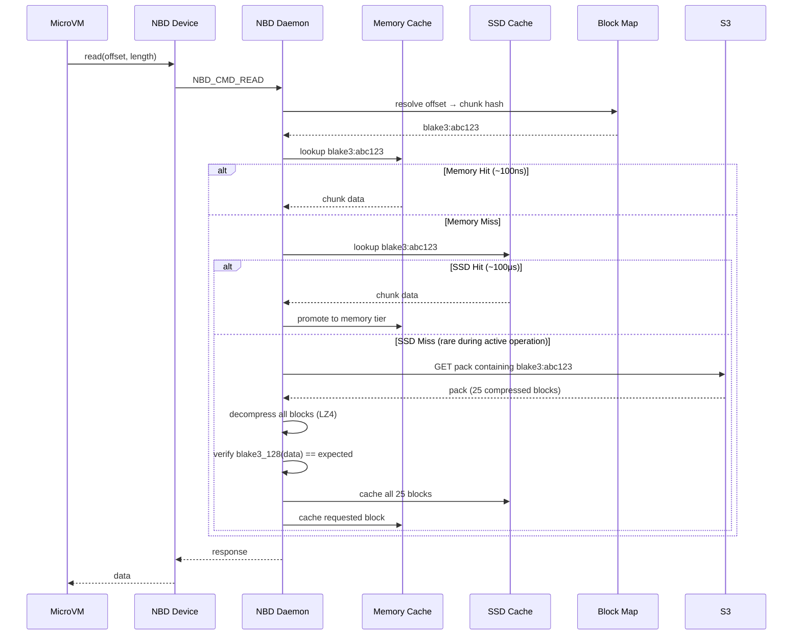

Cache misses that hit S3 are primarily during initial boot (base image blocks) and cross-host wake (tenant data not yet local). During steady-state active operation, the cache hit rate approaches 100% — everything the VM has touched is on local SSD.

**Pack-level prefetch:** On a cache miss, the daemon fetches the entire pack (~3.2MB, 25 blocks) instead of a single block. The S3 first-byte latency (10-50ms) dominates — the extra ~3MB of transfer is negligible. This prefetches temporally related blocks (written in the same flush cycle, often accessed together), warming 25 cache entries per miss.

**Sequential read-ahead:** The daemon tracks the last N read offsets per VM. If reads are to consecutive chunk offsets (sequential access pattern — common during boot and large file reads), proactively fetch the next pack before it's requested. This hides S3 latency for sequential workloads: by the time the VM reads the next block, the pack is already in cache. Simple sequential detector, disabled after a non-sequential read resets the pattern.

---

## Write Path

Writes are acked after hitting the local WAL and cache. S3 upload happens on demand (or in the background for continuous-flush VMs).

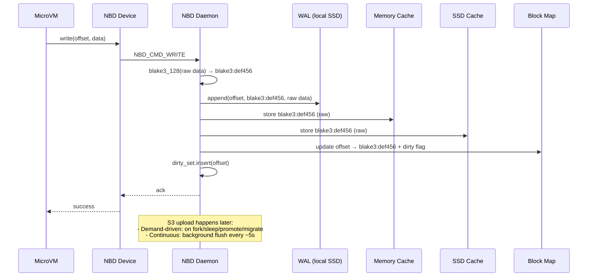

**Key detail:** BLAKE3-128 hashing is always done on raw (uncompressed) data. This ensures dedup works correctly — the same raw content always produces the same hash regardless of compression. Compression happens only at the S3 boundary.

### S3 Flush (When Triggered)

Whether triggered by a fork request, portable sleep, or the continuous flush timer:

1. Drain the dirty set — O(dirty count), not O(block map size)
2. Deduplicate: skip blocks whose hash already exists in the host pack index (already uploaded by this VM or another VM on the host)
3. Read block data from SSD cache for remaining (genuinely new) blocks
4. Compress each new block with LZ4
5. Assemble into a pack (index header + compressed blocks)
6. Single S3 PUT per pack (~3.2MB, 25 blocks)
7. Update host pack index: hash → (pack-id, offset, length)
8. Clear dirty flags on flushed entries, move dirty blocks to clean cache
9. Sync manifest to S3 (block map + pack index derived from host index)
10. Update pack refcounts in control plane DB (transactional with manifest record update — see Garbage Collection)

**Note:** The flush reads from the SSD cache, not the WAL. The WAL is for local crash recovery only (see Crash Recovery). Dirty tracking lives in the block map — each entry carries a flag indicating whether the block has been flushed to S3.

### TRIM / Discard

When a guest filesystem deletes files, it issues TRIM commands to reclaim blocks. Without handling these, the block map grows monotonically.

**Implementation:** Handle `NBD_CMD_TRIM` by resetting trimmed block map entries to the well-known zero-block hash.

- **Metadata-only.** No data uploaded to S3. The WAL records the TRIM for crash recovery, but the entry carries no block data — just the offset and zero hash.
- **Immediate memory savings.** Sparse block map drops zero entries. A VM that wrote 50GB and trimmed 40GB holds ~80K entries (~1.3MB), not ~400K (~6.5MB).
- **Storage reclaimed by GC.** Orphaned blocks are swept on the next GC cycle (subject to grace period). No special TRIM-aware GC needed.
- **Guest opt-in.** The guest filesystem must be mounted with `discard` option or use periodic `fstrim`.

---

## Chunk Size & Write Amplification

**Default: 128KB chunks.**

| Chunk Size | Write Amp (4KB write) | Block Map Size (100GB disk) | Block Map Memory | S3 Objects (100GB) |
|------------|----------------------|----------------------------|-----------------|-------------------|
| 4MB | 1000x | ~25K entries | ~415KB | ~25K |
| 1MB | 256x | ~100K entries | ~1.7MB | ~100K |
| 128KB | 32x | ~800K entries | ~13MB | ~800K |
| 64KB | 16x | ~1.6M entries | ~26MB | ~1.6M |

128KB is the sweet spot:

- **32x write amplification is acceptable.** It only affects local SSD writes (fast, ~20μs) and S3 flushes (infrequent in demand-driven mode). Typical VM workloads do mostly large sequential writes (package installs, builds) where write amp is close to 1x. The 32x case only hits on small random writes.
- **13MB block map per VM is manageable.** At 100 VMs per host with sparse representation (typical), it's ~133MB total.
- **Matches v1's proven chunk size.** v1 uses 128KB blocks and it works. Don't fix what isn't broken.

**Future optimization: sub-chunk dirty tracking.** For workloads with heavy small random writes, track dirty regions within a chunk and only upload the changed portions. Build it only if write amplification becomes a measured problem at scale.

---

## Block Map Design

The block map is the critical metadata structure. Every read and write resolves through it. Must be fast, memory footprint predictable.

**Structure:** An ordered array mapping chunk index → (content hash, source).

```
Block Map for VM-A (100GB disk, 128KB chunks):
  Index 0      → blake3:aabbccdd...    (bytes 0 - 128KB)
  Index 1      → blake3:ddeeff00...    (bytes 128KB - 256KB)
  Index 2      → blake3:ff112233...    (bytes 256KB - 384KB)
  ...
  Index 819199 → blake3:11223344...    (bytes 99.99GB - 100GB)
```

**Per-entry size:** 17 bytes (16-byte BLAKE3-128 hash + 1-byte flags). No offset needed — the array index *is* the offset (index × chunk_size = byte offset). The flags byte encodes:
- **Dirty** (1 bit): whether the block has been flushed to S3. Set on write, cleared on S3 flush. A separate dirty set (`HashSet<u64>` of offsets) tracks which entries are dirty so the flush path iterates O(dirty count), not O(block map size). The WAL is not involved in S3 flush.

No source tag needed — all blocks live in one global namespace (`packs/{prefix}/{pack-id}`, prefix-sharded). The block map contains only the content hash and the dirty flag.

**Why BLAKE3-128 over SHA256:** Content-addressing needs collision resistance, not cryptographic security against adversaries. 128 bits gives a birthday bound of ~2^64 blocks — at 128KB per block, that's 2 exabytes of unique data per tenant. BLAKE3 is ~3-4x faster than SHA256, reducing hashing cost on the write path (~5μs for 128KB vs ~20μs). Shorter hashes mean smaller block maps, smaller manifests, shorter S3 keys.

**Memory analysis:**

| VMs per host | Block map memory (100GB disks) | Block map memory (10GB actual) |
|-------------|-------------------------------|-------------------------------|
| 10 | 133MB | 13MB |
| 50 | 664MB | 66MB |
| 100 | 1.33GB | 133MB |
| 500 | 6.64GB | 664MB |

**Sparse representation:** Most VMs don't touch all 100GB. Unwritten regions point to a well-known "zero block" hash. A sparse map only stores non-zero entries. A VM with 10GB of written data on a 100GB disk stores ~80K entries (~1.3MB), not 800K (~13MB).

### Fork Overlay

Forking copies the block map — but a forked VM is 99% identical to its parent until it diverges. With 180 preview VMs forked from 10 production VMs, full copies waste memory: 200 × 1.3MB = 260MB of nearly-identical arrays.

**Solution: overlay map.** A forked VM holds a shared reference to the parent's block map and a small overlay of diverged entries:

```
ForkedBlockMap:
  parent:  Arc<BlockMap>           ← shared, immutable reference to parent
  overlay: HashMap<u64, Entry>     ← only entries that differ from parent

Lookup(offset):
  overlay[offset] ?? parent[offset]
```

180 forks with ~1% divergence: 10 × 1.3MB (parents) + 180 × ~13KB (overlays) = ~15MB instead of 260MB.

**Flattening:** When the overlay exceeds ~50% of the parent's entries, the fork has diverged enough that the overlay lookup overhead isn't worth it. Flatten into a standalone block map. This is a background operation — copy parent entries, apply overlay, replace the structure.

**S3 manifest:** Always stored as a full block map (no overlay encoding). The overlay is a host-memory optimization only. When the manifest is synced to S3 (flush, fork, sleep), the overlay is resolved into a complete map.

### Local Persistence

The block map is persisted to local SSD on a fast schedule (every few seconds, local fsync only). This enables:
- **Same-host wake:** Load block map from local file. No S3 needed.
- **Daemon restart recovery:** Load local block map + replay local WAL. No S3 needed.

### S3 Manifest

The manifest (block map + pack index) is synced to S3 only when data needs to be portable:
- On demand-driven flush (fork, portable sleep, promote, migrate)
- On continuous-flush schedule (~60 seconds) for production VMs

Manifest size for a 100GB fully-written disk: ~32MB uncompressed (~13MB block map + ~19MB pack index), ~10-15MB compressed. For a typical 10GB VM: ~3.2MB uncompressed, ~1MB compressed.

---

## Fork Operation

The key feature this architecture enables. Forking a 100G VM is a metadata copy, not a data copy. Works across hosts.

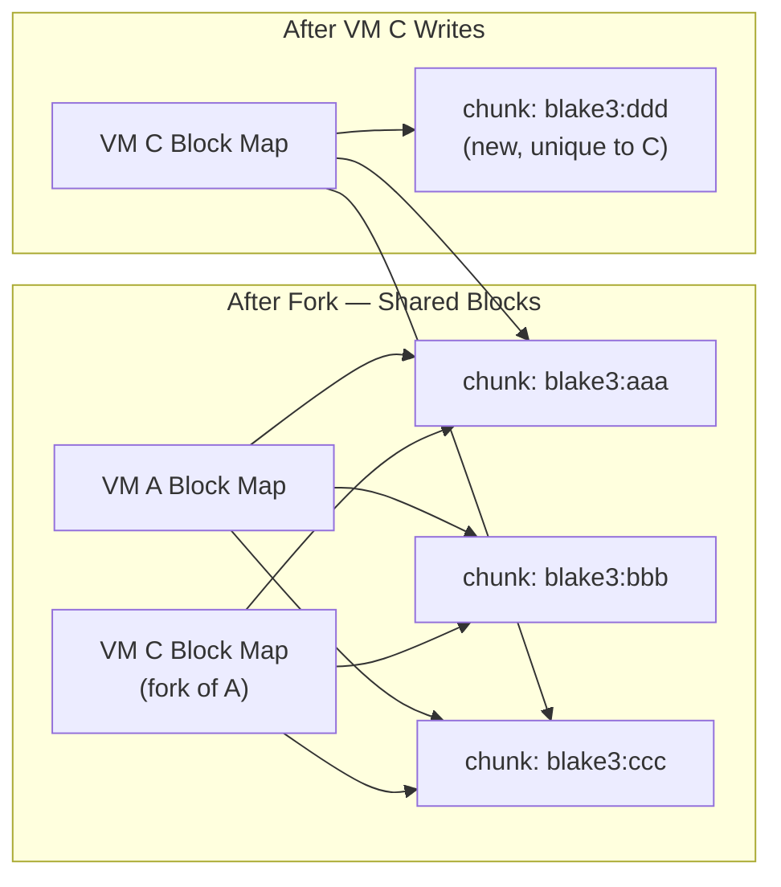

### The Consistency Problem

The source VM is alive and writing. Its state exists in three places:

```
S3 manifest          ← last flush (could be minutes or hours old in demand-driven mode)
S3 blocks            ← all blocks flushed so far
Host SSD cache       ← dirty blocks not yet in S3 (pinned, not evictable)
Host memory          ← block map with dirty flags, updates not yet persisted locally
```

### Two Fork Modes

**Consistent fork (default for Boxes)** — ask the source host to flush first. The fork gets the exact current state.

**Lazy fork** — copy the S3 manifest as-is. No coordination with the source host. The fork gets the state as of the last S3 checkpoint. For demand-driven VMs that haven't flushed recently, this could be stale.

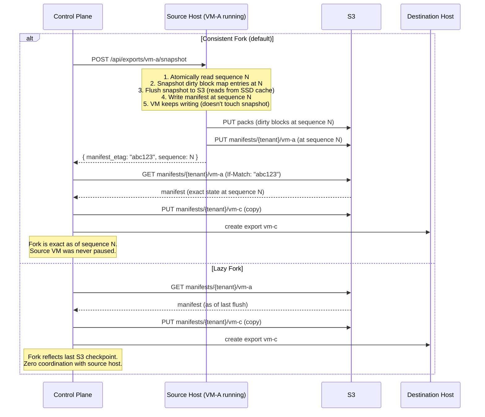

### Why Consistent Fork Is the Right Default for Boxes

`POST /boxes` (create preview) forks production. Production in continuous-flush mode has a manifest that's at most ~60 seconds stale — lazy fork is fine. But production in demand-driven mode may not have flushed in hours. Consistent fork triggers a flush, which is fast for a steady-state production VM (tiny amount of dirty data), and gives an exact point-in-time copy.

Lazy fork is available for cases where staleness is acceptable (e.g., forking a development environment you don't need to be perfectly current).

### The Snapshot Mechanism

The key mechanism is the **sequence number** — a monotonically increasing counter on the write path. Every block write gets a sequence number. The block map tracks the sequence of the last write to each entry.

```
Writes arrive:
  seq 1: write block 42 → blake3:aaa
  seq 2: write block 17 → blake3:bbb
  seq 3: write block 42 → blake3:ccc    ← overwrote block 42
  ─── snapshot requested, cut point = seq 3 ───
  seq 4: write block 99 → blake3:ddd    ← after snapshot, not included
  seq 5: write block 17 → blake3:eee    ← after snapshot, not included
```

The snapshot operation:
1. Atomically read the current sequence number (e.g., N=3). Single atomic load — no lock, no pause.
2. Snapshot the dirty portion of the block map at sequence N into a temporary structure: a list of `(offset, hash)` pairs where `dirty == true && sequence ≤ N`. This is a fast scan — the block map is in memory.
3. Flush from the snapshot, reading block data from SSD cache by hash.
4. Write the manifest at sequence N to S3. Return the ETag to the caller.
5. Clear dirty flags for flushed entries. Unpin their SSD cache entries.

The source VM **keeps writing during the flush**. Concurrent writes get sequence > N and update the live block map, but don't touch the snapshot. Block data for the snapshot is safe in SSD cache — content-addressing means new writes create new cache entries (new hash → new key), they don't overwrite the old ones.

The source VM is **never paused**. The only cost is the time to upload dirty data. For a steady-state production VM, that's a handful of blocks. For a demand-driven VM that's been active for hours, it's proportional to total unique dirty blocks.

### Race Conditions

**Fork during write:** A write arrives at the source between the manifest read and the fork's first access. Not a problem — the fork's manifest doesn't reference the new block. The fork has a consistent snapshot.

**Fork during fork:** Two forks of the same VM requested simultaneously. Both read the same manifest (or close versions). Both produce independent copies. No conflict — manifest PUTs are to different keys.

**Source VM deleted during fork:** The fork's manifest is already written to S3. It references blocks by hash. GC won't touch those blocks — they're in the fork's manifest, which is in the live set. The fork survives independently.

**Fork of a fork:** Same operation. Copy the manifest. Blocks are shared transitively. GC sees all manifests, keeps all referenced blocks.

**Consistent fork + concurrent writes:** The sequence cut is atomic. The snapshot captures dirty entries at sequence ≤ N. Writes after the cut get sequence > N, update the live block map but not the snapshot. The flush reads block data from SSD cache by hash — content-addressing guarantees concurrent writes don't overwrite snapshot data. The manifest at sequence N is internally consistent.

### Self-Containment Property

The S3 manifest is always self-contained. Every hash in it corresponds to a block that exists in S3 (in `packs/{prefix}/{pack-id}`). Unflushed dirty blocks exist only in the local SSD cache — they aren't in any manifest. You can copy a manifest to any host and it resolves completely. No dangling references.

---

## Pack Files (S3 Write Batching)

Content-addressing at the logical level (block map, hashing, dedup). Pack files at the physical level (S3 storage). Same idea as git packfiles: the hash is the address, the packfile is the storage.

### Concept

Each flush cycle collects dirty blocks, compresses them, assembles a pack with a small index header, and uploads with a single PUT. Default: 25 blocks per pack (~3.2MB), matching v1's proven batch size.

```
packs/a7/pack-0042
  ├─ blake3:aaa (compressed)
  ├─ blake3:bbb (compressed)
  ├─ blake3:ccc (compressed)
  └─ index: [{hash, offset, length}]
```

25x fewer S3 PUTs, 25x fewer S3 objects, 25x faster GC LIST operations.

### Pack Index (Host-Level)

Maps `hash → (pack-id, offset, compressed_length)` for every block in S3. **Shared across all VMs on the host** — a single `DashMap` rather than per-VM `HashMap`s.

When a VM flushes, it checks the host pack index before uploading. If a block's hash is already in the index (uploaded by another VM on this host), the flush skips that block and references the existing pack. Every skipped block is 128KB of network I/O saved.

```
VM-A flushes:  hash:abc → pack-42 (uploaded)     host_index[hash:abc] = pack-42
VM-B flushes:  hash:abc → host_index hit → skip   manifest references pack-42
```

**Why this matters:** On a host with 10 tenants running similar stacks, each VM's post-fork `npm install` writes ~4000 blocks of overlapping packages. Without host-level dedup, that's 10 × 160 = 1,600 pack PUTs. With it, VM-1 uploads 160 packs, subsequent VMs skip ~80-90% of their blocks. Total: ~240 packs. 7x fewer uploads, 7x less network I/O competing for the uplink.

**Staleness:** When a VM leaves the host (delete, migrate, sleep), its entries remain in the index but may become stale if GC eventually deletes the referenced packs. Rebuild the host index from active VMs' pack indices on each VM arrival/departure. Rebuild cost: 50 VMs × 80K entries ≈ 4M lookups, ~100ms. Stale entries live at most minutes — well within the 24-hour GC grace period.

**Manifest serialization:** Each VM's manifest includes a complete pack index for portability (self-contained, resolves on any host). Derived from the host index at serialization time — filter to hashes in this VM's block map.

**Memory cost:** ~24 bytes per unique block (16-byte hash key + 4-byte pack-id + 4-byte offset/length). Shared across VMs, so deduplicated content (base image, common packages) is stored once in the index.

| Scenario | Pack index memory | Block map memory | Total |
|----------|------------------|-----------------|-------|
| 10GB actual data (80K blocks) | ~1.9MB | ~1.3MB | ~3.2MB |
| 100GB fully written (800K blocks) | ~19MB | ~13MB | ~32MB |
| 50 VMs × 10GB each (shared host index) | ~95MB (deduplicated) | ~66MB | ~161MB |

### Read Path with Packs

On a cache miss, fetch the entire pack and cache all 25 blocks. One cache miss warms 25 entries — temporal locality means blocks written together are often read together.

### GC with Packs

Pack-level refcounts tracked in the control plane DB. A pack is deleted when its refcount reaches 0 and it's older than the grace period. See the Garbage Collection section for the full design.

- **No compaction.** A pack with mixed liveness (some dead, some live blocks) is kept whole until every block is unreferenced.

**Why not compact mixed packs?** Compaction rewrites live blocks into a new pack. But the old pack may be referenced by manifests on other hosts — a forked VM's pack index points to (hash, old-pack-id, offset). Updating a remote daemon's in-memory pack index requires cross-host coordination. This is distributed coordination — exactly what this design avoids.

**Storage cost of mixed packs:** Bounded and small. A pack is 3.2MB. Worst case: parent VM deleted, fork shares 1 block per pack, 24 dead blocks per pack. For a 10GB parent with 3,200 packs where ~10% are mixed: 320 × 24 × 128KB ≈ 960MB wasted, or ~$0.02/month at S3 pricing. Resolves naturally when the fork is deleted or overwrites the shared blocks.

### S3 Key Layout

```
packs/
  {hash-prefix}/{pack-id}       ← all blocks, globally deduplicated, prefix-sharded

manifests/
  {tenant-id}/{vm-id}           ← per-tenant, per-VM
```

One global block namespace. Content-addressing handles dedup naturally — same content → same hash → stored once regardless of which tenant wrote it. Manifests remain per-tenant for access control and GC reference tracking.

**Prefix sharding:** Pack keys use the first 2 hex characters of the pack's content hash as a prefix: `packs/a7/{pack-id}`. This gives 256 prefixes, each supporting 5,500 PUTs/s = 1.4M PUTs/s aggregate capacity. S3 auto-partitions by prefix, so sharding ensures throughput scales with fleet size without hitting per-prefix limits.

---

## Compression

All blocks are compressed with LZ4 before upload to S3. LZ4 is chosen for its speed — compression and decompression are essentially free relative to I/O latency.

**Pipeline:**

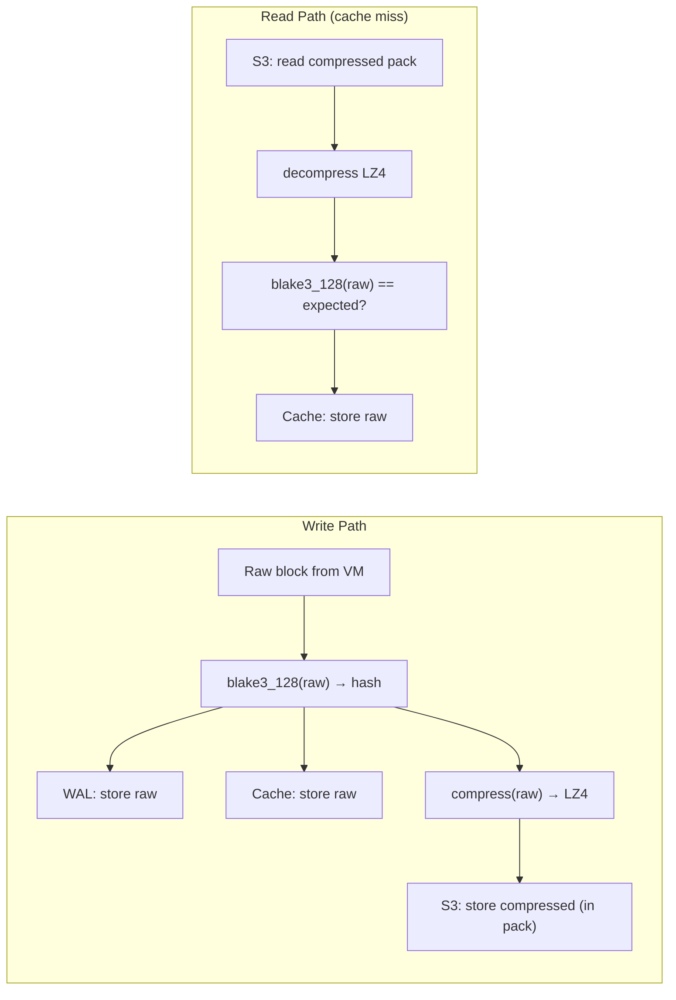

- **Hash before compress.** Same raw data → same hash, regardless of LZ4 version. Critical for dedup.
- **Cache stores raw.** No decompression on the hot path.
- **WAL stores raw.** Compression happens during flush, off the critical path.
- **S3 stores compressed.** ~1.5-2x ratio for typical OS/app data. ~40-50% S3 bill reduction.

---

## Cache Design

Dirty blocks and clean blocks are managed separately. Dirty blocks are pinned (not evictable). Clean blocks use a two-tier S3-FIFO cache.

### Dirty Block Store

Blocks not yet flushed to S3 are stored in a pinned hash map — not in the eviction cache. The WAL is truncated every ~5s, so after truncation the dirty store is the only local copy. Evicting a dirty block means data loss.

```
Write path:  hash block → dirty_store[hash] = data
S3 flush:    dirty_store.remove(hash) → insert into clean cache
```

Dirty blocks are served directly from the dirty store on read (~100ns, in-memory). When flushed to S3, they move to the clean cache and become evictable.

**Dirty block budget.** Each VM has a configurable dirty data budget (default: 5GB). When dirty data exceeds the budget, the daemon flushes the oldest dirty blocks to S3 until back under budget — even in demand-driven mode. This bounds memory/SSD consumption, bounds migration latency (at most `budget` bytes to flush), and keeps demand-driven as the default without risking unbounded growth.

```
dirty_data < budget    → pure demand-driven, zero S3 traffic
dirty_data ≥ budget    → flush oldest dirty blocks until under budget
```

The budget is a per-VM setting, configured at export creation (`dirty_budget_gb`, default 5). The daemon checks on every write (O(1) — compare counter against threshold). Forced flushes are identical to normal flushes — same pack assembly, same refcount updates, same code path.

### Clean Block Cache (S3-FIFO)

Clean blocks (backed by S3, safe to evict and re-fetch) use a two-tier cache with S3-FIFO eviction.

**Why S3-FIFO over LRU:** VM boot is a sequential scan — reads hundreds of base image blocks once, then never touches them again. LRU promotes all of them to the head, evicting actually hot blocks. S3-FIFO's small/main/ghost queue structure handles this naturally: one-time reads stay in the small queue and wash through without polluting the main queue. Blocks accessed more than once get promoted. S3-FIFO matches ARC on hit rate with simpler implementation and better concurrency — FIFO queues don't need per-access linked list manipulation.

**Memory tier:**
- Configurable size per host (`memory_cache_gb`).
- S3-FIFO eviction. Evicted blocks fall to SSD tier.
- ~100ns reads. 1000x faster than SSD.

**SSD tier:**
- Bounded by available SSD space. Much larger than memory tier.
- S3-FIFO eviction. Evicted blocks re-pulled from S3 on next access.
- Stores uncompressed blocks. ~100μs reads.

**Implementation:** Use [foyer](https://github.com/foyer-rs/foyer) — a Rust hybrid cache library that provides S3-FIFO eviction with memory + disk tiers. Matches the two-tier design directly. The dirty block store is separate and trivial (a `HashMap` with no eviction).

### Boot Hot Set Prefetching

The `glidefs bless` pipeline already processes every block in the base image. During the bless, boot the image in a reference VM and record which block offsets are accessed during the first 10 seconds (the boot hot set — kernel, init, core libs, runtime). Store this as a boot manifest alongside the base image manifest.

On VM start, before Firecracker launches, prefetch boot hot set blocks into the memory cache. For base image blocks already cached from sibling VMs, this is a no-op (already in cache). For cold hosts, this pulls the boot-critical blocks from S3 in parallel, hiding the latency before the VM needs them.

**Key properties:**
- During active operation, the SSD tier contains *everything the VM has ever read or written*. Cache hit rate approaches 100%.
- Blocks are immutable (content-addressed), so cached blocks are always valid. No coherence protocol.
- On same-host wake: cache is fully warm. No S3 reads needed.
- On cross-host wake: cache starts cold. Boot hot set prefetch warms critical blocks. Base image blocks likely warm from siblings. Tenant data warms organically.

---

## Crash Recovery (WAL)

The WAL handles two distinct recovery scenarios:

### Local Recovery (Daemon Restart)

The daemon crashes but the host and SSD are fine. Load the locally persisted block map and replay the local WAL. No S3 involved.

1. Load block map from local SSD file (last persisted state)
2. Replay WAL entries since last persistence (update block map, populate memory cache)
3. Resume serving

Fast — milliseconds. The WAL only contains entries since the last local block map persistence (~5 seconds of writes), not since the last S3 flush. Block data is already in the SSD cache.

### Cross-Host Recovery (Host Death)

The host dies. WAL and local cache are gone. Fall back to the last S3 manifest.

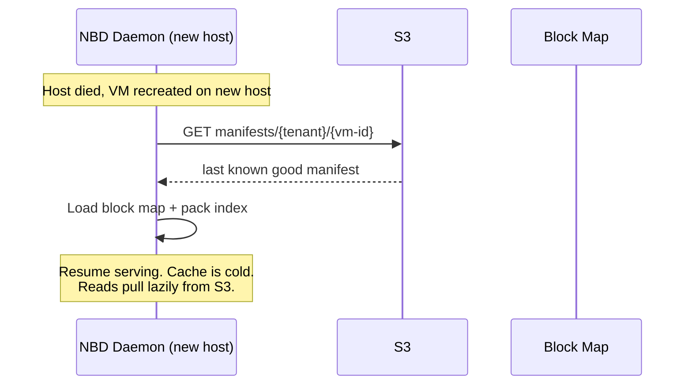

**Data loss:** Writes since the last S3 manifest are lost. In demand-driven mode, this could be everything since the last fork/sleep/promote. In continuous mode, bounded by the flush interval (~5 seconds).

For preview VMs: acceptable. Recreate from the fork point.
For production VMs: continuous flush bounds the loss to seconds.

### WAL Properties

- Append-only file on local SSD. Sequential writes only — fast and predictable.
- Each entry: `(vm-id, offset, blake3_128_hash, raw_chunk_data)`. Self-contained for replay.
- **The WAL is for local crash recovery only.** It bridges the gap between the last locally-persisted block map and the crash point. It is NOT the source of data for S3 flushes — that's the SSD cache + dirty flags in the block map.
- Truncated after each local block map persistence (every ~5 seconds). Once the block map is persisted and block data is in the SSD cache, the WAL entries are redundant.
- **WAL size is bounded by local persist interval, not S3 flush interval.** This is critical for demand-driven mode, where S3 flushes may be hours apart. The WAL doesn't accumulate across that window.

**Aggregate WAL sizing (typical host: 2TB NVMe, 50 VMs):**

| VM type | Count | Write rate | WAL contribution |
|---------|-------|-----------|-----------------|
| Production (continuous) | 3 | ~1 MB/s each | ~3 MB/s |
| Active builds (transient) | 5 | ~50 MB/s each | ~250 MB/s |
| Dev environments (active) | 10 | ~2 MB/s each | ~20 MB/s |
| Idle previews | 32 | ~0 | 0 |
| **Aggregate** | **50** | | **~273 MB/s peak** |

WAL size = aggregate write rate × local persist interval = **273 MB/s × 5s ≈ 1.4 GB**. On a 2TB NVMe, that's 0.07% of disk. Even at 2x the write rate with a 10s persist interval, the WAL is ~5.5 GB — comfortably under 0.3% of disk.

The SSD cache is the larger consumer of local disk (it holds the actual block data for all active VMs), but that's bounded by VM count × written data per VM and is the subject of cache eviction policy, not WAL management.

### Failure Modes

- **Daemon crash, WAL intact:** Full local recovery. Replay unflushed entries.
- **Daemon crash, WAL partially written:** Last incomplete entry is discarded. That single in-flight write is lost. Same as a power loss on bare metal.
- **Host dies, SSD dead:** Fall back to last S3 manifest. Writes since last S3 flush are lost.

---

## Global Block Dedup

All blocks live in one global namespace. Content-addressing handles dedup naturally — same content, same hash, stored once, regardless of which tenant wrote it.

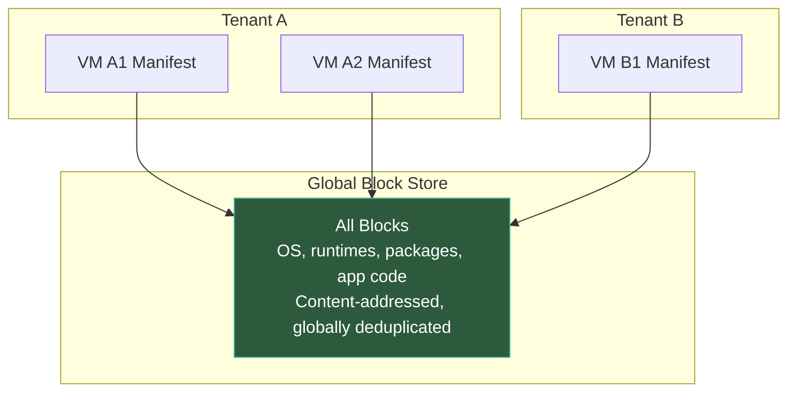

**Rules:**
- Blocks are stored once globally. Hash is the only address.
- Manifests are per-tenant, per-VM. This is the access control boundary.
- Dedup happens across all tenants automatically — no bless pipeline, no source tags, no dual namespace.

**Why this is safe:** The deduplication oracle attack requires observing whether dedup happened. In this architecture, tenants operate through VMs — writes always hit local SSD at identical latency regardless of whether the block exists elsewhere. S3 dedup happens in background flush, not observable from the guest. Tenants don't have S3 access.

### Block Resolution

One path. No source tags, no routing:

```
1. Dirty store     → hit? serve it  (~100ns, in-memory)
2. Memory cache    → hit? serve it  (~100ns)
3. SSD cache       → hit? serve it  (~100μs)
4. S3              → packs/{prefix}/{pack-id}  (10-50ms)
```

The block map is just a hash. The pack index maps hash → pack location. One lookup, one namespace.

---

## Base Image Pipeline

Base images are the starting point for VMs — Ubuntu, Node runtimes, Python environments. Chunked, uploaded to the global block store, and referenced by a base manifest.

### Bless Pipeline

```bash
glidefs bless --image ubuntu-22.04-node20.raw --name ubuntu-22.04-node20-v3
```

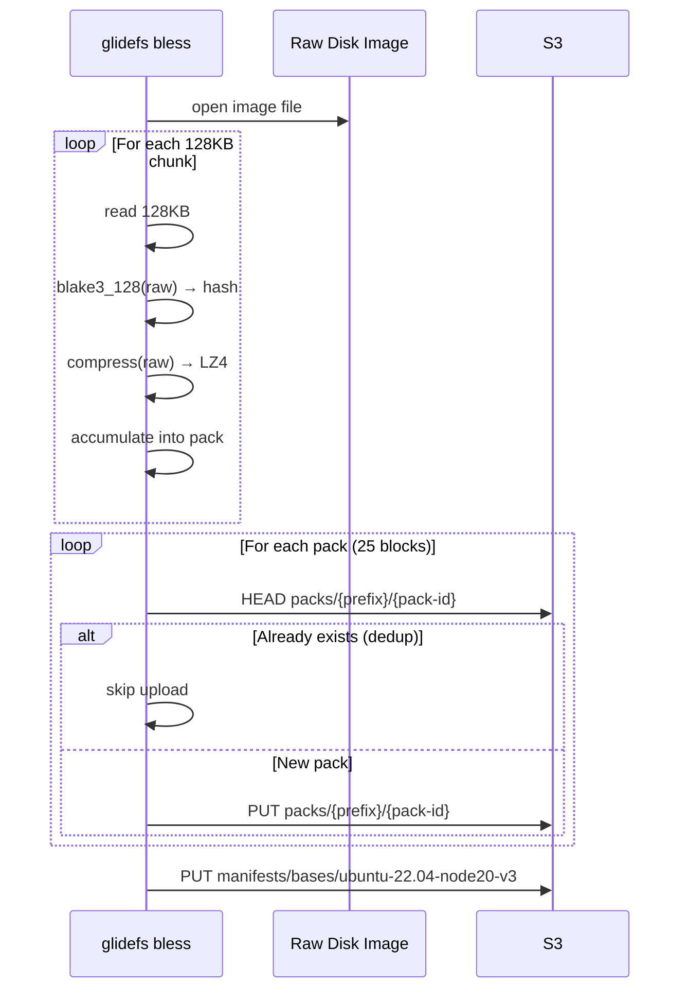

**Properties:**
- **Global dedup across everything.** Ubuntu 22.04 + Node 18 and Ubuntu 22.04 + Node 20 share ~95% of their OS blocks. If a tenant has already written those blocks, they're already in S3. Only genuinely new content gets uploaded.
- **Idempotent.** Same image → same hashes → same manifest. A no-op on re-run.
- **Offline.** No daemon involvement. CLI talks directly to S3. Runs in CI or on a dev machine.
- **No layers.** A base image is a flat disk image. Content-addressing handles deduplication.

### Creating a VM from a Base Image

The VM's manifest starts as a copy of the base manifest. All entries point to blocks that already exist in the global store. As the VM writes, individual entries get new hashes. Unmodified chunks continue resolving from the same global namespace — no data copied, no storage consumed. New blocks written by the VM are also globally deduplicated — if another tenant has already written the same content (same npm packages, same runtime files), the block already exists.

---

## Garbage Collection

When VMs are deleted or blocks are overwritten, orphaned blocks (in packs) accumulate in S3.

**Design principle: O(1) per lifecycle event, not O(N manifests).** The system must scale to millions of VMs without GC becoming a bottleneck. This means event-driven refcounts as the primary mechanism, not periodic scanning.

### Event-Driven Refcounts (Primary)

Every pack has a reference count in the control plane database. Refcount updates are transactional with manifest updates — they cannot drift.

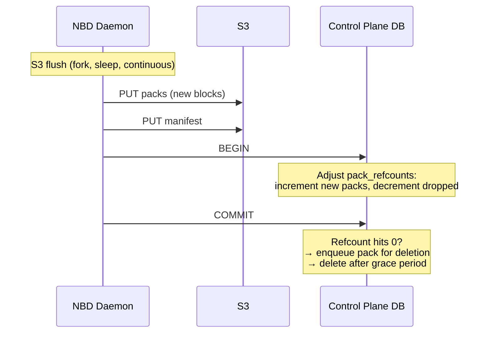

**Lifecycle events and their cost:**

| Event | Refcount operations | Cost |
|-------|-------------------|------|
| Flush (continuous, ~5s) | Increment new packs, decrement overwritten (~2-5 packs) | O(1) |
| Fork | Read pack list from S3 manifest, increment refcounts | O(packs in manifest) — one-time |
| VM delete | Read pack list from S3 manifest, decrement refcounts | O(packs in manifest) — one-time |
| Refcount → 0 | Enqueue pack for deletion after grace period | O(1) |

Steady-state operations (flush) touch a handful of rows per transaction. Lifecycle operations (fork, delete) are proportional to the VM's pack count (~3,200 for a 10GB VM) but happen once per VM lifetime. None scale with fleet size.

### The Transaction

Pack refcounts live in the control plane database. The full manifest (block map + pack index) lives in S3. The DB tracks pack refcounts only — no per-manifest pack lists. The S3 manifest is the source of truth for which packs a VM references.

```sql
-- Flush (daemon sends the delta: packs added, packs dropped)
UPDATE pack_refcounts SET refcount = refcount + 1
  WHERE pack_id = ANY($added);
UPDATE pack_refcounts SET refcount = refcount - 1,
  last_decremented = now()
  WHERE pack_id = ANY($dropped);

-- Fork (pack list read from S3 manifest, already in hand)
UPDATE pack_refcounts SET refcount = refcount + 1
  WHERE pack_id = ANY($all_packs);

-- VM delete (pack list from S3 manifest — one GET)
UPDATE pack_refcounts SET refcount = refcount - 1,
  last_decremented = now()
  WHERE pack_id = ANY($all_packs);
```

For a continuous flush that wrote 2 new packs and overwrote blocks in 1 old pack: 3 refcount updates. For fork or delete: one S3 GET (manifest, ~1MB) + one bulk UPDATE (~3,200 rows). No join table, no 3.2B-row manifest_packs table at scale.

### Pack Deletion

A background worker processes packs with refcount 0:

```sql
SELECT pack_id FROM pack_refcounts
  WHERE refcount = 0
  AND last_decremented < now() - interval '24 hours';
```

Index scan, O(dead packs), not O(all packs). Deletes the S3 objects. Runs continuously or on a short timer.

### Reconciliation (Monthly Safety Net)

The transactional refcounts should never drift. Reconciliation is a defense-in-depth measure, not a routine operation. Run monthly (or on-demand after incidents):

1. Scan all manifests in S3, build live pack set
2. Compare against pack_refcounts in DB
3. Correct any drift (log discrepancies for investigation)
4. Delete packs that are unreferenced in both S3 manifests and DB

At 1M VMs this takes ~60 minutes. At 10M VMs, a few hours. Acceptable for a monthly job. Can be run incrementally (rotate through tenant subsets over a week) if needed.

### Safety Rails

- **Grace period (24 hours):** Packs with refcount 0 are not deleted until 24 hours after the last decrement. Protects against races: flush creates packs not yet referenced by a manifest, fork copies a manifest while blocks are in flight.
- **Atomic refcount updates:** Refcount increments/decrements are applied in a single DB transaction per event. Flush sends only the delta (added/dropped packs). Fork and delete read the full pack list from the S3 manifest.
- **Max deletions per cycle:** Cap the number of packs deleted per deletion worker cycle. Limits blast radius.
- **Dry-run mode:** Log what would be deleted without deleting. Validate before enabling in production.
- **Failure mode:** Always conservative. Transaction failure → no refcount change → orphans survive. Deletion worker crash → orphans survive until next cycle. Never deletes live data.

### Scaling Properties

| Fleet size | Steady-state GC cost | Lifecycle GC cost | Reconciliation |
|-----------|---------------------|------------------|----------------|
| 1K VMs | ~10 refcount updates/s | Negligible | Minutes |
| 100K VMs | ~1K refcount updates/s | ~100 VM deletes/day | ~10 minutes |
| 1M VMs | ~10K refcount updates/s | ~1K VM deletes/day | ~60 minutes monthly |
| 10M VMs | ~100K refcount updates/s | ~10K VM deletes/day | Hours, incremental |

The control plane DB (PostgreSQL) handles 100K simple updates/s on modest hardware. This is the same database the control plane already uses for VM metadata, tenant records, and scheduling.

---

## Encryption at Rest

SSE-KMS with a shared platform key. All blocks and manifests encrypted with one KMS key.

- **All packs:** SSE-KMS with the platform key. Transparent encryption/decryption on PUT/GET.
- **All manifests:** SSE-KMS with the platform key.
- **No application-layer encryption needed.** S3 + KMS handles it. The daemon doesn't touch keys.

**Why a shared key:** Per-tenant KMS keys are security theater for a developer platform. "Key compromised" means your AWS account is compromised, at which point the attacker has access to all KMS keys anyway. The platform operator needs access to all keys to serve VMs. A shared key satisfies SOC2 encryption-at-rest requirements. Per-tenant keys can be added later if an enterprise customer requires customer-managed keys in their own AWS account — it's additive (change the KMS key on S3 PUTs for that tenant, accept that their blocks don't dedup cross-tenant).

---

## I/O QoS

Linux cgroup v2 block I/O controllers. The kernel handles scheduling. The NBD daemon stays dumb.

- `io.max` — hard limits (tiered plans): "This VM gets at most X IOPS and Y MB/s."
- `io.weight` — proportional sharing: "When contended, divide bandwidth by weight."

Zero QoS code in the daemon. Policy is a control plane concern — set cgroup limits when creating the VM. Composable with CPU and memory cgroups.

---

## Block Integrity Verification

Content-addressing gives free integrity checks.

- **S3 reads (cache miss):** Always verify. Decompress, hash, compare. This is the ingestion boundary.
- **Cache reads (hit):** Don't verify on every read. Trust local SSD/memory.
- **Background scrubber:** Periodically re-verify cached blocks. Catches silent bit rot off the hot path.
- **On mismatch:** Retry once (transient corruption), then alert.

---

## Component Summary

| Component | Role | Implementation Notes |
|-----------|------|---------------------|
| **NBD Device** | 1:1 per VM, block device interface | Linux kernel NBD, socket pair to daemon. Tune `nbds_max` for VM density and per-device I/O depth (default is low — set to 32-128 in-flight requests to match daemon throughput). |
| **NBD Daemon** | Single process, multiplexes all VMs | Event loop, resolves offsets via block maps, no QoS logic |
| **Flush Scheduler** | Controls when blocks go to S3 | Demand-driven (default) or continuous (production). Per-VM policy. |
| **WAL** | Local crash recovery (bridges last ~5s before local persist) | Append-only on local SSD, sequence-numbered, truncated on persist |
| **Block Map** | Ordered array of (hash, flags) per VM | 17 bytes/entry. Fork overlay for shared parents. Persisted locally (fast) + S3 (on flush). Sparse for unwritten regions. |
| **Dirty Block Store** | Pinned storage for unflushed blocks | HashMap, no eviction. Blocks move to clean cache on S3 flush. |
| **Dirty Set** | Track dirty block offsets | HashSet\<u64\>. O(1) insert on write, O(D) drain on flush. Avoids O(B) block map scan. |
| **Memory Cache** | In-memory S3-FIFO, hot blocks | Configurable size, ~100ns reads, evicts to SSD tier. foyer library. |
| **SSD Cache** | SSD-backed S3-FIFO, warm blocks | ~100μs reads, stores uncompressed, verified on ingestion. foyer library. |
| **Pack Files** | Batched S3 storage format | 25 blocks/pack (~3.2MB). 25x fewer S3 PUTs. Whole-pack prefetch. |
| **Pack Index** | Hash → pack location mapping | ~24 bytes/block. Shared across VMs on host (DashMap). Rebuilt on VM lifecycle events. Per-VM index derived for manifest serialization. |
| **TRIM Handler** | Reclaim deleted blocks | Reset to zero-block hash. Metadata-only. Orphans cleaned by GC. |
| **Compression** | LZ4 at S3 boundary | Hash raw → compress → pack → S3. ~1.5-2x ratio. |
| **Base Image Pipeline** | Base image ingestion | Offline CLI pipeline (`glidefs bless`). Uploads to global block store. Deduped naturally. |
| **Pack Refcounts** | Track pack liveness | Event-driven updates in control plane DB. O(1) per flush, O(P) per fork/delete. Pack lists read from S3 manifests — no join table. |
| **Pack Deletion Worker** | Delete orphaned packs | Processes refcount-0 packs after 24h grace period. Index scan, continuous. |
| **GC Reconciliation** | Correctness safety net | Monthly mark-and-sweep across all manifests. Corrects any drift. Incremental at scale. |
| **cgroup v2 I/O** | Per-VM IOPS/throughput limits | Kernel-level, configured by control plane |
| **Background Scrubber** | Cache integrity verification | Periodic re-hash of cached blocks, off hot path |

---

## Algorithmic Complexity Analysis

Systematic analysis of every operation's time and space complexity. Variables:

```
B = block_map_size (entries per VM, max ~800K for 100GB disk, typical ~80K for 10GB)
D = dirty_count (blocks modified since last flush)
P = packs_per_manifest (~B/25, ~3,200 for 10GB VM)
V = VMs_on_host (typical 50-100, max ~500)
N = total_VMs_in_fleet (target: millions)
K = pack_size (blocks per pack, default 25)
```

### Hot Path (Per-Request)

| Operation | Time | Space | Bottleneck? | Notes |
|-----------|------|-------|-------------|-------|
| **Read: block map lookup** | O(1) | — | No | Array index or overlay HashMap + parent fallback |
| **Read: dirty store check** | O(1) | — | No | HashMap lookup |
| **Read: memory cache lookup** | O(1) | — | No | DashMap (foyer) |
| **Read: SSD cache lookup** | O(1) | — | No | foyer |
| **Read: S3 fetch (cache miss)** | O(K) | O(K) | No | Fetch 1 pack, decompress + cache 25 blocks |
| **Read: BLAKE3 verify** | O(128KB) | — | No | ~5μs, constant |
| **Write: BLAKE3 hash** | O(128KB) | — | No | ~5μs, constant |
| **Write: WAL append** | O(128KB) | — | No | Sequential, ~20μs |
| **Write: cache insert** | O(1) | O(128KB) | No | Dirty store + memory cache |
| **Write: block map update** | O(1) | — | No | Array index or overlay insert |
| **Write: dirty set insert** | O(1) | — | No | Track dirty offsets for flush |

**Verdict: all O(1).** The hot path has no operations that scale with VM count, block map size, or fleet size. Throughput is bounded by SSD bandwidth and CPU (hashing), not algorithmic complexity.

### Flush Path (Periodic or On-Demand)

| Operation | Time | Space | Bottleneck? | Notes |
|-----------|------|-------|-------------|-------|
| **Collect dirty blocks** | O(D) | O(D) | **Fixed** | Dirty set, not block map scan (see below) |
| **Host pack index dedup** | O(D) | — | No | D lookups in DashMap, O(1) each |
| **Read from SSD cache** | O(D') | — | No | D' = blocks after dedup, D' ≤ D |
| **BLAKE3 hash (if re-verify)** | O(D' × 128KB) | — | No | Optional integrity check |
| **LZ4 compress** | O(D' × 128KB) | O(D' × 128KB) | No | ~1GB/s, negligible |
| **S3 PUT (packs)** | O(D'/K) | — | No | Network-bound, not CPU |
| **Host pack index update** | O(D') | — | No | DashMap inserts |
| **Manifest serialization** | O(B) | O(B) | **Watch** | Must serialize full block map + derive pack index |
| **Manifest S3 PUT** | O(1) | — | No | Single object |
| **Refcount DB update** | O(Δ packs) | — | No | Only changed packs, ~2-5 for steady-state flush. No join table. |

**Bottleneck found and fixed: dirty block collection.**

The doc said "scan block map for dirty entries" — that's O(B) per flush, scanning 80K-800K entries to find a handful of dirty blocks. For continuous flush every 5 seconds, this is wasteful.

**Fix: maintain a dirty set.** On write, insert the block offset into a `HashSet<u64>`. On flush, iterate the dirty set (O(D), not O(B)). On flush completion, clear flushed entries. Cost: O(1) per write (HashSet insert), O(D) per flush. Space: O(D) — negligible.

**Watch: manifest serialization** is O(B) — must write the full block map and derive each entry's pack location from the host index. For continuous flush, this runs every ~60 seconds. At B=800K and 5 production VMs: 5 × 800K / 60 = ~67K lookups/s. ~3ms of CPU. Not a bottleneck in practice, but it's the one flush operation that scales with disk size rather than dirty count.

### Lifecycle Operations

| Operation | Time | Space | Bottleneck? | Notes |
|-----------|------|-------|-------------|-------|
| **Fork: S3 manifest copy** | O(B) | O(B) | No | Serialize + PUT. One-time per fork. |
| **Fork: refcount increment** | O(P) | — | No | Pack list from S3 manifest (already in hand). One UPDATE, ~3,200 rows. |
| **Fork: host overlay setup** | O(1) | O(1) | No | Arc clone + empty HashMap |
| **VM delete: refcount decrement** | O(P) | — | No | Read pack list from S3 manifest (one GET), decrement refcounts. Async. |
| **VM delete: local cleanup** | O(1) | — | No | Drop block map, release cache entries lazily |
| **Same-host wake** | O(B) | O(B) | No | Load block map from local file |
| **Cross-host wake** | O(B) | O(B) | No | GET manifest from S3 + parse |
| **Boot hot set prefetch** | O(H) | O(H) | No | H = hot set size, ~1,600 blocks. Parallel S3 GETs. |

**Verdict: all O(per-VM), none O(fleet).** Fork and delete are proportional to the VM's pack count (~3,200), not to fleet size. Two SQL queries handle the DB updates regardless of whether the fleet has 1K or 10M VMs.

### Background Operations

| Operation | Time | Space | Bottleneck? | Notes |
|-----------|------|-------|-------------|-------|
| **WAL truncation** | O(1) | — | No | Truncate file after block map persist |
| **Block map local persist** | O(B) | O(B) | No | Every ~5s, fsync to SSD. Bounded by disk size. |
| **Host pack index rebuild** | O(V × B) | O(unique blocks) | **Watch** | On VM lifecycle events. ~100ms at 100 VMs. |
| **Fork overlay flattening** | O(B) | O(B) | No | Copy parent + apply overlay. Background. Rare. |
| **Background scrubber** | O(cached blocks) | — | No | Amortized over hours/days. Off hot path. |
| **Sequential read-ahead** | O(1) per read | O(V) | No | Ring buffer per VM for pattern detection |
| **Pack deletion worker** | O(dead packs) | — | No | Index scan on refcount=0. Continuous. |
| **Reconciliation** | O(N × B) | O(unique hashes) | **Known** | Monthly. Incremental at scale. |

**Watch: host pack index rebuild** is O(V × B). At 500 VMs × 80K entries = 40M entries, ~500ms. Triggered on VM arrive/depart. If VMs churn rapidly (10+ events/second), rebuilds could lag. Mitigation: debounce rebuilds (batch lifecycle events within a 1-second window) or use incremental updates (add on arrive, mark-and-sweep on depart).

**Known: reconciliation** is O(N × B) — the one operation that scales with fleet size. Bounded to monthly cadence. At 1M VMs: ~60 minutes. At 10M VMs: hours, run incrementally over a week. This is a consistency check, not a bottleneck — event-driven refcounts handle steady-state GC at O(1).

### Space Complexity (Per Host)

| Structure | Size | Bounded by | Growth pattern |
|-----------|------|-----------|---------------|
| **Block maps** | O(V × B) | VM count × disk size | Static per VM. Fork overlay reduces by ~95%. |
| **Dirty block store** | O(Σ dirty blocks) | Per-VM budget (default 5GB) | Bounded. Forced partial flush at budget. |
| **Memory cache** | Configured | `memory_cache_gb` setting | Fixed. Eviction handles pressure. |
| **SSD cache** | Configured | Available SSD | Fixed. Eviction handles pressure. |
| **WAL** | O(write_rate × 5s) | Persist interval | Truncated every ~5s. ~1.4GB worst case. |
| **Host pack index** | O(unique blocks on host) | VM count × data per VM | Rebuilt on lifecycle events. |
| **Sequential detector** | O(V) | VM count | Ring buffer per VM. Negligible. |

**Dirty block store is bounded.** Each VM has a dirty block budget (default 5GB). When exceeded, the daemon flushes the oldest dirty blocks to S3 — even in demand-driven mode. At 50 VMs, worst-case aggregate dirty data is 50 × 5GB = 250GB, well within SSD capacity on a 2TB NVMe host.

### Fleet-Level Operations

| Operation | Time | Scales with | Bottleneck? |
|-----------|------|------------|-------------|
| **Refcount update (per flush)** | O(Δ packs) | Nothing — constant per flush | No |
| **Refcount update (fork/delete)** | O(P) | Per-VM data | No |
| **Pack deletion** | O(dead packs) | Churn rate | No |
| **S3 PUTs (aggregate)** | O(fleet write rate / K) | Fleet write rate | Infra cost, not algorithmic |
| **S3 GETs (aggregate)** | O(fleet cache misses) | Cache hit rate | Infra cost, not algorithmic |
| **Reconciliation** | O(N × B) | Fleet size | Monthly. Incremental. |

### Summary

```
Hot path:          O(1) per read/write         ✓ no bottleneck
Flush:             O(D) with dirty set         ✓ fixed (was O(B))
Manifest sync:     O(B) per VM                 ~ bounded by disk size, infrequent
Fork/delete:       O(P) per VM                 ✓ independent of fleet size
GC (steady-state): O(1) per flush event        ✓ no bottleneck
GC (lifecycle):    O(P) per fork/delete         ✓ independent of fleet size
GC (reconcile):    O(N × B) monthly            ~ known, incremental at scale
Host operations:   O(V × B) on lifecycle        ~ bounded by host density
```

**Nothing in the steady-state hot path or flush path scales with fleet size.** The only fleet-scale operation is monthly reconciliation, which is a safety net, not a routine operation. The system scales horizontally by adding hosts — each host is O(V × B) regardless of total fleet size.

---

## What We're Replacing (and Why)

| ZFS Capability | Replacement | Why |
|---------------|-------------|-----|
| **Local snapshots/clones** | Block map copy in S3 | ZFS clones are local-only. Block map copy works cross-host. |
| **LZ4 compression** | LZ4 at S3 boundary | Same algorithm, different layer. Equivalent ratio. |
| **Block integrity** | BLAKE3-128 content-addressing + scrubber | Every block verified by re-hashing. |
| **ARC (adaptive read cache)** | Two-tier memory + SSD cache with S3-FIFO | S3-FIFO matches ARC on hit rates, better scan resistance, simpler concurrency. foyer library. |
| **Copy-on-write** | Content-addressed writes | Every write produces a new block. Old blocks remain until GC. |
| **Durability (ZIL/SLOG)** | WAL on local SSD | Same concept. WAL covers the window between local block map persists (~5s). S3 flush reads from SSD cache, not WAL. |
| **Deduplication** | Content-addressing (inherent, global) | Same content → same hash → same block. Automatic across all tenants. |

---

## Open Questions

1. **Memory cache sizing** — What's the right default for `memory_cache_gb`? Needs profiling under realistic load.
2. **Continuous flush intervals** — Block flush at ~5s, manifest at ~60s is the starting point for production VMs. Adaptive flush adjusts based on dirty block count. Both base intervals tunable.
3. **cgroup I/O limits by tier** — What are the actual IOPS/throughput numbers per tier?
4. **GC grace period tuning** — 24 hours is conservative. Could be shorter if we can bound the max time between block creation and manifest update.
5. **Sub-chunk dirty tracking** — Deferred until write amplification is a measured problem.
6. ~~**Pinned dirty block pressure**~~ — **Resolved.** Per-VM dirty block budget (default 5GB) with forced partial flush. See Dirty Block Store section.
7. **Pack size** — 25 blocks (3.2MB) matches v1. Profile to find the sweet spot between S3 ops and mixed-pack waste.
8. **Demand-driven for production** — Should production default to demand-driven (flush on fork request) instead of continuous? Saves S3 traffic at the cost of 1-5 seconds of fork latency. Depends on preview creation frequency.
9. **Fork overlay flattening threshold** — 50% divergence is the starting heuristic for flattening a fork overlay into a standalone block map. May need tuning based on read path overhead vs memory savings.
10. ~~**manifest_packs table size**~~ — **Resolved.** Eliminated the table entirely. Pack lists are read from S3 manifests on fork/delete (one GET, ~1MB). Refcounts are the only DB state. No 3.2B-row join table at scale.
11. **Per-tenant KMS keys (future)** — If an enterprise customer requires customer-managed keys, add per-tenant encryption as an opt-in. Blocks for that tenant don't dedup cross-tenant. Additive change — no architectural rework needed.
12. **Reconciliation scheduling at extreme scale** — At 10M+ VMs, full reconciliation takes hours. Incremental approach (rotate through tenant subsets) keeps individual runs bounded. Determine the right rotation period.
