# MicroVM Storage Architecture

## Design Document — NBD + Content-Addressed Block Store + S3

---

## Overview

A storage layer for microVMs that provides fast boot, cheap cross-host forks, durable persistence, and tenant isolation.

**Core insight:** Separate the interface the VM sees (block device) from how we store data (content-addressed chunks in S3, cached locally). The VM gets a normal disk. We get deduplication, lazy loading, and fork-as-metadata-copy.

**Why not ZFS?** ZFS is good at what it does — compression, integrity, local snapshots. The problem is that it's local. The killer feature this architecture unlocks is cross-host fork: copy a manifest in S3 and a VM materializes on any host, instantly, with zero data transfer. ZFS clone can't cross a host boundary without shipping data. Everything else in this design (WAL, content-addressing, compression, integrity checking) replaces ZFS's local responsibilities to make that cross-host capability possible. We're not removing ZFS because it's bad — we're removing it because we need something it can't do.

---

## Benefits

**Fast boot.** VMs don't wait for a full disk image to materialize. The NBD device is available immediately, and blocks pull lazily from S3 on first access. Boot only touches the kernel, init, and core libs — a few hundred MB at most, much of which is already cached from sibling VMs. Sub-second to first instruction is achievable.

**Cheap cross-host forks.** Forking a 100G VM is a metadata copy — duplicate the block map in S3, done. Zero data copied. The forked VM shares 100% of its blocks with the parent until it writes. Storage cost is proportional to unique writes, not total disk size. This works across hosts — the fork can materialize anywhere. This unlocks preview environments, branch deploys, and dev/prod parity at near-zero cost.

**Storage efficiency.** Content-addressing deduplicates automatically within a tenant. Ten VMs running the same Node app share one copy of the base OS, runtime, and dependencies. LZ4 compression before upload further reduces S3 storage by ~1.5-2x for typical OS/application data. Combined with shared base images across tenants, actual S3 usage is a small fraction of total allocated disk space.

**Simple durability model.** WAL on local SSD for fast acks, background flush to S3 for durability. S3 is the source of truth. Cache and WAL are ephemeral — losing them means slower reads and replaying a small log, not data loss. No distributed consensus, no replication factor to manage.

**Clean migration.** Moving a VM between hosts requires flushing the WAL and pointing the destination at the manifest in S3. No bulk data transfer. Base image blocks are likely already warm on the destination. The improvement over v1 is that the WAL lets us resume the VM on the destination while the flush completes, rather than blocking on a full drain.

**Operational simplicity.** No ZFS to tune (ARC, zpool, scrub schedules). No distributed filesystem to operate (quorum, rebalancing, split-brain). No QoS code in the daemon (cgroup v2 handles it). No application-layer encryption (SSE-KMS handles it). Each component does one thing.

**Tenant isolation without sacrificing efficiency.** Shared base image blocks give most of the cross-tenant dedup savings. Tenant-written blocks are namespace-isolated, closing the deduplication oracle side channel. Per-tenant KMS keys mean a compromised S3 bucket doesn't expose all tenants' data.

**Integrity for free.** Content-addressing means every block can be verified by re-hashing. No separate checksum database to maintain. Corruption is detectable at read time and by background scrubbing.

---

## Tradeoffs

**S3 latency on cache miss.** A cold read hits S3, which is 10-50ms depending on region and object size. For sequential I/O patterns or large working sets that don't fit in cache, this shows up as tail latency. Mitigation: memory cache tier for hot blocks (~100ns), SSD cache for warm blocks (~100μs), aggressive prefetching of known hot sets. But there's no avoiding it for truly cold data — this architecture trades peak local disk performance for cross-host capabilities.

**WAL is a single point of failure on the host.** If both the host and the SSD die simultaneously (e.g., full machine loss), unflushed WAL entries are gone. Data loss is bounded by the WAL flush interval — the window between last S3-confirmed manifest and the crash. Mitigation: tune flush frequency. A 5-second interval means at most 5 seconds of writes lost in a total machine failure. For most workloads, this is acceptable. For those where it isn't, you'd need synchronous S3 writes (back to write-through) and the latency hit that comes with it.

**S3 availability = write availability (eventually).** Background flush means a brief S3 blip is absorbed by the WAL. But a sustained S3 outage means the WAL grows unbounded until you hit the back-pressure threshold and stall writes. S3's availability is 99.99%, so this is a rare event, but "rare" isn't "never." There's no local-only fallback that preserves durability guarantees.

**Write amplification.** Content-addressing means every write to a chunk produces a new block, even if only a small portion changed. With 128KB chunks, a 4KB random write still produces a 128KB new block — 32x amplification. This is substantially better than naive 4MB chunks (1000x) but still real. Workloads with heavy small random writes (databases, logging) will generate more S3 traffic and storage than the raw write volume suggests. See the Chunk Size & Write Amplification section for the full analysis and mitigations.

**Block map memory at scale.** A 100GB disk with 128KB chunks = ~800K entries per VM. At 17 bytes per entry (BLAKE3-128 hash + source tag), that's ~13MB per VM in the dense case. With sparse representation (typical 10GB of actual written data), it's ~1.3MB per VM. At 100 VMs per host, block maps consume ~133MB (dense) or ~133MB total in practice — manageable on any host running that many VMs. See the Block Map section for the full analysis.

**Garbage collection is a real system.** Deleted VMs leave orphaned blocks in S3. Cleaning these up under concurrent fork/delete/write operations is one of the harder parts of the design. It requires its own concrete design, not just a passing mention. See the Garbage Collection section.

**Cold cache on migration.** The destination host starts with an empty cache for the migrated VM. Reads will hit S3 until the cache warms. For I/O-heavy workloads, this is a noticeable latency cliff post-migration. Base image blocks help (likely already warm from siblings), but tenant-specific hot data will be cold. This is better than shipping the full cache, but it's still a transient degradation.

**cgroup v2 QoS requires kernel support.** The host kernel needs cgroup v2 with io controller enabled. Older kernels or misconfigured hosts won't enforce I/O limits. Not a design issue, but a deployment prerequisite to validate.

---

## Architecture

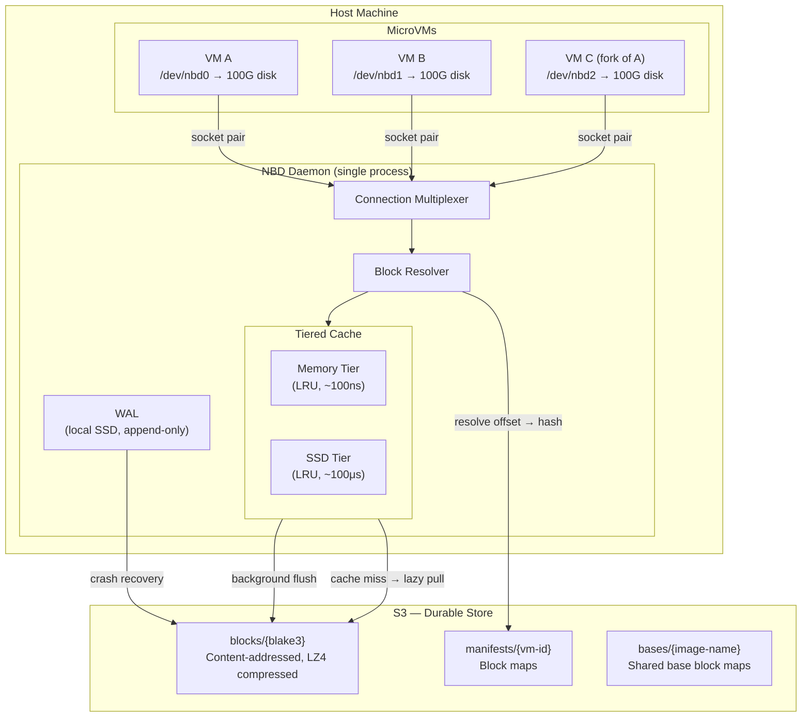
```mermaid
graph TB
    subgraph Host["Host Machine"]
        subgraph VMs["MicroVMs"]
            VM1["VM A<br/>/dev/nbd0 → 100G disk"]
            VM2["VM B<br/>/dev/nbd1 → 100G disk"]
            VM3["VM C (fork of A)<br/>/dev/nbd2 → 100G disk"]
        end

        subgraph NBD["NBD Daemon (single process)"]
            MUX["Connection Multiplexer"]
            BR["Block Resolver"]
            WAL["WAL<br/>(local SSD, append-only)"]
            subgraph CACHE["Tiered Cache"]
                MEM["Memory Tier<br/>(LRU, ~100ns)"]
                SSD["SSD Tier<br/>(LRU, ~100μs)"]
            end
        end

        VM1 -->|"socket pair"| MUX
        VM2 -->|"socket pair"| MUX
        VM3 -->|"socket pair"| MUX
        MUX --> BR
        BR --> CACHE
    end

    subgraph S3["S3 — Durable Store"]
        BLOCKS["blocks/{blake3}<br/>Content-addressed, LZ4 compressed"]
        MANIFESTS["manifests/{vm-id}<br/>Block maps"]
        BASES["bases/{image-name}<br/>Shared base block maps"]
    end

    CACHE -->|"background flush"| BLOCKS
    BR -->|"resolve offset → hash"| MANIFESTS
    CACHE -->|"cache miss → lazy pull"| BLOCKS
    WAL -->|"crash recovery"| BLOCKS
```

---

## Read Path

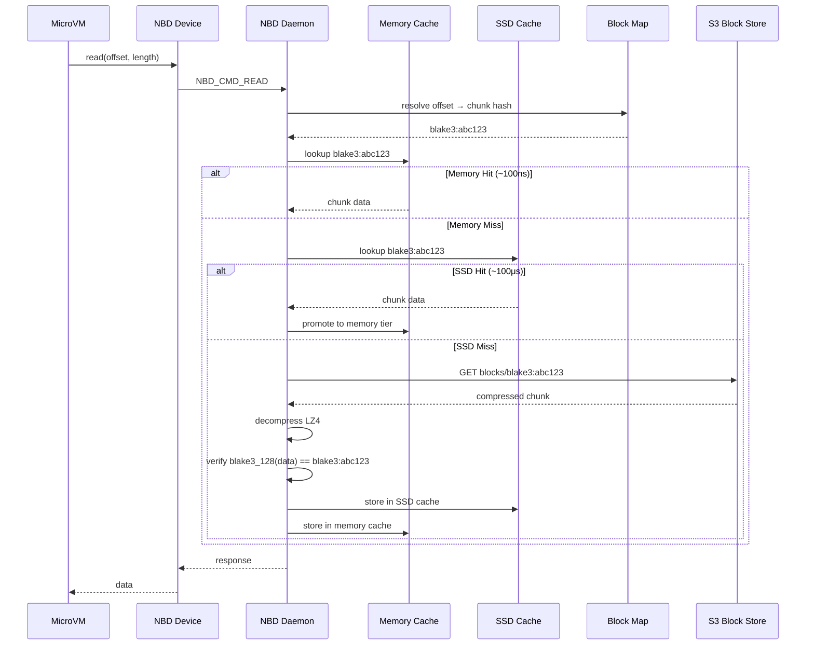
```mermaid
sequenceDiagram
    participant VM as MicroVM
    participant NBD as NBD Device
    participant D as NBD Daemon
    participant MC as Memory Cache
    participant SC as SSD Cache
    participant M as Block Map
    participant S3 as S3 Block Store

    VM->>NBD: read(offset, length)
    NBD->>D: NBD_CMD_READ
    D->>M: resolve offset → chunk hash
    M-->>D: blake3:abc123

    D->>MC: lookup blake3:abc123
    alt Memory Hit (~100ns)
        MC-->>D: chunk data
    else Memory Miss
        D->>SC: lookup blake3:abc123
        alt SSD Hit (~100μs)
            SC-->>D: chunk data
            D->>MC: promote to memory tier
        else SSD Miss
            D->>S3: GET blocks/blake3:abc123
            S3-->>D: compressed chunk
            D->>D: decompress LZ4
            D->>D: verify blake3_128(data) == blake3:abc123
            D->>SC: store in SSD cache
            D->>MC: store in memory cache
        end
    end

    D-->>NBD: response
    NBD-->>VM: data
```

---

## Write Path

Writes are acked after hitting the local WAL and cache. S3 upload happens in the background. Blocks are compressed with LZ4 before upload.

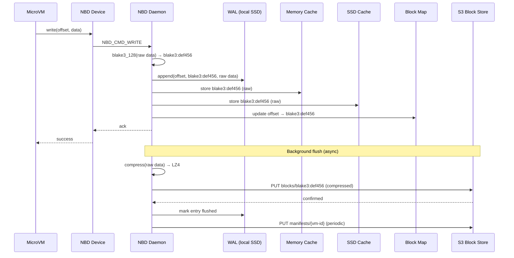
```mermaid
sequenceDiagram
    participant VM as MicroVM
    participant NBD as NBD Device
    participant D as NBD Daemon
    participant WAL as WAL (local SSD)
    participant MC as Memory Cache
    participant SC as SSD Cache
    participant M as Block Map
    participant S3 as S3 Block Store

    VM->>NBD: write(offset, data)
    NBD->>D: NBD_CMD_WRITE
    D->>D: blake3_128(raw data) → blake3:def456
    D->>WAL: append(offset, blake3:def456, raw data)
    D->>MC: store blake3:def456 (raw)
    D->>SC: store blake3:def456 (raw)
    D->>M: update offset → blake3:def456
    D-->>NBD: ack
    NBD-->>VM: success

    Note over D,S3: Background flush (async)
    D->>D: compress(raw data) → LZ4
    D->>S3: PUT blocks/blake3:def456 (compressed)
    S3-->>D: confirmed
    D->>WAL: mark entry flushed
    D->>S3: PUT manifests/{vm-id} (periodic)
```

**Key detail:** BLAKE3-128 hashing is always done on raw (uncompressed) data. This ensures dedup works correctly — the same raw content always produces the same hash regardless of compression. Compression happens only at the S3 boundary.

---

## TRIM / Discard Handling

When a guest filesystem deletes files, it issues TRIM (discard) commands to the block device. Without handling these, the block map grows monotonically — a VM that writes 50GB then deletes 40GB still carries a 50GB block map and 50GB of orphaned blocks in S3 until GC sweeps.

**Implementation:** Handle `NBD_CMD_TRIM` by resetting trimmed block map entries to the well-known zero-block hash.

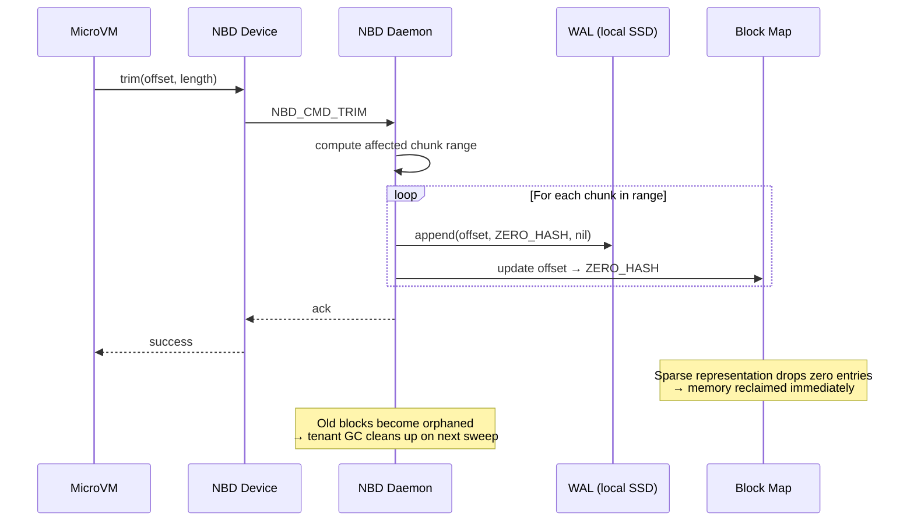
```mermaid
sequenceDiagram
    participant VM as MicroVM
    participant NBD as NBD Device
    participant D as NBD Daemon
    participant WAL as WAL (local SSD)
    participant M as Block Map

    VM->>NBD: trim(offset, length)
    NBD->>D: NBD_CMD_TRIM
    D->>D: compute affected chunk range

    loop For each chunk in range
        D->>WAL: append(offset, ZERO_HASH, nil)
        D->>M: update offset → ZERO_HASH
    end

    D-->>NBD: ack
    NBD-->>VM: success

    Note over M: Sparse representation drops zero entries<br/>→ memory reclaimed immediately
    Note over D: Old blocks become orphaned<br/>→ tenant GC cleans up on next sweep
```

**Properties:**
- **Metadata-only.** No data uploaded to S3. The WAL records the TRIM for crash recovery, but the entry carries no block data — just the offset and zero hash.
- **Immediate memory savings.** Sparse block map drops zero entries. A VM that wrote 50GB and trimmed 40GB holds ~80K entries (~1.3MB), not ~400K (~6.5MB).
- **Storage reclaimed by GC.** Orphaned blocks are swept on the next GC cycle (subject to grace period). No special TRIM-aware GC logic needed — the normal sweep sees unreferenced hashes and deletes them.
- **Guest opt-in.** The guest filesystem must be mounted with `discard` option or use periodic `fstrim` to generate TRIM commands. Standard for any thin-provisioned block device.

---

## Chunk Size & Write Amplification

This is one of the most important design decisions. The chunk size determines the tradeoff between write amplification, metadata overhead, and S3 request volume.

**Default: 128KB chunks.**

| Chunk Size | Write Amp (4KB write) | Block Map Size (100GB disk) | Block Map Memory | S3 Objects (100GB) |
|------------|----------------------|----------------------------|-----------------|-------------------|
| 4MB | 1000x | ~25K entries | ~415KB | ~25K |
| 1MB | 256x | ~100K entries | ~1.7MB | ~100K |
| 128KB | 32x | ~800K entries | ~13MB | ~800K |
| 64KB | 16x | ~1.6M entries | ~26MB | ~1.6M |

128KB is the sweet spot. Rationale:

- **32x write amplification is acceptable.** Typical VM workloads (app servers, build systems) do mostly large sequential writes (package installs, log writes, artifact creation) where write amp is close to 1x. The 32x case only hits on small random writes, which are a minority of I/O for these workloads. For database-heavy VMs, this is a known cost.
- **13MB block map per VM is manageable.** At 100 VMs per host, that's 1.3GB in the dense case — well within typical host memory budgets. With sparse representation (typical workloads), it's ~130MB total. Block maps are read-heavy (every I/O resolves through them) so they should be fully in memory.
- **800K S3 objects per full 100GB disk is fine.** Most VMs don't touch all 100GB. A VM with 10GB of actual written data has ~80K objects. S3 handles this without issue. LIST operations for GC are the concern at scale — addressed in the GC section.
- **Matches v1's proven chunk size.** v1 uses 128KB blocks with positional batching and it works. Don't fix what isn't broken.

**Future optimization: sub-chunk dirty tracking.** For workloads with heavy small random writes, we could track dirty regions within a chunk and only upload the changed portions. The chunk boundary stays at 128KB for addressing and dedup, but the S3 object stores a base + delta. This adds real complexity — build it only if write amplification becomes a measured problem at scale.

---

## Block Map Design

The block map is the critical metadata structure. Every read and write resolves through it. It must be fast and its memory footprint must be predictable.

**Structure:** An ordered array mapping chunk index → (content hash, source).

```
Block Map for VM-A (100GB disk, 128KB chunks):
  Index 0      → (blake3:aabbccdd..., base)    (bytes 0 - 128KB)
  Index 1      → (blake3:ddeeff00..., base)    (bytes 128KB - 256KB)
  Index 2      → (blake3:ff112233..., tenant)  (bytes 256KB - 384KB)
  ...
  Index 819199 → (blake3:11223344..., base)    (bytes 99.99GB - 100GB)
```

**Per-entry size:** 17 bytes (16-byte BLAKE3-128 hash + 1-byte source tag). No offset needed — the array index *is* the offset (index × chunk_size = byte offset). The source tag (`base` or `tenant`) tells the daemon exactly where to resolve the block in S3 — `blocks/bases/{hash}` or `blocks/tenants/{tenant}/{hash}` — avoiding a 404 fallback chain. When a VM writes to a chunk that was previously `base`, the new entry becomes `(new_hash, tenant)`.

**Why BLAKE3-128 over SHA256:** Content-addressing needs collision resistance, not cryptographic security against adversaries. 128 bits gives a birthday bound of ~2^64 blocks — at 128KB per block, that's 2 exabytes of unique data per tenant. No tenant will ever approach this. BLAKE3 is also ~3-4x faster than SHA256, reducing the hashing cost on the write path (~5μs for 128KB vs ~20μs). Shorter hashes mean smaller block maps, smaller manifests, shorter S3 keys, and fewer bytes on the wire.

**Memory analysis:**

| VMs per host | Block map memory (100GB disks) | Block map memory (10GB actual) |
|-------------|-------------------------------|-------------------------------|
| 10 | 133MB | 13MB |
| 50 | 664MB | 66MB |
| 100 | 1.33GB | 133MB |
| 500 | 6.64GB | 664MB |

**Sparse representation:** Most VMs don't touch all 100GB. Unwritten regions point to a well-known "zero block" hash. A sparse map only stores non-zero entries, dramatically reducing actual memory usage. A VM with 10GB of written data on a 100GB disk stores ~80K entries (~1.3MB), not 800K (~13MB).

**Manifest sync to S3:** The full block map is serialized and uploaded to S3 periodically (every N seconds or M writes). This is the checkpoint. On crash recovery, the last manifest + WAL replay reconstructs the current state. Manifest size for a 100GB fully-written disk: ~13MB uncompressed, ~3-5MB compressed. Acceptable for periodic S3 PUTs.

---

## Fork Operation

The key feature this architecture enables. Forking a 100G VM is a metadata copy, not a data copy. Works across hosts.

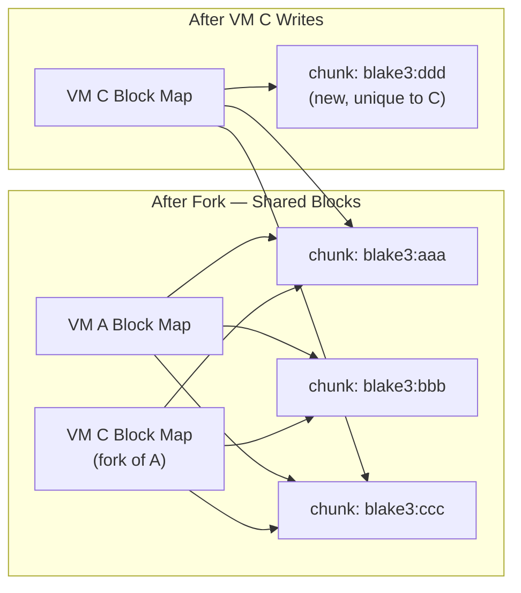
```mermaid
graph LR
    subgraph "After Fork — Shared Blocks"
        MA["VM A Block Map"] --> B1["chunk: blake3:aaa"]
        MA --> B2["chunk: blake3:bbb"]
        MA --> B3["chunk: blake3:ccc"]

        MC["VM C Block Map<br/>(fork of A)"] --> B1
        MC --> B2
        MC --> B3
    end

    subgraph "After VM C Writes"
        MC2["VM C Block Map"] --> B1
        MC2 --> B4["chunk: blake3:ddd<br/>(new, unique to C)"]
        MC2 --> B3
    end
```

### The Consistency Problem

The source VM is alive and writing. Its state exists in three places:

```
S3 manifest          ← last periodic sync, maybe 5s stale
S3 blocks            ← all blocks flushed so far
Host WAL             ← writes since last flush (not in S3 yet)
Host memory/cache    ← block map updates not yet persisted
```

If you copy the S3 manifest, the fork gets the state as of the last manifest sync. It misses blocks in the WAL that haven't been uploaded and block map entries that haven't been persisted. This is fine — but the consistency guarantee should be explicit.

### Two Fork Modes

**Lazy fork (default)** — copy the S3 manifest as-is. No coordination with the source host.

**Consistent fork** — ask the source host to flush first. The fork gets the exact current state.

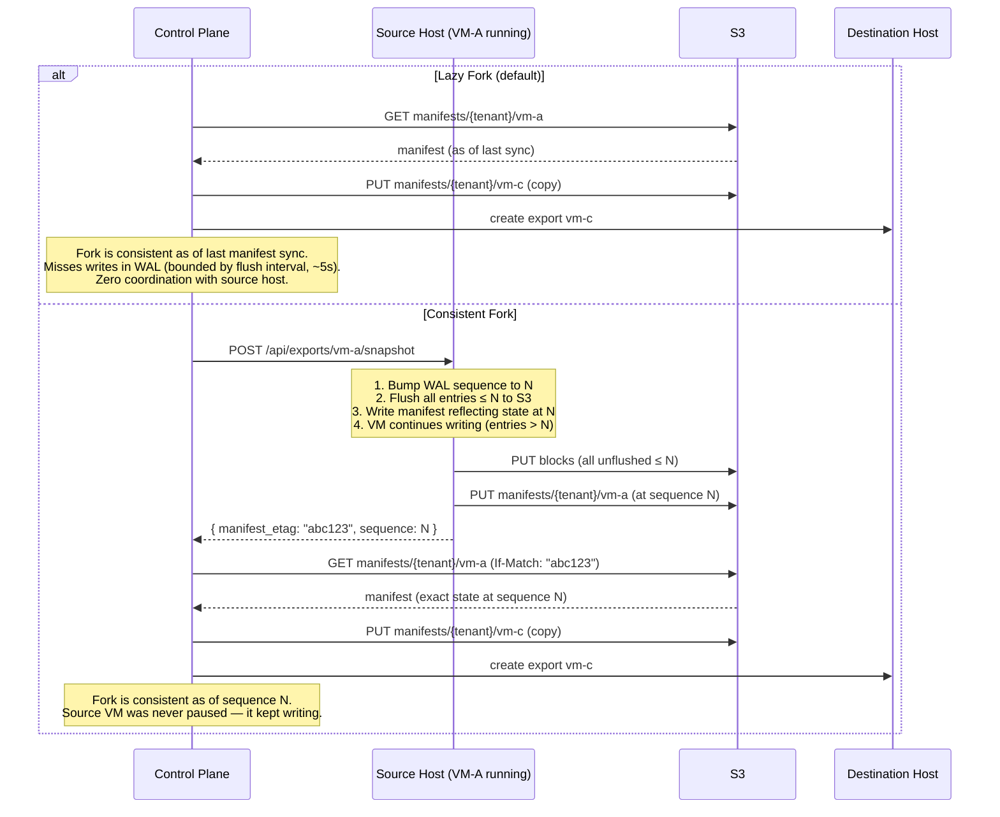
```mermaid
sequenceDiagram
    participant CP as Control Plane
    participant SRC as Source Host (VM-A running)
    participant S3 as S3
    participant DST as Destination Host

    alt Lazy Fork (default)
        CP->>S3: GET manifests/{tenant}/vm-a
        S3-->>CP: manifest (as of last sync)
        CP->>S3: PUT manifests/{tenant}/vm-c (copy)
        CP->>DST: create export vm-c
        Note over CP: Fork is consistent as of last manifest sync.<br/>Misses writes in WAL (bounded by flush interval, ~5s).<br/>Zero coordination with source host.

    else Consistent Fork
        CP->>SRC: POST /api/exports/vm-a/snapshot
        Note over SRC: 1. Bump WAL sequence to N<br/>2. Flush all entries ≤ N to S3<br/>3. Write manifest reflecting state at N<br/>4. VM continues writing (entries > N)
        SRC->>S3: PUT blocks (all unflushed ≤ N)
        SRC->>S3: PUT manifests/{tenant}/vm-a (at sequence N)
        SRC-->>CP: { manifest_etag: "abc123", sequence: N }

        CP->>S3: GET manifests/{tenant}/vm-a (If-Match: "abc123")
        S3-->>CP: manifest (exact state at sequence N)
        CP->>S3: PUT manifests/{tenant}/vm-c (copy)
        CP->>DST: create export vm-c
        Note over CP: Fork is consistent as of sequence N.<br/>Source VM was never paused — it kept writing.
    end
```

### Why Lazy Fork Is the Right Default

For the primary use case — preview environments and branch deploys — a fork that's a few seconds stale is perfectly fine. You're forking a development database or an app server to create a preview. Whether the fork reflects the state from 3 seconds ago or right now doesn't matter.

Lazy fork has critical operational properties:
- **Zero coordination.** Works even if the source host is unreachable, overloaded, or being migrated itself.
- **Zero impact on source VM.** No flush stall, no I/O pause, no latency spike.
- **Idempotent.** Retry-safe. No locks held.

### Consistent Fork: The Snapshot Endpoint

For cases where you need an exact point-in-time copy (e.g., forking a production database for debugging), the `/snapshot` endpoint provides it without pausing the source VM.

The key mechanism is the **WAL sequence number**:

```
WAL entries:
  seq 1: write block 42 → blake3:aaa
  seq 2: write block 17 → blake3:bbb
  seq 3: write block 42 → blake3:ccc    ← overwrote block 42
  ─── snapshot requested, cut point = seq 3 ───
  seq 4: write block 99 → blake3:ddd    ← after snapshot, not included
  seq 5: write block 17 → blake3:eee    ← after snapshot, not included
```

The snapshot operation:
1. Atomically read the current WAL sequence (e.g., N=3). This is a single atomic load — no lock, no pause.
2. Flush all WAL entries with sequence ≤ N to S3 (blocks + manifest).
3. Return the manifest ETag to the caller.
4. The source VM keeps writing normally. Entries with sequence > N are unaffected.

The source VM is **never paused**. The only cost is a flush of already-pending WAL entries, which would happen soon anyway via the background sync.

### Race Conditions

**Fork during write:** A write arrives at the source between the manifest read and the fork's first access. Not a problem — the fork's manifest doesn't reference the new block. The fork has a consistent snapshot.

**Fork during fork:** Two forks of the same VM requested simultaneously. Both read the same manifest (or close versions). Both produce independent copies. No conflict — manifest PUTs are to different keys (`vm-c` and `vm-d`).

**Source VM deleted during fork:** The fork's manifest is already written to S3. It references blocks by hash. GC won't touch those blocks — they're in the fork's manifest, which is in the live set. The fork survives independently.

**Fork of a fork:** Same operation. Copy the manifest. Blocks are shared transitively. GC sees all manifests, keeps all referenced blocks.

**Consistent fork + concurrent writes:** The WAL sequence cut is atomic. Writes that arrive after the cut get sequence > N and aren't included in the flush. The manifest at sequence N is internally consistent — it reflects all writes ≤ N and none > N.

### Self-Containment Property

The S3 manifest is always self-contained. Every hash in it corresponds to a block that exists in S3 (either in `blocks/bases/` or `blocks/tenants/{tid}/`). Unflushed blocks exist only in the WAL and local cache — they aren't in any manifest. You can copy a manifest to any host and it resolves completely. No dangling references.

---

## Tenant Isolation Model

Cross-tenant deduplication is a side-channel risk (deduplication oracle attack). The design uses a tiered isolation model.

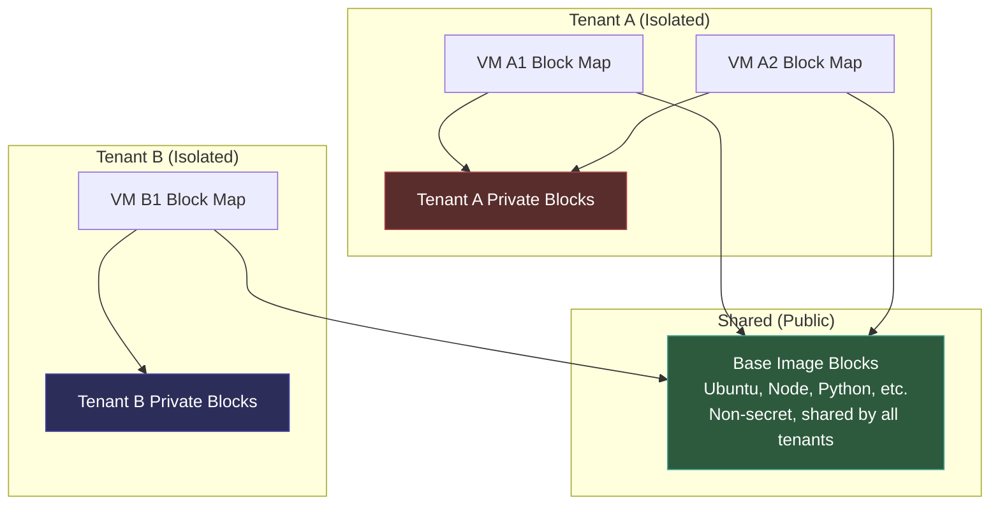
```mermaid
graph TB
    subgraph "Shared (Public)"
        BASES["Base Image Blocks<br/>Ubuntu, Node, Python, etc.<br/>Non-secret, shared by all tenants"]
    end

    subgraph "Tenant A (Isolated)"
        MA1["VM A1 Block Map"]
        MA2["VM A2 Block Map"]
        BA["Tenant A Private Blocks"]
        MA1 --> BASES
        MA2 --> BASES
        MA1 --> BA
        MA2 --> BA
    end

    subgraph "Tenant B (Isolated)"
        MB1["VM B1 Block Map"]
        BB["Tenant B Private Blocks"]
        MB1 --> BASES
        MB1 --> BB
    end

    BA ~~~ BB

    style BASES fill:#2d5a3d,stroke:#4a9,color:#fff
    style BA fill:#5a2d2d,stroke:#a44,color:#fff
    style BB fill:#2d2d5a,stroke:#44a,color:#fff
```

**Rules:**
- Base image blocks are blessed, public, and shared across all tenants
- Any block written by a tenant is keyed to that tenant's namespace
- Dedup happens freely *within* a tenant (their own VMs share blocks)
- Cross-tenant dedup only happens against the shared base set

**S3 Key Layout:**

```
blocks/
  bases/{blake3}                ← shared, anyone can read
  tenants/{tenant-id}/{blake3}  ← isolated, tenant-scoped

manifests/
  {tenant-id}/{vm-id}           ← always tenant-scoped

bases/
  manifests/{image-name}        ← blessed base image manifests
  refcounts/{image-name}        ← base image reference counts (GC optimization)
```

---

## Base Image Registry

Base images are the shared foundation — Ubuntu, Node runtimes, Python environments. They need to be chunked, uploaded, and made available to all tenants. This is an offline pipeline, not a hot-path daemon operation.

### Bless Pipeline

An admin or CI pipeline builds a raw disk image, then blesses it into the content-addressed store:

```bash
glidefs bless --image ubuntu-22.04-node20.raw --name ubuntu-22.04-node20-v3
```

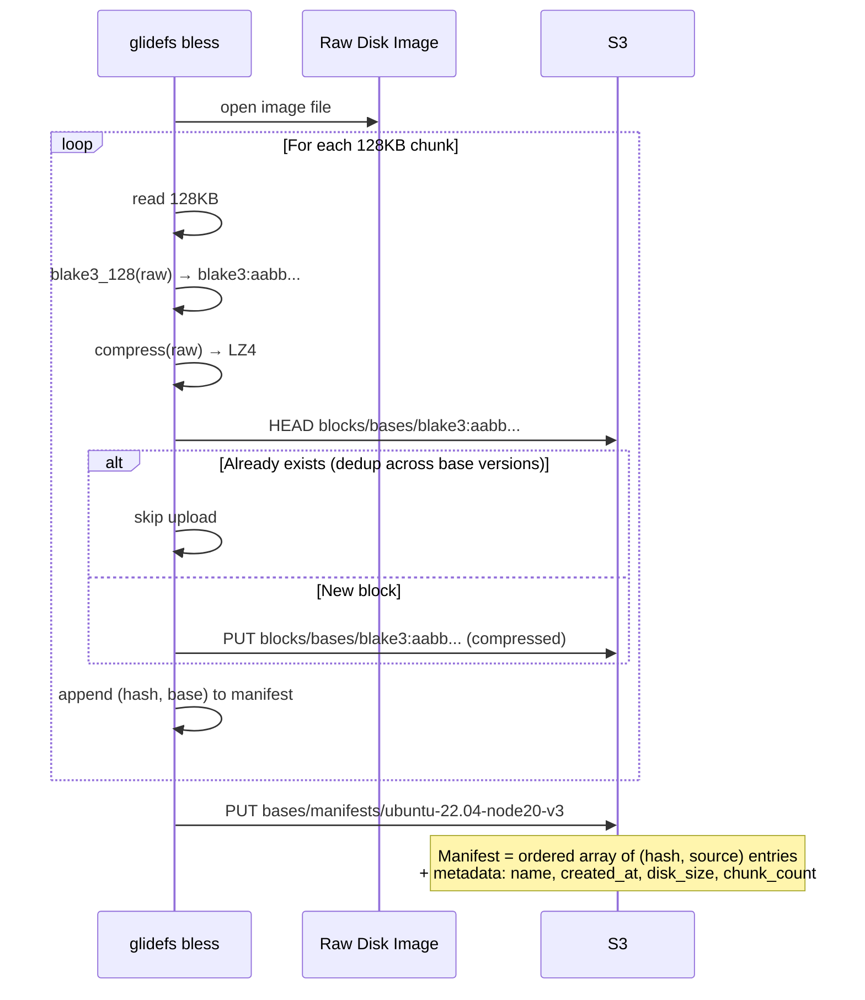
```mermaid
sequenceDiagram
    participant CLI as glidefs bless
    participant DISK as Raw Disk Image
    participant S3 as S3

    CLI->>DISK: open image file

    loop For each 128KB chunk
        CLI->>CLI: read 128KB
        CLI->>CLI: blake3_128(raw) → blake3:aabb...
        CLI->>CLI: compress(raw) → LZ4
        CLI->>S3: HEAD blocks/bases/blake3:aabb...
        alt Already exists (dedup across base versions)
            CLI->>CLI: skip upload
        else New block
            CLI->>S3: PUT blocks/bases/blake3:aabb... (compressed)
        end
        CLI->>CLI: append (hash, base) to manifest
    end

    CLI->>S3: PUT bases/manifests/ubuntu-22.04-node20-v3
    Note over S3: Manifest = ordered array of (hash, source) entries<br/>+ metadata: name, created_at, disk_size, chunk_count
```

**Key properties:**
- **Dedup across base versions.** Ubuntu 22.04 + Node 18 and Ubuntu 22.04 + Node 20 share ~95% of their OS blocks. The HEAD-before-PUT check means only genuinely new chunks get uploaded. The second base image is nearly free to store.
- **Idempotent.** Running bless again with the same image and name produces the same hashes, same manifest. A no-op.
- **Offline.** No daemon involvement. The CLI talks directly to S3. Runs in CI, on a dev machine, wherever.
- **No layers.** A base image is a flat disk image. Composition (Ubuntu + Node + your framework) happens at image build time, not the storage layer. Layers add complexity for marginal benefit when content-addressing already deduplicates across images.

### Creating a VM from a Base Image

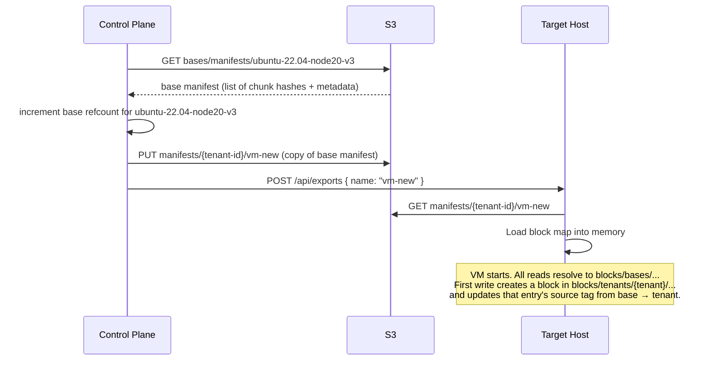
```mermaid
sequenceDiagram
    participant CP as Control Plane
    participant S3 as S3
    participant HOST as Target Host

    CP->>S3: GET bases/manifests/ubuntu-22.04-node20-v3
    S3-->>CP: base manifest (list of chunk hashes + metadata)
    CP->>CP: increment base refcount for ubuntu-22.04-node20-v3
    CP->>S3: PUT manifests/{tenant-id}/vm-new (copy of base manifest)
    CP->>HOST: POST /api/exports { name: "vm-new" }
    HOST->>S3: GET manifests/{tenant-id}/vm-new
    HOST->>HOST: Load block map into memory
    Note over HOST: VM starts. All reads resolve to blocks/bases/...<br/>First write creates a block in blocks/tenants/{tenant}/...<br/>and updates that entry's source tag from base → tenant.
```

The VM's manifest starts as an exact copy of the base manifest. Every entry has source tag `base`. As the VM writes, individual entries flip to `(new_hash, tenant)`. Unmodified chunks continue resolving from the shared base namespace — no data copied, no storage consumed.

### Block Resolution with Source Tags

The source tag in each manifest entry tells the daemon exactly where to look:

```
1. Memory cache    → hit? serve it  (~100ns)
2. SSD cache       → hit? serve it  (~100μs)
3. S3              → source tag == base?
                       blocks/bases/{hash}          (10-50ms)
                     source tag == tenant?
                       blocks/tenants/{tenant}/{hash} (10-50ms)
```

No 404 fallback chain. No bloom filters. The manifest is the source of truth for both *what* block and *where* it lives.

### Versioning and Retirement

Base images are immutable once blessed. New version = new name. Old versions persist until explicitly retired.

```
bases/manifests/
  ubuntu-22.04-node20-v1    ← old, maybe retired
  ubuntu-22.04-node20-v2    ← previous
  ubuntu-22.04-node20-v3    ← current
```

The control plane decides which version new VMs use. Old VMs keep their manifests — they reference blocks by hash, not by base image name. Retiring a base image never breaks existing VMs.

### Base Block Garbage Collection

Base blocks require their own GC, separate from per-tenant GC. The challenge: determining whether a base block is still referenced requires scanning manifests across *all* tenants. At scale (thousands of VMs across hundreds of tenants), that's expensive.

**Solution: reference counting as a fast path, mark-and-sweep as the source of truth.**

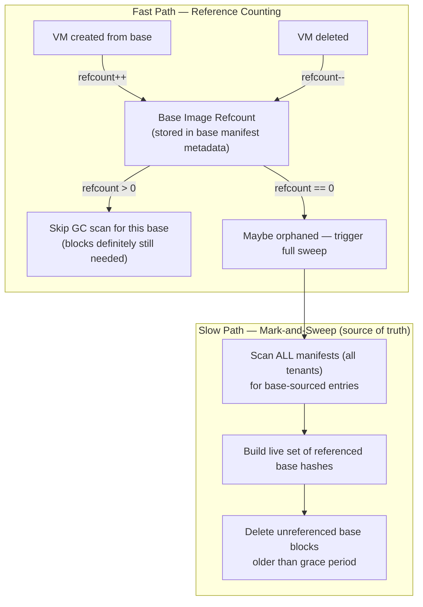
```mermaid
graph TB
    subgraph "Fast Path — Reference Counting"
        CREATE["VM created from base"] -->|"refcount++"| RC["Base Image Refcount<br/>(stored in base manifest metadata)"]
        DELETE["VM deleted"] -->|"refcount--"| RC
        RC -->|"refcount > 0"| SKIP["Skip GC scan for this base<br/>(blocks definitely still needed)"]
        RC -->|"refcount == 0"| MAYBE["Maybe orphaned — trigger full sweep"]
    end

    subgraph "Slow Path — Mark-and-Sweep (source of truth)"
        MAYBE --> SCAN["Scan ALL manifests (all tenants)<br/>for base-sourced entries"]
        SCAN --> LIVE["Build live set of referenced base hashes"]
        LIVE --> SWEEP["Delete unreferenced base blocks<br/>older than grace period"]
    end
```

**How the refcount works:**
- Stored in a small sidecar object `bases/refcounts/{image-name}`.
- Incremented when a VM is created from this base. Decremented when a VM is deleted.
- **Updated by the control plane, not by individual hosts.** The control plane already serializes VM creation/deletion — it's the natural place to batch refcount updates. This avoids conditional PUT (If-Match ETag) contention on S3 during burst scaling events (e.g., autoscaler spins up 50 VMs from the same base simultaneously — 50 concurrent conditional PUTs would mostly fail and retry). Since the control plane processes these requests, it can coalesce refcount increments into a single PUT per base per batch.
- The refcount is an **optimization hint**, not a correctness mechanism. If it drifts (crash between VM delete and refcount decrement), the worst case is that GC skips a scan it could have done — orphaned blocks accumulate until the next reconciliation.

**Reconciliation:** Periodically (e.g., daily), reconcile refcounts by scanning all tenant manifests and counting actual references to each base image. This corrects any drift. The reconciliation is the same full scan that mark-and-sweep would do — but it only runs when refcounts suggest it's needed, or on a slow schedule as a safety net.

**Why this hybrid approach:**
- **Common case (refcount > 0):** O(1) check, no scan needed. Most base images are actively used. This covers 99% of GC cycles.
- **Retirement case (refcount == 0):** Full scan to confirm no references remain. This is expensive but rare — it only happens when an admin retires a base image and all VMs using it have been deleted.
- **Failure mode is always conservative.** A stale refcount > 0 means we keep blocks longer than necessary (storage cost, not data loss). Mark-and-sweep catches it eventually.

**Retirement flow:**

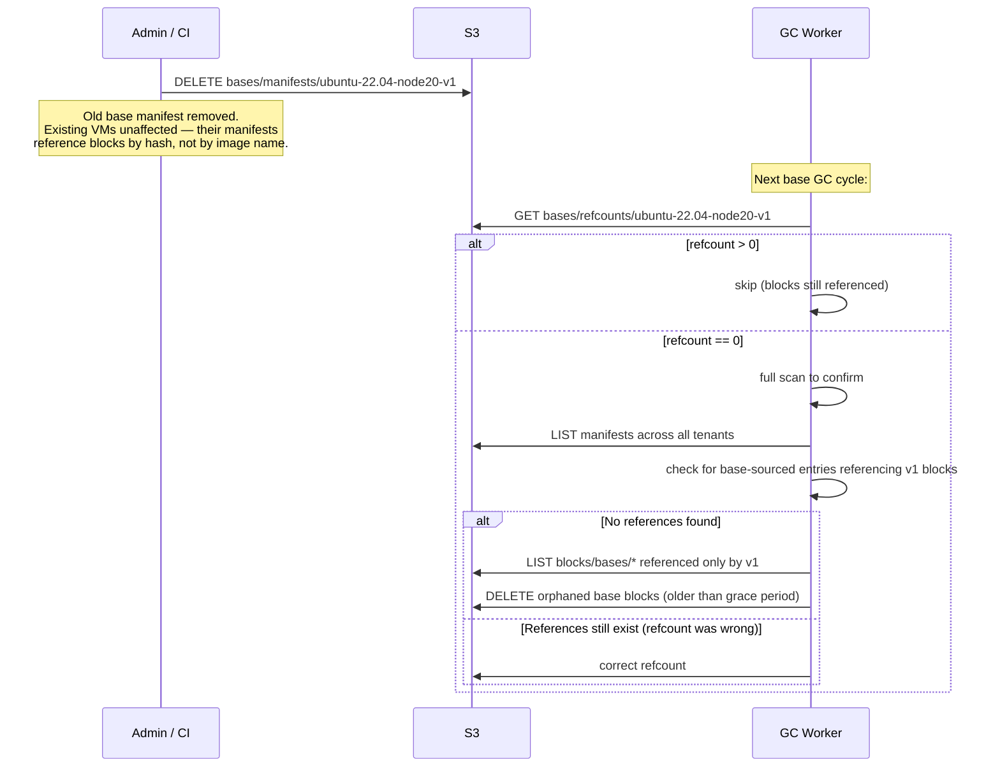
```mermaid
sequenceDiagram
    participant ADMIN as Admin / CI
    participant S3 as S3
    participant GC as GC Worker

    ADMIN->>S3: DELETE bases/manifests/ubuntu-22.04-node20-v1
    Note over ADMIN: Old base manifest removed.<br/>Existing VMs unaffected — their manifests<br/>reference blocks by hash, not by image name.

    Note over GC: Next base GC cycle:
    GC->>S3: GET bases/refcounts/ubuntu-22.04-node20-v1
    alt refcount > 0
        GC->>GC: skip (blocks still referenced)
    else refcount == 0
        GC->>GC: full scan to confirm
        GC->>S3: LIST manifests across all tenants
        GC->>GC: check for base-sourced entries referencing v1 blocks
        alt No references found
            GC->>S3: LIST blocks/bases/* referenced only by v1
            GC->>S3: DELETE orphaned base blocks (older than grace period)
        else References still exist (refcount was wrong)
            GC->>S3: correct refcount
        end
    end
```

**Critical safety property:** Deleting a base manifest never breaks existing VMs. VM manifests reference blocks by hash. The blocks persist in `blocks/bases/` until no manifest anywhere references them and the grace period expires.

---

## Cache Design

Two-tier cache: in-memory LRU for hot blocks, SSD-backed LRU for warm blocks.

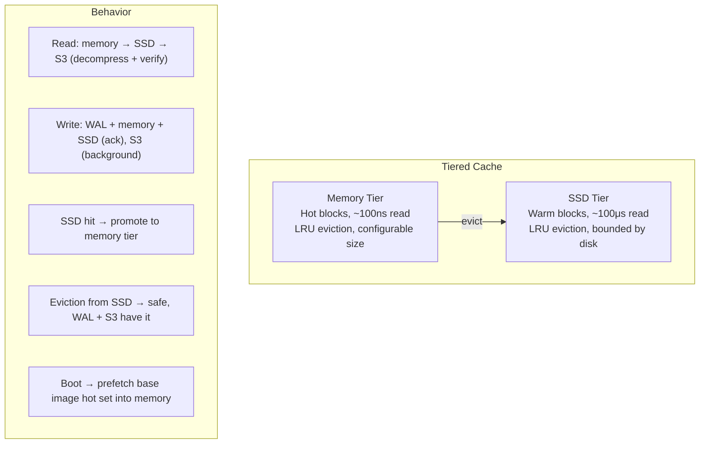
```mermaid
graph TB
    subgraph "Tiered Cache"
        MEM["Memory Tier<br/>Hot blocks, ~100ns read<br/>LRU eviction, configurable size"]
        SSD["SSD Tier<br/>Warm blocks, ~100μs read<br/>LRU eviction, bounded by disk"]
        MEM -->|"evict"| SSD
    end

    subgraph "Behavior"
        READ["Read: memory → SSD → S3 (decompress + verify)"]
        WRITE["Write: WAL + memory + SSD (ack), S3 (background)"]
        PROMOTE["SSD hit → promote to memory tier"]
        EVICT["Eviction from SSD → safe, WAL + S3 have it"]
        BOOT["Boot → prefetch base image hot set into memory"]
    end
```

**Memory tier:**
- Configurable size per host (e.g., `memory_cache_gb`). Sized relative to workload — hosts running many small VMs need more cache breadth, hosts running few large VMs need more cache depth.
- LRU eviction. Evicted blocks fall to SSD tier, not lost.
- 1000x faster than SSD for hot-path reads. This matters for database workloads and any VM with a tight working set.

**SSD tier:**
- Bounded by available SSD space. Much larger than memory tier.
- LRU eviction. Evicted blocks are simply gone from cache — re-pulled from S3 on next access.
- Blocks are stored uncompressed on SSD (already decompressed on ingestion from S3). Avoids decompression on the SSD read path.

**Key properties:**
- Both tiers are pure optimization. Losing them means slower reads, not data loss (WAL + S3 are the durability story).
- Blocks are immutable (content-addressed), so cached blocks are always valid. No coherence protocol needed.
- Boot prefetching: base images have a known hot set (kernel, init, core libs). Prefetch into memory cache when a VM is scheduled, before it starts.

---

## Compression

All blocks are compressed with LZ4 before upload to S3. LZ4 is chosen for its speed — compression and decompression are essentially free relative to I/O latency.

**Where compression happens in the pipeline:**

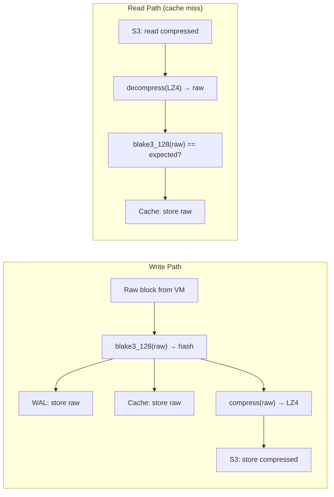
```mermaid
graph LR
    subgraph "Write Path"
        W_RAW["Raw block from VM"] --> W_HASH["blake3_128(raw) → hash"]
        W_HASH --> W_WAL["WAL: store raw"]
        W_HASH --> W_CACHE["Cache: store raw"]
        W_HASH --> W_COMPRESS["compress(raw) → LZ4"]
        W_COMPRESS --> W_S3["S3: store compressed"]
    end

    subgraph "Read Path (cache miss)"
        R_S3["S3: read compressed"] --> R_DECOMPRESS["decompress(LZ4) → raw"]
        R_DECOMPRESS --> R_VERIFY["blake3_128(raw) == expected?"]
        R_VERIFY --> R_CACHE["Cache: store raw"]
    end
```

**Design decisions:**
- **Hash before compress.** Dedup is based on raw content hashes (BLAKE3-128). Same raw data always produces the same hash, regardless of LZ4 version or compression level. This is critical — if we hashed compressed data, different compression runs of identical content could produce different hashes, breaking dedup.
- **Cache stores raw (uncompressed) blocks.** Cache reads are on the hot path. Decompression on every cache hit adds CPU cost for no benefit — the cache exists to be fast.
- **WAL stores raw blocks.** WAL replay needs to re-upload to S3, which means compressing during replay. Storing raw in the WAL keeps the write path simple (no compression before ack) and pays the compression cost during background flush, off the critical path.
- **S3 stores compressed blocks.** This is where compression pays for itself — reduced storage cost (~1.5-2x for typical OS/app data) and reduced transfer time on cache misses.

**Expected savings:**
- OS and application data: 1.5-2x compression ratio with LZ4
- Already-compressed data (images, archives): ~1x (LZ4 detects incompressible data and passes through with minimal overhead)
- Effective S3 bill reduction: ~40-50% for typical workloads

---

## S3 Write Batching (Pack Files)

Content-addressing stores each block as a separate S3 object keyed by its hash. For a VM with 10GB of unique data at 128KB chunks, that's ~80K S3 objects and ~80K PUT operations during flush. At scale across thousands of VMs, this adds up — both in PUT costs and GC LIST overhead.

**Solution: pack files.** Batch content-addressed blocks into single S3 objects. The addressing model (content-addressed by hash) is unchanged — packs are a physical storage optimization, not a logical change. Same idea as git packfiles: the SHA is the address, the packfile is the storage.

### Concept

```
Without packs:                        With packs:

  blocks/tenants/t1/blake3:aaa          packs/tenants/t1/pack-0042
  blocks/tenants/t1/blake3:bbb            ├─ blake3:aaa (compressed)
  blocks/tenants/t1/blake3:ccc            ├─ blake3:bbb (compressed)
  ...                                     ├─ blake3:ccc (compressed)
  (80K objects for 10GB)                  └─ index: [{hash, offset, length}]
                                        (3.2K objects for 10GB)
```

Each flush cycle collects dirty blocks, compresses them, assembles a pack with a small index header, and uploads with a single PUT. Default: 25 blocks per pack (~3.2MB), matching v1's proven batch size.

### Write Path with Packs

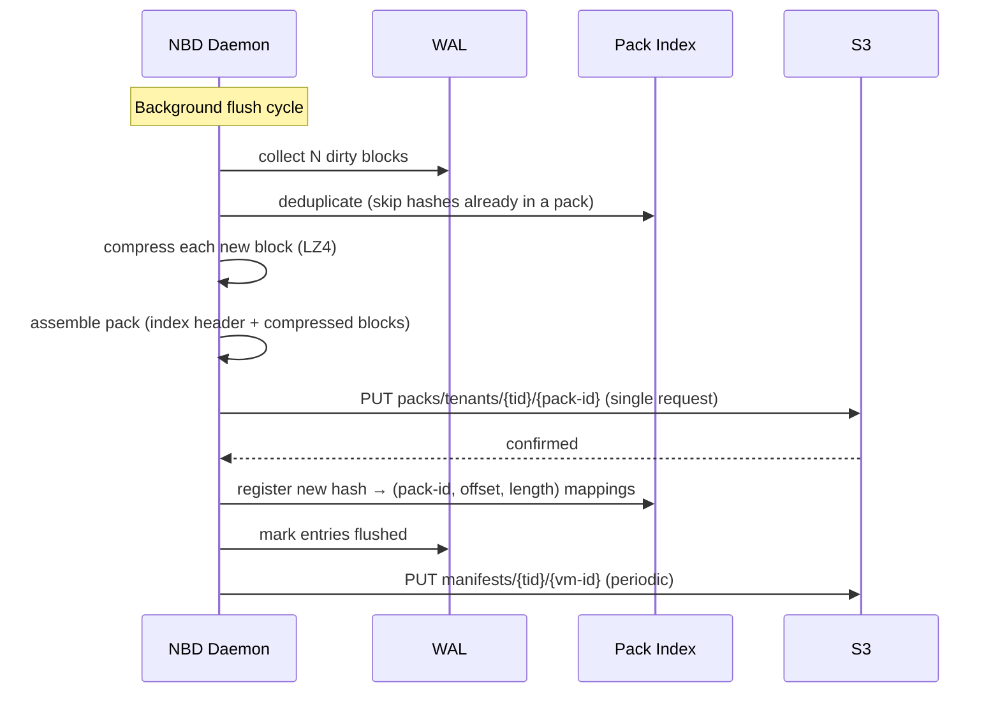
```mermaid
sequenceDiagram
    participant D as NBD Daemon
    participant WAL as WAL
    participant PI as Pack Index
    participant S3 as S3

    Note over D: Background flush cycle
    D->>WAL: collect N dirty blocks
    D->>PI: deduplicate (skip hashes already in a pack)
    D->>D: compress each new block (LZ4)
    D->>D: assemble pack (index header + compressed blocks)
    D->>S3: PUT packs/tenants/{tid}/{pack-id} (single request)
    S3-->>D: confirmed
    D->>PI: register new hash → (pack-id, offset, length) mappings
    D->>WAL: mark entries flushed
    D->>S3: PUT manifests/{tid}/{vm-id} (periodic)
```

**Dedup during flush:** Before packing, check the pack index for each hash. If a block with that hash already exists in a pack (common after forks — the parent already uploaded it), skip it. Physical dedup within a tenant without a global index.

### Read Path with Packs

On a cache miss, the daemon resolves the block's physical location via the pack index:

```
1. Block map: offset → hash                    (~100ns, in memory)
2. Memory cache → hit? serve                   (~100ns)
3. SSD cache → hit? serve                      (~100μs)
4. Pack index: hash → (pack-id, offset, length) (~100ns, in memory)
5. S3 GET packs/{source}/{pack-id}             (10-50ms)
6. Decompress all blocks in pack
7. Verify hashes, cache all blocks
```

**Key optimization: prefetch the whole pack.** On a cache miss, download the entire pack (~3.2MB) instead of a single block via Range request. You're already paying the S3 first-byte latency (10-50ms) — the extra ~3MB of transfer is negligible at S3's bandwidth. Caching all 25 blocks exploits temporal locality: blocks written in the same flush cycle are often accessed together (same boot sequence, same install pass, same write burst). One cache miss warms 25 cache entries.

### Pack Index

The pack index maps `hash → (pack-id, offset, compressed_length)` for every block stored in S3. Maintained in memory by the daemon, persisted as part of the manifest.

**Memory cost:** ~24 bytes per unique block (16-byte hash key + 4-byte pack-id + 4-byte offset/length).

| Scenario | Pack index memory | Block map memory | Total |
|----------|------------------|-----------------|-------|
| 10GB actual data (80K blocks) | ~1.9MB | ~1.3MB | ~3.2MB |
| 100GB fully written (800K blocks) | ~19MB | ~13MB | ~32MB |
| 100 VMs × 10GB each | ~190MB | ~133MB | ~323MB |

Within a tenant, forked VMs share pack index entries — a fork that hasn't diverged adds zero index overhead.

**On startup:** Load the pack index from the manifest. No pack header scanning needed.

### S3 Key Layout with Packs

```
packs/
  bases/{pack-id}                ← base image packs (from bless pipeline)
  tenants/{tenant-id}/{pack-id}  ← tenant packs

manifests/
  {tenant-id}/{vm-id}           ← always tenant-scoped (unchanged)
```

### Interaction with Other Components

**Fork:** Unchanged. Copy the manifest (which includes the pack index). The fork references the same packs as the parent. No data copied.

**GC:** Operates on packs instead of individual blocks.
- **Mark:** Build live set of hashes from all manifests (unchanged).
- **Sweep:** For each pack, check how many of its blocks are in the live set.
  - All live → keep.
  - All dead + older than grace period → delete pack.
  - Mixed → **compact** if dead ratio exceeds threshold: write new pack with only live blocks, update manifests, delete old pack.
- **Compaction** is the new GC operation. It's rare in practice — most packs are either fully live (recent writes) or fully dead (old packs whose blocks have all been overwritten). Packs age out naturally.

**Base images:** The bless pipeline creates packs instead of individual block objects. A base image is one or more packs containing all chunks. VMs created from the base reference these packs directly.

### Cost Analysis

| Metric | Individual Blocks | Pack Files (25/pack) | Improvement |
|--------|------------------|---------------------|-------------|
| S3 PUTs (10GB VM) | 80,000 | 3,200 | **25x fewer** |
| S3 objects (10GB VM) | 80,000 | 3,200 | **25x fewer** |
| GC LIST requests (100 VMs) | ~8,000 | ~320 | **25x fewer** |
| S3 GET on cache miss | 1 block cached | 25 blocks cached | **25x better prefetch** |
| Memory overhead | 0 (block map only) | +1.9MB per 10GB | Acceptable |

At S3 pricing ($5/M PUTs, $0.40/M GETs):
- 10GB VM build-out: $0.40 → $0.016 (PUTs alone)
- Daily GC for 100-VM tenant: $0.032 → $0.0013

The real win at scale is fewer S3 requests across thousands of VMs and frequent GC cycles — plus the temporal locality bonus on reads that no individual-block scheme can match.

---

## Crash Recovery (WAL)

The WAL (write-ahead log) is the durability mechanism. S3 is the long-term store, but writes are acked locally before S3 confirms. The WAL bridges the gap.

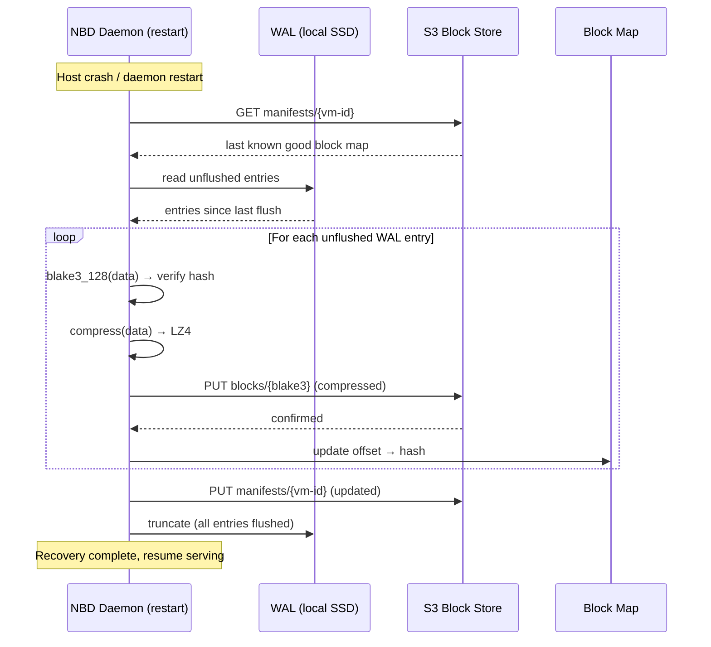
```mermaid
sequenceDiagram
    participant D as NBD Daemon (restart)
    participant WAL as WAL (local SSD)
    participant S3 as S3 Block Store
    participant M as Block Map

    Note over D: Host crash / daemon restart
    D->>S3: GET manifests/{vm-id}
    S3-->>D: last known good block map
    D->>WAL: read unflushed entries
    WAL-->>D: entries since last flush

    loop For each unflushed WAL entry
        D->>D: blake3_128(data) → verify hash
        D->>D: compress(data) → LZ4
        D->>S3: PUT blocks/{blake3} (compressed)
        S3-->>D: confirmed
        D->>M: update offset → hash
    end

    D->>S3: PUT manifests/{vm-id} (updated)
    D->>WAL: truncate (all entries flushed)
    Note over D: Recovery complete, resume serving
```

**WAL properties:**
- Append-only file on local SSD. Sequential writes only — fast and predictable.
- Each entry: `(vm-id, offset, blake3_128_hash, raw_chunk_data)`. Self-contained for replay.
- Entries are marked flushed after S3 confirms the block upload.
- Manifest is persisted to S3 periodically (e.g., every N seconds or M entries), not on every write.
- On recovery: load last-known-good manifest from S3, replay unflushed WAL entries, done.
- WAL is truncated after full flush. Keeps disk usage bounded.

**Failure modes:**
- **Host dies, WAL intact:** Full recovery. Replay unflushed entries.
- **Host dies, WAL partially written:** Last incomplete entry is discarded. That single in-flight write is lost. The VM sees it as a write that didn't ack — same as a power loss on bare metal. Acceptable.
- **Host dies, SSD dead:** WAL and cache are both gone. Fall back to last manifest in S3. Unflushed writes since last manifest sync are lost. This is the worst case — bounded by manifest flush interval.

---

## Live Migration

Moving a VM between hosts. The source of truth is S3, not local state.

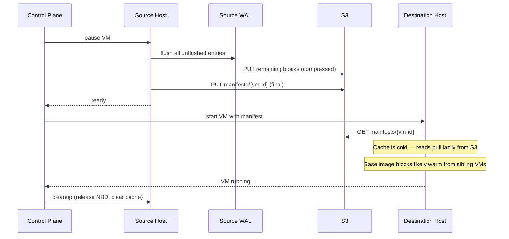
```mermaid
sequenceDiagram
    participant CP as Control Plane
    participant SRC as Source Host
    participant WAL as Source WAL
    participant S3 as S3
    participant DST as Destination Host

    CP->>SRC: pause VM
    SRC->>WAL: flush all unflushed entries
    WAL->>S3: PUT remaining blocks (compressed)
    SRC->>S3: PUT manifests/{vm-id} (final)
    SRC-->>CP: ready

    CP->>DST: start VM with manifest
    DST->>S3: GET manifests/{vm-id}
    Note over DST: Cache is cold — reads pull lazily from S3
    Note over DST: Base image blocks likely warm from sibling VMs
    DST-->>CP: VM running
    CP->>SRC: cleanup (release NBD, clear cache)
```

**Comparison with v1:**
- v1 already does drain-dirty-blocks → point new host at S3. This design doesn't fundamentally change that flow.
- The meaningful improvement: the WAL means we can bound the flush to only unflushed entries, and potentially resume the VM on the destination before the flush fully completes (serve reads from S3 while WAL replays in the background). v1 blocks on a full drain.
- Base image blocks are likely already warm on the destination from sibling VMs, so the cold-cache penalty is mostly limited to tenant-specific data.
- Migration cost is proportional to WAL flush size, not disk size. A 100G VM with 10MB of unflushed writes costs 10MB to migrate.

**Cache warming:** Not strictly necessary. The destination cache warms organically. For latency-sensitive workloads, the control plane *could* hint the destination to prefetch the source's hot set, but this is an optimization to consider later, not a launch requirement.

---

## Garbage Collection

This is one of the harder parts of the system. When VMs are deleted or blocks are overwritten, orphaned blocks accumulate in S3. They need to be cleaned up without racing against concurrent forks, writes, or deletes.

**Approach: mark-and-sweep with a grace period.**

Reference counting was considered and rejected. Under concurrent fork + delete + write, maintaining accurate reference counts requires distributed coordination (or serialization through a single counter) that adds complexity and fragility. A count that goes wrong means either storage leaks (count too high) or data loss (count hits zero while still referenced). Mark-and-sweep is simpler and its failure mode is always conservative — worst case, you keep blocks too long.

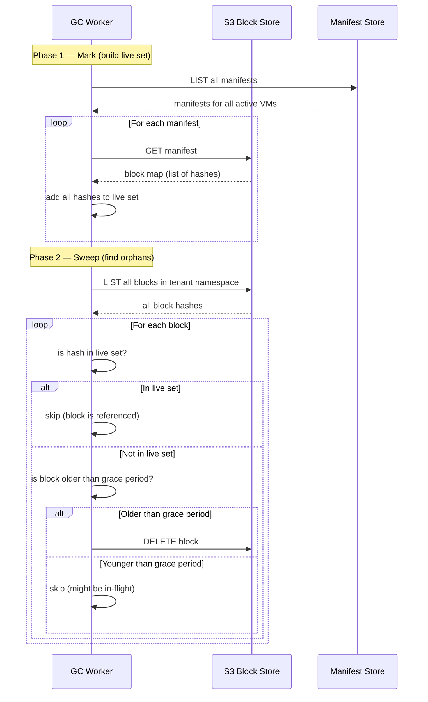
```mermaid
sequenceDiagram
    participant GC as GC Worker
    participant S3 as S3 Block Store
    participant MAN as Manifest Store

    Note over GC: Phase 1 — Mark (build live set)
    GC->>MAN: LIST all manifests
    MAN-->>GC: manifests for all active VMs

    loop For each manifest
        GC->>S3: GET manifest
        S3-->>GC: block map (list of hashes)
        GC->>GC: add all hashes to live set
    end

    Note over GC: Phase 2 — Sweep (find orphans)
    GC->>S3: LIST all blocks in tenant namespace
    S3-->>GC: all block hashes

    loop For each block
        GC->>GC: is hash in live set?
        alt In live set
            GC->>GC: skip (block is referenced)
        else Not in live set
            GC->>GC: is block older than grace period?
            alt Older than grace period
                GC->>S3: DELETE block
            else Younger than grace period
                GC->>GC: skip (might be in-flight)
            end
        end
    end
```

**Grace period:** Blocks younger than the grace period (e.g., 24 hours) are never deleted, even if unreferenced. This protects against races:
- A write creates a block in S3 but hasn't updated the manifest yet. Without the grace period, GC could delete it.
- A fork copies a manifest, and the source VM deletes a block between the manifest read and the fork's first access. The grace period keeps the block alive.
- WAL replay after a crash uploads blocks that aren't yet in any manifest. Grace period covers the recovery window.

**Operational design:**
- **Frequency:** Daily or every few hours. GC is not latency-sensitive — running it less frequently means slightly more orphaned storage, not correctness issues.
- **Scope:** Per-tenant. Each tenant's blocks are GC'd independently. Shared base image blocks have their own GC with refcount-accelerated mark-and-sweep — see the Base Image Registry section.
- **Cost:** The main cost is S3 LIST operations. For a tenant with 1M blocks, a full LIST is ~1000 requests (1000 keys per page). At current S3 pricing, this is negligible. The live set construction requires reading all manifests — for a tenant with 100 VMs, that's 100 GET requests.
- **Consistency:** GC is eventually consistent. A sweep might miss a block that was just orphaned. It'll be caught on the next sweep. This is fine — the cost is a few hours of extra storage, not correctness.

**Failure modes:**
- **GC crashes mid-sweep:** No harm. Incomplete sweep means some orphans survive until the next run. Conservative failure.
- **GC deletes a block that's still needed:** Can only happen if the block is older than the grace period AND not in any manifest. The grace period must be longer than the longest possible window between block creation and manifest update (WAL flush interval + manifest sync interval + buffer). A 24-hour grace period is extremely conservative.
- **GC runs during a fork operation:** The fork copies a manifest atomically (single S3 GET + PUT). GC sees either the old manifest or the new one. Either way, all blocks referenced by the visible manifest are in the live set.

---

## Encryption at Rest

Tenant data in S3 is encrypted per-tenant using S3 server-side encryption with KMS (SSE-KMS).

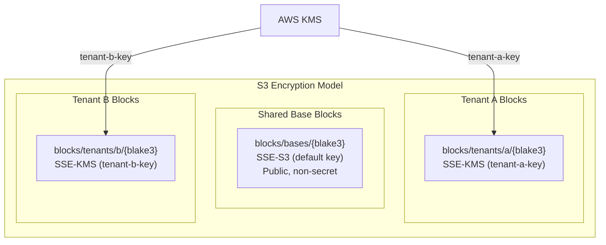
```mermaid
graph TB
    subgraph "S3 Encryption Model"
        subgraph "Shared Base Blocks"
            SB["blocks/bases/{blake3}<br/>SSE-S3 (default key)<br/>Public, non-secret"]
        end

        subgraph "Tenant A Blocks"
            TA["blocks/tenants/a/{blake3}<br/>SSE-KMS (tenant-a-key)"]
        end

        subgraph "Tenant B Blocks"
            TB["blocks/tenants/b/{blake3}<br/>SSE-KMS (tenant-b-key)"]
        end
    end

    KMS["AWS KMS"] -->|"tenant-a-key"| TA
    KMS -->|"tenant-b-key"| TB
```

**Rules:**
- Shared base image blocks: SSE-S3 (AWS-managed key). These aren't secret — they're public OS/runtime images.
- Tenant-written blocks: SSE-KMS with a per-tenant KMS key. Encryption and decryption handled transparently by S3 on PUT/GET.
- Manifests: SSE-KMS with the tenant's key. The block map itself reveals which blocks a tenant is using.
- No application-layer encryption needed. S3 + KMS handles it. The daemon doesn't touch keys.

---

## I/O QoS

Use Linux cgroup v2 block I/O controllers. The kernel handles scheduling and fairness. The NBD daemon stays dumb.

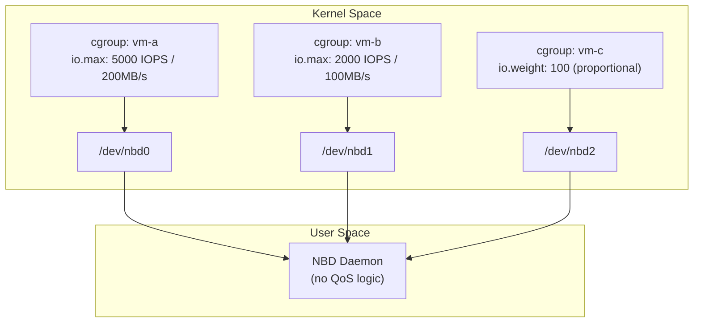
```mermaid
graph TB
    subgraph "Kernel Space"
        CG_A["cgroup: vm-a<br/>io.max: 5000 IOPS / 200MB/s"]
        CG_B["cgroup: vm-b<br/>io.max: 2000 IOPS / 100MB/s"]
        CG_C["cgroup: vm-c<br/>io.weight: 100 (proportional)"]

        NBD0["/dev/nbd0"]
        NBD1["/dev/nbd1"]
        NBD2["/dev/nbd2"]

        CG_A --> NBD0
        CG_B --> NBD1
        CG_C --> NBD2
    end

    subgraph "User Space"
        DAEMON["NBD Daemon<br/>(no QoS logic)"]
        NBD0 --> DAEMON
        NBD1 --> DAEMON
        NBD2 --> DAEMON
    end
```

**Two modes available:**
- `io.max` — hard limits. "This VM gets at most X IOPS and Y MB/s." Good for tiered plans.
- `io.weight` — proportional sharing. "When contended, divide bandwidth by weight." Good for fair sharing among same-tier VMs.

**Why this is the right move:**
- Zero QoS code in the daemon. No token buckets, no priority queues, no scheduling logic.
- The kernel's block layer is already optimized for this. Battle-tested, low overhead.
- QoS policy becomes a control plane concern — set cgroup limits when creating the VM. The daemon doesn't know or care about tiers.
- Composable with CPU and memory cgroups the microVM runtime is already using.

---

## Block Integrity Verification

Content-addressing gives us free integrity checks. Every block is keyed by its hash — verification is just re-hashing and comparing.

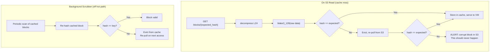
```mermaid
graph TB
    subgraph "On S3 Read (cache miss)"
        PULL["GET blocks/{expected_hash}"] --> DECOMP["decompress LZ4"]
        DECOMP --> HASH["blake3_128(raw data)"]
        HASH --> CMP{"hash == expected?"}
        CMP -->|"Yes"| CACHE_STORE["Store in cache, serve to VM"]
        CMP -->|"No"| RETRY["Evict, re-pull from S3"]
        RETRY --> CMP2{"hash == expected?"}
        CMP2 -->|"Yes"| CACHE_STORE
        CMP2 -->|"No"| ALERT["ALERT: corrupt block in S3<br/>This should never happen"]
    end

    subgraph "Background Scrubber (off hot path)"
        SCAN["Periodic scan of cached blocks"] --> REHASH["Re-hash cached block"]
        REHASH --> VERIFY{"hash == key?"}
        VERIFY -->|"Yes"| OK["Block valid"]
        VERIFY -->|"No"| EVICT_BAD["Evict from cache<br/>Re-pull on next access"]
    end
```

**Strategy: trust-but-verify, off the hot path.**
- **S3 reads (cache miss):** Always verify. Decompress, then hash the raw block, compare to the expected hash. This is the ingestion boundary — verify here, trust the cache after.
- **Cache reads (cache hit):** Don't verify on every read. Hashing on the hot path adds CPU latency to every I/O. The local SSD and memory are trusted for transient storage.
- **Background scrubber:** Periodically re-verify cached blocks against their hashes. Catches silent bit rot on the SSD without touching the hot path. Frequency tunable — hourly is probably fine.
- **On mismatch from S3:** Retry once (could be transient network corruption). If it fails again, the block is corrupt in S3 — raise an alert. This shouldn't happen given S3's own integrity guarantees, but defense in depth.

---

## Component Summary

| Component | Role | Implementation Notes |
|-----------|------|---------------------|
| **NBD Device** | 1:1 per VM, block device interface | Linux kernel NBD, socket pair to daemon |
| **NBD Daemon** | Single process, multiplexes all VMs | Event loop, resolves offsets via block maps, no QoS logic |
| **WAL** | Crash recovery, durability bridge | Append-only on local SSD, stores raw blocks, sequence-numbered, replayed on recovery |
| **Block Map** | Ordered array of (hash, source) per VM | 17 bytes/entry (BLAKE3-128 + source tag). ~13MB per 100GB disk at 128KB chunks. Sparse for unwritten regions. Fully in memory. |
| **Memory Cache** | In-memory LRU, hot blocks | Configurable size (`memory_cache_gb`), ~100ns reads, evicts to SSD tier |
| **SSD Cache** | SSD-backed LRU, warm blocks | ~100μs reads, stores uncompressed blocks, verified on ingestion |
| **Compression** | LZ4 at S3 boundary | BLAKE3-128 raw → compress → store. Decompress → verify → cache. ~1.5-2x ratio. |
| **Pack Files** | Batched S3 storage format | 25 blocks/pack (~3.2MB). 25x fewer S3 PUTs and objects. Whole-pack fetch prefetches temporal neighbors. |
| **Pack Index** | Hash → pack location mapping | ~24 bytes/block. Persisted in manifest. Resolves cache misses to pack + offset. |
| **TRIM Handler** | Reclaim deleted blocks | NBD_CMD_TRIM → reset to zero-block hash. Metadata-only, no S3 upload. Orphans cleaned by GC. |
| **S3 Block Store** | Durable, content-addressed chunks | BLAKE3-128 keyed, LZ4 compressed, 128KB chunk size, SSE-KMS per tenant. Stored in pack files. |
| **Base Image Registry** | Blessed shared blocks | Offline CLI pipeline (`glidefs bless`). Pre-chunked into packs, deduped across versions, SSE-S3. |
| **Base Block GC** | Base image block cleanup | Refcount fast path + mark-and-sweep source of truth. Scans all tenants only when refcount hits 0. |
| **Tenant GC Worker** | Tenant orphan block cleanup | Mark-and-sweep with 24h grace period, per-tenant, daily. Operates on packs, with compaction for mixed-liveness packs. |
| **cgroup v2 I/O** | Per-VM IOPS/throughput limits | Kernel-level, configured by control plane at VM creation |
| **Background Scrubber** | Cache integrity verification | Periodic re-hash of cached blocks, off hot path |

---

## What We're Replacing (and Why)

| ZFS Capability | Replacement | Why |
|---------------|-------------|-----|
| **Local snapshots/clones** | Block map copy in S3 | ZFS clones are local-only. Block map copy works cross-host — this is the primary motivation for the entire design. |
| **LZ4 compression** | LZ4 at S3 boundary | Same algorithm, applied at a different layer. Compression ratio is equivalent. |
| **Block integrity (checksums)** | BLAKE3-128 content-addressing + scrubber | Every block is verified by re-hashing. Background scrubber catches bit rot. |
| **ARC (adaptive read cache)** | Two-tier memory + SSD cache | Memory tier replaces ARC's L1. SSD tier replaces ARC's L2. LRU instead of ARC's adaptive algorithm — simpler, may revisit if hit rates are poor. |
| **Copy-on-write** | Content-addressed writes | Every write produces a new block by definition. Old blocks remain until GC. |
| **Durability (ZIL/SLOG)** | WAL on local SSD | Same concept, different implementation. WAL entries flush to S3 instead of being replayed locally. |
| **Deduplication** | Content-addressing (inherent) | Same content → same hash → same block. Dedup is automatic, not a feature flag. |

---

## Open Questions

1. **Memory cache sizing** — What's the right default for `memory_cache_gb`? This depends on workload mix. Needs profiling under realistic load to find the knee of the hit-rate curve.
2. **WAL flush interval** — How frequently do we flush the manifest to S3? This determines the worst-case data loss window if both the host and SSD die simultaneously. Every 5s? Every 100 entries? Tunable per workload?
3. **Cache warming strategy** — How aggressively do we prefetch on VM create? Is the boot hot set predictable enough to preload? Start without it, measure cold-boot latency, add if needed.
4. **cgroup I/O limits by tier** — What are the actual IOPS/throughput numbers per tier? Use `io.max` for hard caps (paid tiers) or `io.weight` for proportional sharing (shared environments)?
5. **GC grace period tuning** — 24 hours is conservative. Could be shorter if we can bound the maximum time between block creation and manifest update. Shorter grace period = less orphan accumulation.
6. **Sub-chunk dirty tracking** — If write amplification becomes a measured problem for database-heavy workloads, implement delta tracking within chunks. Deferred until we have data showing it matters.
7. **WAL size bound** — If S3 is slow or temporarily unavailable, the WAL grows. At what size do we start back-pressuring writes? This is the release valve for S3 outages.
8. **ARC vs LRU** — The memory cache uses simple LRU. ZFS's ARC algorithm adapts between recency and frequency. If cache hit rates are poor under realistic workloads, consider implementing ARC or LIRS. Start with LRU — it's simpler and might be good enough.
9. **Pack compaction threshold** — At what dead-block ratio should GC rewrite a pack? Too aggressive (compact at 10% dead) wastes S3 bandwidth. Too lenient (compact at 90% dead) wastes storage. Likely in the 50-70% range, but needs tuning under real churn patterns.
10. **Pack size vs prefetch tradeoff** — 25 blocks (3.2MB) per pack matches v1. Larger packs mean fewer S3 objects but more wasted bandwidth on partial reads. Smaller packs mean more objects but finer-grained prefetch. Profile under real workloads to find the sweet spot.
