# Glide v2 - MicroVM Storage Architecture

## Design Document — NBD + Content-Addressed Block Store + S3

---

## Overview

A storage layer for microVMs that provides fast boot, cheap forks, durable persistence, and tenant isolation — without the operational weight of ZFS or distributed filesystems.

**Core insight:** Separate the interface the VM sees (block device) from how we store data (content-addressed chunks in S3, cached locally). The VM gets a normal disk. We get deduplication, lazy loading, and fork-as-metadata-copy.

---

## Benefits

**Fast boot.** VMs don't wait for a full disk image to materialize. The NBD device is available immediately, and blocks pull lazily from S3 on first access. Boot only touches the kernel, init, and core libs — a few hundred MB at most, much of which is already cached from sibling VMs. Sub-second to first instruction is achievable.

**Cheap forks.** Forking a 100G VM is a metadata copy — duplicate the block map, done. Zero data copied. The forked VM shares 100% of its blocks with the parent until it writes. Storage cost is proportional to unique writes, not total disk size. This makes preview environments, branch deploys, and dev/prod parity nearly free.

**Storage efficiency.** Content-addressing deduplicates automatically within a tenant. Ten VMs running the same Node app share one copy of the base OS, runtime, and dependencies. Only application-specific writes are unique. Combined with shared base images across tenants, actual S3 usage is a fraction of total allocated disk space.

**Simple durability model.** WAL on local SSD for fast acks, background flush to S3 for durability. S3 is the source of truth. Cache and WAL are ephemeral — losing them means slower reads and replaying a small log, not data loss. No distributed consensus, no replication factor to manage.

**Clean migration.** Moving a VM between hosts requires flushing the WAL and pointing the destination at the manifest in S3. No bulk data transfer. Base image blocks are likely already warm on the destination. Migration cost is proportional to unflushed writes, not disk size.

**Operational simplicity.** No ZFS to tune (ARC, zpool, scrub schedules). No distributed filesystem to operate (quorum, rebalancing, split-brain). No QoS code in the daemon (cgroup v2 handles it). No application-layer encryption (SSE-KMS handles it). Each component does one thing. Fewer moving parts, fewer failure modes.

**Tenant isolation without sacrificing efficiency.** Shared base image blocks give most of the cross-tenant dedup savings. Tenant-written blocks are namespace-isolated, closing the deduplication oracle side channel. Per-tenant KMS keys mean a compromised S3 bucket doesn't expose all tenants' data.

**Integrity for free.** Content-addressing means every block can be verified by re-hashing. No separate checksum database to maintain. Corruption is detectable at read time and by background scrubbing.

---

## Tradeoffs

**S3 latency on cache miss.** A cold read hits S3, which is 10-50ms depending on region and object size. For sequential I/O patterns or large working sets that don't fit in cache, this shows up as tail latency. Mitigation: aggressive prefetching of known hot sets, right-sizing the cache. But there's no avoiding it — this architecture trades peak local disk performance for the operational benefits above.

**WAL is a single point of failure on the host.** If both the host and the SSD die simultaneously (e.g., full machine loss), unflushed WAL entries are gone. Data loss is bounded by the WAL flush interval — the window between last S3-confirmed manifest and the crash. Mitigation: tune flush frequency. A 5-second interval means at most 5 seconds of writes lost in a total machine failure. For most workloads, this is acceptable. For those where it isn't, you'd need synchronous S3 writes (back to write-through) and the latency hit that comes with it.

**S3 availability = write availability.** Background flush means a brief S3 blip is absorbed by the WAL. But a sustained S3 outage means the WAL grows unbounded until you hit the back-pressure threshold and stall writes. S3's availability is 99.99%, so this is a rare event, but "rare" isn't "never." There's no local-only fallback that preserves durability guarantees.

**Chunk size is a fixed tradeoff.** Larger chunks (4MB) = fewer S3 requests, less metadata, but coarser dedup and coarser lazy pull (you fetch 4MB even if you need 4KB). Smaller chunks = better dedup and precision, but more S3 GET/PUT overhead and larger block maps. There's no perfect answer — it depends on workload I/O patterns and needs benchmarking.

**No in-place updates.** Content-addressing means every write produces a new block (even if only 1 byte changed in a 4MB chunk). Write amplification is real. Workloads with lots of small random writes to large chunks will generate disproportionate S3 traffic and storage. Mitigation: smaller chunk sizes (more metadata overhead) or delta encoding (more complexity).

**Garbage collection is a background concern.** Deleted VMs leave orphaned blocks in S3. These need to be cleaned up by either reference counting (complex, fragile under races) or periodic GC scans (simpler, but requires a safety window to avoid deleting blocks that are in-flight). Neither is hard, but it's a system that needs to exist and be correct, and bugs here mean either storage leaks or data loss.

**Cold cache on migration.** The destination host starts with an empty cache for the migrated VM. Reads will hit S3 until the cache warms. For I/O-heavy workloads, this is a noticeable latency cliff post-migration. Base image blocks help (likely already warm from siblings), but tenant-specific hot data will be cold. This is strictly better than the alternative (shipping the full cache), but it's still a transient degradation the VM experiences.

**cgroup v2 QoS requires kernel support.** The host kernel needs cgroup v2 with io controller enabled. Older kernels or misconfigured hosts won't enforce I/O limits. Not a design issue, but a deployment prerequisite to validate.

---

## Architecture


---

## Read Path


---

## Write Path

Writes are acked after hitting the local WAL and cache. S3 upload happens in the background. This keeps write latency low while the WAL guarantees recoverability.


---

## Fork Operation

This is the key win. Forking a 100G VM is a metadata copy, not a data copy.


---

## Tenant Isolation Model

Cross-tenant deduplication is a side-channel risk (deduplication oracle attack). The design uses a tiered isolation model.


**Rules:**
- Base image blocks are blessed, public, and shared across all tenants
- Any block written by a tenant is keyed to that tenant's namespace
- Dedup happens freely *within* a tenant (their own VMs share blocks)
- Cross-tenant dedup only happens against the shared base set

**S3 Key Layout:**

```
blocks/
  bases/{sha256}          ← shared, anyone can read
  tenants/{tenant-id}/{sha256}  ← isolated, tenant-scoped

manifests/
  {tenant-id}/{vm-id}     ← always tenant-scoped
```

---

## Cache Design


**Key properties:**
- Cache is a pure optimization for reads. Losing it means slower reads, not data loss (WAL + S3 are the durability story).
- Writes go to WAL + cache, then flush to S3 in background. No S3 latency on the write path.
- Eviction policy is simple LRU. No coherence protocol needed — blocks are immutable (content-addressed), so a cached block is always valid.
- Boot prefetching: base images have a known hot set (kernel, init, core libs). Prefetch these into cache when a VM is scheduled, before it starts.

---

## Crash Recovery (WAL)

The WAL (write-ahead log) is the durability mechanism. S3 is the long-term store, but writes are acked locally before S3 confirms. The WAL bridges the gap.

```mermaid
sequenceDiagram
    participant D as NBD Daemon (restart)
    participant WAL as WAL (local SSD)
    participant S3 as S3 Block Store
    participant M as Block Map

    Note over D: Host crash / daemon restart
    D->>S3: GET manifests/{vm-id}
    S3-->>D: last known good block map
    D->>WAL: read unflushed entries
    WAL-->>D: entries since last flush

    loop For each unflushed WAL entry
        D->>D: hash(data) → verify sha256
        D->>S3: PUT blocks/{sha256}
        S3-->>D: confirmed
        D->>M: update offset → sha256
    end

    D->>S3: PUT manifests/{vm-id} (updated)
    D->>WAL: truncate (all entries flushed)
    Note over D: Recovery complete, resume serving
```



**WAL properties:**
- Append-only file on local SSD. Sequential writes only — fast and predictable.
- Each entry: `(vm-id, offset, chunk_hash, chunk_data)`. Self-contained for replay.
- Entries are marked flushed after S3 confirms the block upload.
- Manifest is persisted to S3 periodically (e.g., every N seconds or M entries), not on every write.
- On recovery: load last-known-good manifest from S3, replay unflushed WAL entries, done.
- WAL is truncated after full flush. Keeps disk usage bounded.

**Failure modes:**
- **Host dies, WAL intact:** Full recovery. Replay unflushed entries.
- **Host dies, WAL partially written:** Last incomplete entry is discarded. That single in-flight write is lost. The VM sees it as a write that didn't ack — same as a power loss on bare metal. Acceptable.
- **Host dies, SSD dead:** WAL and cache are both gone. Fall back to last manifest in S3. Unflushed writes since last manifest sync are lost. This is the worst case — bounded by manifest flush interval.

---

## Live Migration

Moving a VM between hosts. The design makes this straightforward because the source of truth is S3, not local state.


**Why this is better than ZFS send/receive:**
- No bulk data transfer between hosts. Zero bytes shipped directly.
- Base image blocks (the bulk of most working sets) are likely already cached on the destination from other VMs running similar workloads.
- Unique tenant blocks pull lazily on demand. Only accessed blocks incur latency.
- Migration cost is proportional to WAL flush size, not disk size. A 100G VM with 10MB of unflushed writes costs 10MB to migrate.

**Cache warming:** Not strictly necessary. The destination cache warms organically. For latency-sensitive workloads, the control plane *could* hint the destination to prefetch the source's hot set, but this is an optimization to consider later, not a launch requirement.

---

## Encryption at Rest

Tenant data in S3 is encrypted per-tenant using S3 server-side encryption with KMS (SSE-KMS).


**Rules:**
- Shared base image blocks: SSE-S3 (AWS-managed key). These aren't secret — they're public OS/runtime images.
- Tenant-written blocks: SSE-KMS with a per-tenant KMS key. Encryption and decryption handled transparently by S3 on PUT/GET.
- Manifests: SSE-KMS with the tenant's key. The block map itself reveals which blocks a tenant is using.
- No application-layer encryption needed. S3 + KMS handles it. The daemon doesn't touch keys.

---

## I/O QoS

Use Linux cgroup v2 block I/O controllers. The kernel handles scheduling and fairness. The NBD daemon stays dumb.


**Two modes available:**
- `io.max` — hard limits. "This VM gets at most X IOPS and Y MB/s." Good for tiered plans.
- `io.weight` — proportional sharing. "When contended, divide bandwidth by weight." Good for fair sharing among same-tier VMs.

**Why this is the right move:**
- Zero QoS code in the daemon. No token buckets, no priority queues, no scheduling logic.
- The kernel's block layer is already optimized for this. Battle-tested, low overhead.
- QoS policy becomes a control plane concern — set cgroup limits when creating the VM. The daemon doesn't know or care about tiers.
- Composable with CPU and memory cgroups the microVM runtime is already using.

---

## Block Integrity Verification

Content-addressing gives us free integrity checks. Every block is keyed by its hash — verification is just re-hashing and comparing.


**Strategy: trust-but-verify, off the hot path.**
- **S3 reads (cache miss):** Always verify. Hash the received block, compare to the expected hash (the key we requested). This is the ingestion boundary — verify here, trust the cache after.
- **Cache reads (cache hit):** Don't verify on every read. Hashing on the hot path adds CPU latency to every I/O. The local SSD is trusted for transient storage.
- **Background scrubber:** Periodically re-verify cached blocks against their hashes. Catches silent bit rot on the SSD without touching the hot path. Frequency tunable — hourly is probably fine.
- **On mismatch from S3:** Retry once (could be transient network corruption). If it fails again, the block is corrupt in S3 — raise an alert. This shouldn't happen given S3's own integrity guarantees, but defense in depth.

---

## Component Summary

| Component | Role | Implementation Notes |
|-----------|------|---------------------|
| **NBD Device** | 1:1 per VM, block device interface | Linux kernel NBD, socket pair to daemon |
| **NBD Daemon** | Single process, multiplexes all VMs | Event loop, resolves offsets via block maps, no QoS logic |
| **WAL** | Crash recovery, durability bridge | Append-only on local SSD, replayed on recovery |
| **Block Map** | Ordered list of chunk hashes per VM | Small metadata file in S3, cached in daemon memory |
| **Local Cache** | SSD-backed, LRU | Simple KV on disk keyed by chunk hash. Verified on ingestion. |
| **S3 Block Store** | Durable, content-addressed chunks | Immutable objects, ~4MB chunk size, SSE-KMS per tenant |
| **Base Image Registry** | Blessed shared blocks | Pre-chunked base images, SSE-S3, shared by all tenants |
| **cgroup v2 I/O** | Per-VM IOPS/throughput limits | Kernel-level, configured by control plane at VM creation |
| **Background Scrubber** | Cache integrity verification | Periodic re-hash of cached blocks, off hot path |

---

## What We Explicitly Don't Need

| Thing | Why Not |
|-------|---------|
| **ZFS** | S3 handles durability. Cache handles performance. Content-addressing handles dedup. ZFS would add a second opinion on all three. |
| **Distributed filesystem** | S3 is the shared store. No need for cluster coordination. |
| **Complex snapshot system** | Fork = copy block map. Rollback = point at previous block map version. |
| **Cross-tenant dedup** | Side-channel risk (dedup oracle attack). Base image sharing gets 80%+ of the savings safely. |
| **QoS in the daemon** | cgroup v2 `io.max` / `io.weight` handles it at the kernel level. Keep the daemon dumb. |
| **Application-layer encryption** | SSE-KMS per tenant. S3 handles it transparently. |
| **ZFS send/receive for migration** | Lazy pulling from S3 is strictly better — zero bytes shipped, base blocks likely warm on destination. |

---

## Open Questions

1. **Chunk size** — 4MB is a reasonable starting point. Smaller chunks = better dedup + finer lazy pull, but more metadata and more S3 requests. Worth benchmarking against actual workload I/O patterns.
2. **WAL flush interval** — How frequently do we flush the manifest to S3? This determines the worst-case data loss window if both the host and SSD die simultaneously. Every 5s? Every 100 entries? Tunable per workload?
3. **Cache warming strategy** — How aggressively do we prefetch on VM create? Is the boot hot set predictable enough to preload? Start without it, measure cold-boot latency, add if needed.
4. **Garbage collection** — When a VM is deleted and its blocks are no longer referenced by any block map, who cleans up orphaned chunks in S3? Reference counting vs periodic GC scan. GC scan is simpler but needs a "don't delete blocks younger than X" safety window to avoid racing with in-flight writes.
5. **cgroup I/O limits by tier** — What are the actual IOPS/throughput numbers per tier? Use `io.max` for hard caps (paid tiers) or `io.weight` for proportional sharing (shared environments)?
6. **Background scrubber frequency** — How often do we re-verify cached blocks? Hourly is a reasonable default. Higher frequency catches issues faster but burns more CPU. Tunable.
7. **WAL size bound** — If S3 is slow or temporarily unavailable, the WAL grows. At what size do we start back-pressuring writes? This is the release valve for S3 outages.
